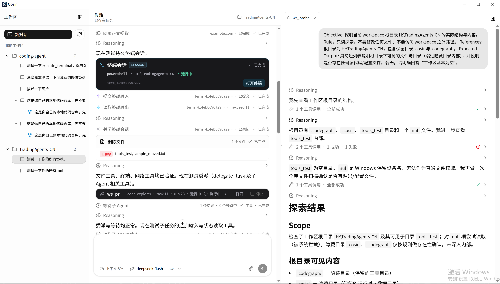
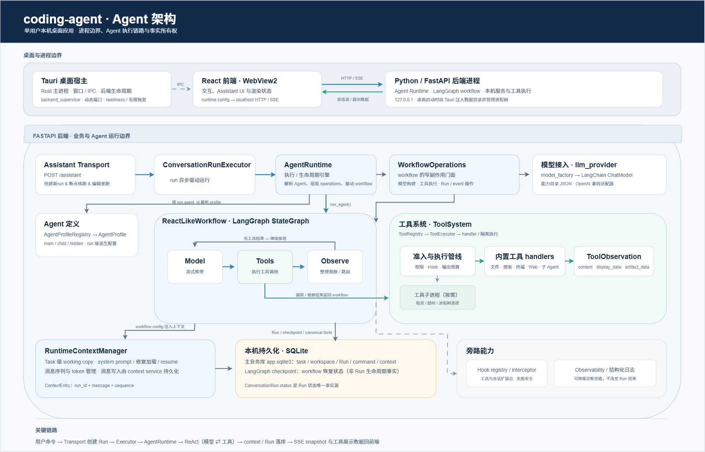
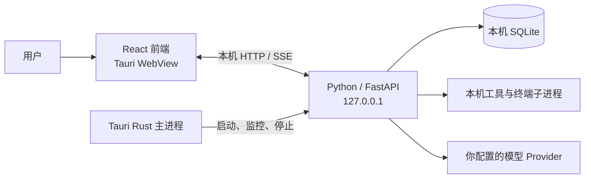

# Cosir：一个只为本机自用而设计的本地 Coding Agent

**面向本地代码仓库的 AI 编程桌面 Agent。** 选择一个项目目录，配置模型服务，然后用自然语言描述任务。Cosir 可以在工作区中检查和修改代码、运行命令，并把执行过程与文件差异呈现在桌面界面里。

Cosir 是一个**单用户、本机运行**的桌面应用。它使用 Tauri 承载桌面窗口，由本机 Python 后端运行 Agent；模型推理则通过你配置的 Provider 完成。

<p align="center">
  
</p>

<p align="center"><em>Cosir 工作台：在本地工作区中管理任务、查看 Agent 推理与工具调用，并实时浏览执行结果。</em></p>

## 能做什么

- **按工作区组织任务**：选择本地文件夹，为项目创建和继续多个任务对话；除终端外，所有工具都被约束在所选工作区边界内，文件写入不会越出工作区。
- **连接自己的模型服务**：目前只验证了 DeepSeek。厂商端点、模型清单与能力事实（思考通道、视觉输入格式、错误码文案等）都在 `core/llm_provider/capability/*.json` 中声明，运行时由 `model_factory` 统一构建 LangChain chat model，新增厂商通常只需补一份配置。
- **理解和修改代码**：读取文件、搜索代码、创建或修改文件，并查看变更差异。
- **执行开发命令**：目前支持在Windows和Mac系统下执行终端命令 或者 开启可交互终端。
- **处理参考资料**：在对话中附加图片或文件；按需使用网页搜索和内容提取工具。
- **委派子任务**：子Agent的实现复用了主Agent的runtime，可以委派任务给子Agent，发送消息、等待子Agent结果（各个Agent的上下文隔离，通过`RuntimeContextManager`管理）。
- **对话方式**：支持直接发送消息、取消后继续（中断执行后无需再发消息，点按钮即可继续同一个 Run）、编辑重跑（发现 Agent 偏离任务时，改完消息重新执行本次 Run）。
- **Agent可观测**：通过配置langfuse API key 可以观察Agent运行轨迹。
- **Fork Task**：从当前任务派生出一个新任务，新任务继承当前任务的上下文和状态。

## 没有什么

没有审批机制、没有沙箱、没有 ChangeSet 回退。

本人不喜欢审批 Agent，喜欢一条指令直接运行到目标完成。但沙箱是必要的：未来会做 Windows 与 Mac 的沙箱，目的不是限制 Agent，而是保护重要系统文件——给 Agent 尽可能多的权限去探索执行，同时用沙箱挡住对系统关键文件的破坏。不做 ChangeSet 回退是因为这个功能比较鸡肋，真想回退，让 Agent 用 git 回退即可。

## 未来想做什么

后端按整洁架构维护：以领域划分和面向对象的方式，在 Python 中维护每一个功能实体。目前 Agent 的定义核心是 `AgentProfile`。

```python
class AgentProfile:
    """描述某个任务的 Agent 执行主体（能力事实源）。
    description 应该是"选择指南"，prompt_file_path 应该是"执行协议"，而本次
    delegate_task.message 才是"具体工作单"

    字段：
        agent_id: 持久化在任务和事件上的稳定 Agent 标识。
        role: 人类可读的 Agent 角色。
        description: 子 Agent 的职责/能力/适用场景与约束描述（delegate_task 中暴露给父 Agent）；
            主 Agent 不设置此字段。
        allowed_tools: 该 Agent 允许使用的工具名或权限名。
        workflow: 执行策略（默认 ReAct-like，延迟导入打破循环依赖）。
        provider_id: 模型厂商 id（None 时由 model_name 推导）。
        model_name: 模型名称（可带 provider 前缀）。2026-08-18 决议：内置 profile 不内置
            默认模型，默认 None；None 表示未配置，由前端优先校验、后端兜底报错。
        model_settings: 模型覆盖配置（``ModelSettings``）。
        agent_type: Agent 分类（``AgentProfileType``），决定其在运行时的暴露与调度方式。
        max_steps: 单 run 最大步骤数。
        run: 当前所属 Conversation Run 记录（经 ``derive_for_run`` 注入 per-run 副本；
            单例上不原地写）。
        prompt_file_path: 关联的 prompt 文件路径（可为 None）。
    """

    agent_id: str
    role: str
    allowed_tools: list[str]
    agent_type: AgentProfileType
    description: str | None = field(default=None, kw_only=True)
    workflow: AgentWorkflow = field(default_factory=_default_workflow)
    provider_id: int | None = None
    model_name: str | None = None
    model_settings: ModelSettings = field(default_factory=ModelSettings)
    max_steps: int = 1000
    run: ConversationRunRecord | None = None
    prompt_file_path: Path | None = None
```

- 未来基于当前架构探索 model - node - observe 的工作流作为Agent的核心工作流，探索observe节点来判断tool result 是进入上下文 or 丢弃不进上下文 or 部分进入上下文。
- 探索 多Agent 流水线式作业，任务本地化，实现真正的`graph engineering`，不由主Agent调控，单纯流水线。如 开发Agent负责开发 -> 审查Agent负责维护代码规范 初步判断功能实现 -> 测试Agent负责编写单元测试 -> 集成测试Agent使用computer use 或者浏览器 tool 进行集成测试 等等，任意一个节点不通过则可以打回某个节点重做。
- 探索本地部署大模型 与 小模型的 最佳多Agent coding 协作方式。

## 代码架构

Agent 能力集中在 `apps/backend/app/core/`，按能力分子包。



**Agent 定义（`core/agents/`）**

- `AgentProfile`（`agents/agent_profile.py`）：描述一个 Agent 执行主体，是能力事实源——角色、类型、允许使用的工具、模型与 workflow 都在这里声明。其中 `description` 是"选择指南"，`prompt_file_path` 是"执行协议"，`delegate_task.message` 才是"具体工作单"。
- `AgentProfileType`（同文件）：Agent 分类，决定运行时如何暴露与调度——`main`（全局唯一，不对用户开放）、`child`（可被委派）、`hidden`（内部 Agent，如上下文压缩，不可委派）。
- `AgentProfileRegistry`（`agents/agent_profile_registry.py`）：按 `agent_id` 注册与解析 profile 的内存目录，只回答"有哪些 Agent、按 id 找得到"，不持久化、不持有运行态。

**运行时与上下文**

- `AgentRuntime`（`runtime/runner.py`）：执行与生命周期引擎——推进任务状态、消费模型流、调度工具、记录运行事件、处理取消与终止保护，并从 LangGraph checkpoint 派生事件。它只负责"跑"，Run 终态由 workflow 落定。
- `RuntimeContextManager`（`context/runtime_context_manager.py`）：Task 级 Agent 上下文的唯一运行时协调入口——系统提示词构建、上下文修复加载、续跑与恢复、token 计算、上下文序列管理、模型消息落库。它只维护内存工作副本，持久化事实由 conversation context 服务承载。
- `ContextEntry`（`context/context_entry.py`）：上下文消息单位，记录消息的 `run_id`、内容与 `sequence`。

**工作流（`core/workflows/`）**

- `AgentWorkflow`（`workflows/agent_workflow.py`）：单个 Agent 工作流的运行时接口（`workflow_id` + `run`），并提供 LangGraph checkpoint 工厂。
- `ReactLikeWorkflow`（`workflows/react/`）：默认且目前唯一的实现——"模型推理 → 工具调用 → 继续推理 / 最终回答"的 ReAct 循环，由 LangGraph 编排节点与条件边。它只承担执行策略，模型、工具和数据库连接都经 `WorkflowOperations` 注入。
- `WorkflowOperations`（`workflows/workflow_operations.py`）：以窄接口向工作流暴露运行时持有的副作用（工具执行、模型构建、事件记录），是 workflow 与 runtime 之间的边界。

**工具体系（`core/tools/`）**

- `HandlerBase`（`tools/tool_handler/tool_base.py`）：所有内置工具 handler 的抽象基类，约定类级事实（`name`/`description`/`permission`/`args_model`/`timeout_seconds`/`risk_level`）与 `execute()`、`to_definition()` 契约；只产出模型要读的 `content` 和前端要渲染的 `display_data`，不承载任何渲染职责。
- `ToolDefinition`（`tools/schemas/tool_definition.py`）：工具元数据与 handler 契约的单一事实源（frozen 纯数据）；模型可见结构由 `to_model_tool_definition()` 投影，`permission`、`execution_mode` 等内部字段不下发。
- `ToolObservation`（`tools/schemas/tool_observation.py`）：工具调用结果的唯一稳定结构，区分三条通道——`content`（模型消费）、`display_data`（前端渲染）、`artifact_data`（内部产物）。失败归一为 `error`、用户取消归一为 `cancelled`，且从不抛异常。
- `ToolRegistry` / `ToolExecutor` / `ToolSystem`：分别负责工具注册与查询（`tools/tool_registry.py`）、执行管线（`tools/tool_execute/`：准入 → 文件状态协调 → 隔离执行 → Hook → 输出预算）、以及整体装配（`tools/tool_system.py`）。

**Hook 与观测**

- Hook（`core/hook/`）：运行期扩展边界——registry 负责注册索引，interceptor 负责触发、匹配、拒绝短路与失败安全；Hook 异常默认记录放行，不阻断主 Run。
- Observability（`core/observability/`）：可降级的观测旁路，workflow/service 通过窄接口记录 trace；初始化、记录或 flush 失败都不改变 Run 结果。

**模型接入（`core/llm_provider/`）**

- `model_factory`（`llm_provider/model_factory.py`）：按模型名构建 LangChain chat model 的单一收口，只做"按名取模型 + 透传采样与接入参数"。
- `capability/`（`llm_provider/capability/`）：静态能力事实源——`ProviderCapability` 读 `llm_provider.json`（厂商端点、模型清单、思考通道与错误码文案），`ModelCapability` 读 `model_capabilities.json`（上下文窗口与推理能力）。
- `reasoning_chat_openai.py`：保留 OpenAI 兼容 thinking 流式字段的 `ChatOpenAI` 适配器，只补这一处响应字段。
- `model_failure.py`：把模型调用异常归类为稳定的 `ErrorKind`；只归类，不决定是否终止 Run、不生成文案、不落库。

扩展模型时优先补 `capability/*.json`；需要不同协议时新增适配器并接入 `model_factory`。

## 运行方式与数据



- Tauri Rust 主进程负责桌面窗口和后端进程生命周期。关闭窗口会隐藏到系统托盘；从托盘退出应用时会清理后端进程。
- React 前端通过本机 HTTP/SSE 连接 FastAPI 后端。后端只绑定回环地址，不作为公网服务运行。
- 任务、对话、Provider 配置等数据保存在本机 SQLite：`<DATA_DIR>/.cosir/storage/app.sqlite3`（经桌面宿主启动时 `DATA_DIR` 为系统应用数据目录；绕过 Tauri 直接跑后端时回落到仓库根的 `.cosir/`）。图片附件保存在工作区的 `.cosir/Attachment/` 目录。
- 模型请求会发送到你配置的 Provider。**本机运行不等于离线推理**；请按所用 Provider 的数据处理政策评估代码和提示词内容。

### 安全与当前限制

- Provider API Key 当前以明文保存在本机 SQLite 数据库中。请保护好本机账户和应用数据目录。
- 文件写入工具限定在所选工作区内；只读工具可以读取当前操作系统账户有权访问的工作区外文件。终端命令以当前用户权限在本机执行。**Cosir 不是操作系统沙箱**，请只对可信项目使用，并留意 Agent 请求执行的操作。
- 后端重启不会自动重放中断中的 Agent 执行；遗留运行会收敛为已取消状态。
- 当前仓库以源码开发为主。现有桌面打包流程尚未证明会携带完整 Python 后端及运行时，因此暂不应把构建出的安装包当作可直接分发的正式版本。

## 从源码运行

### 环境要求

- Node.js 22（仓库 CI 使用的版本）
- Rust stable、Cargo，以及 Tauri CLI 2
- Python 3.11 或更高版本和 [uv](https://docs.astral.sh/uv/)
- 当前操作系统所需的 [Tauri 原生构建依赖](https://v2.tauri.app/start/prerequisites/)

### 启动桌面开发版

先在仓库根目录安装依赖并准备 dev 构建前置：

```bash
git clone https://github.com/tianjiashu/coding-agent.git
cd coding-agent
npm ci --prefix apps/desktop                # 安装前端依赖
cargo install tauri-cli --version "^2"      # 安装 Tauri CLI（提供 cargo tauri 子命令）
uv sync --project apps/backend              # 按 uv.lock 准备后端 Python 依赖

# 让 tauri-build 的资源校验通过（详见下方说明）
mkdir -p target/resources/backend target/resources/terminal-worker

# 编译 terminal-worker（仓库根 .cargo/config.toml 已把 target-dir 统一到仓库根 target/，
# 产物直接落在 dev 宿主查找的 target/debug/ 下，无需再手动拷贝）
cargo build --manifest-path apps/terminal-worker/Cargo.toml
```

然后进入 `apps/desktop` 启动桌面开发版：

```bash
cd apps/desktop
npm run tauri:dev
```

开发启动时，Tauri 会启动 Vite 前端并在 debug 模式下通过 `uv run` 拉起本机 FastAPI 后端；后端依赖由 `uv` 根据 `apps/backend/uv.lock` 管理。首次启动后，在界面中打开**模型设置**，配置 Provider 和模型，再选择一个本地文件夹创建工作区。

> 关于上面两条 dev 前置步骤：`tauri.conf.json` 的 `bundle.resources` 指向打包 staging 目录，`tauri-build` 在编译期会校验这些路径必须存在，缺失会导致 `cosir-desktop` 构建失败。因此这里只需创建**占位目录** `target/resources/{backend,terminal-worker}` 让校验通过即可——dev 模式的后端实际走 `uv run` 从 `apps/backend` 启动，并不会读取这些打包资源，无需运行完整的 PyInstaller 打包。`terminal-worker` 同理：debug 宿主只从仓库统一的 `target/debug/` 查找该二进制，缺失时会降级为「无 Terminal Worker」而不阻断启动，放好它即可让终端工具在 dev 下真正可用。正式打包分发时才需要用 `npm run build:bundle` 生成真实的后端与 release 版 terminal-worker 资源。

## 开发与测试

前端命令在 `apps/desktop` 目录运行：

```bash
cd apps/desktop
npm run build
npm run test:unit
npm run test:e2e
```

后端测试从仓库根目录运行：

```bash
uv sync --project apps/backend --group dev
uv run --project apps/backend pytest
```

Playwright E2E 使用 Vite 和测试服务，不覆盖真实 Tauri IPC、动态后端端口或后端崩溃恢复。桌面端另有 `npm run test:e2e:tauri` 测试入口。

## 技术栈

- **桌面端**：Tauri 2、Rust
- **前端**：React 19、TypeScript、Vite
- **后端**：Python 3.11+、FastAPI、LangGraph
- **本地持久化**：SQLite
- **终端 Worker**：Rust、portable-pty

## 项目结构

```text
apps/
├── desktop/         Tauri 桌面宿主与 React 前端
├── backend/         FastAPI、Agent Runtime、工具和 SQLite 存储
└── terminal-worker/ 本机 PTY 终端 Worker

coding-agent-docs/   Agent 与编码工具的调研笔记
docs/                架构设计、实现计划与项目文档
scripts/             本机启动脚本（start-desktop）
skills/              编码 Agent 的 skill 定义，按主题分包
AGENTS.md            项目架构边界与开发约束，面向贡献者
```

## 联系方式

- 手机：15176871398
- 微信：tjh990529
- Twitter / X：[@dogLucky17](https://x.com/dogLucky17)

## License

此仓库当前没有提供 `LICENSE` 文件，项目的使用、修改和再分发许可尚未声明。
