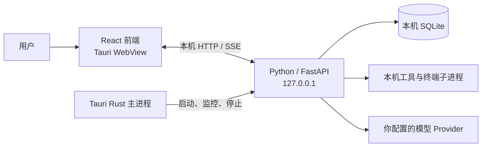

# Cosir

**面向本地代码仓库的 AI 编程桌面 Agent。** 选择一个项目目录，配置模型服务，然后用自然语言描述任务。Cosir 可以在工作区中检查和修改代码、运行命令，并把执行过程与文件差异呈现在桌面界面里。

Cosir 是一个**单用户、本机运行**的桌面应用。它使用 Tauri 承载桌面窗口，由本机 Python 后端运行 Agent；模型推理则通过你配置的 Provider 完成。

## 能做什么

- **按工作区组织任务**：选择本地文件夹，为项目创建和继续多个任务对话。
- **连接自己的模型服务**：在界面里添加 Provider、配置 API 地址和密钥、测试连接，并选择模型。
- **理解和修改代码**：读取文件、搜索代码、创建或修改文件，并查看变更差异。
- **执行开发命令**：在本机工作区运行终端命令，并查看工具执行结果。
- **处理参考资料**：在对话中附加图片或文件；按需使用网页搜索和内容提取工具。
- **委派子任务**：将任务交给子 Agent，并在工作台中查看结果。
- **跟踪运行状态**：查看流式回复、工具调用、任务状态和上下文用量；可停止正在运行的任务。

## 运行方式与数据



- Tauri Rust 主进程负责桌面窗口和后端进程生命周期。关闭窗口会隐藏到系统托盘；从托盘退出应用时会清理后端进程。
- React 前端通过本机 HTTP/SSE 连接 FastAPI 后端。后端只绑定回环地址，不作为公网服务运行。
- 任务、对话、Provider 配置等数据保存在本机 SQLite。开发环境默认数据库位于仓库 `storage/` 目录；图片附件保存在工作区的 `.cosir/Attachment/` 目录。
- 模型请求会发送到你配置的 Provider。**本机运行不等于离线推理**；请按所用 Provider 的数据处理政策评估代码和提示词内容。

### 安全与当前限制

- Provider API Key 当前以明文保存在本机 SQLite 数据库中。请保护好本机账户和应用数据目录。
- 文件写入工具限定在所选工作区内；只读工具可以读取当前操作系统账户有权访问的工作区外文件。终端命令以当前用户权限在本机执行。**Cosir 不是操作系统沙箱**，请只对可信项目使用，并留意 Agent 请求执行的操作。
- 后端重启不会自动重放中断中的 Agent 执行；遗留运行会收敛为已取消状态。
- 当前仓库以源码开发为主。现有桌面打包流程尚未证明会携带完整 Python 后端及运行时，因此暂不应把构建出的安装包当作可直接分发的正式版本。

## 从源码运行

### 环境要求

- Node.js 22（仓库 CI 使用的版本）
- Rust stable、Cargo，以及 Tauri CLI 2
- Python 3.11 或更高版本和 [uv](https://docs.astral.sh/uv/)
- 当前操作系统所需的 [Tauri 原生构建依赖](https://v2.tauri.app/start/prerequisites/)

### 启动桌面开发版

先在仓库根目录安装依赖并准备 dev 构建前置：

```bash
git clone https://github.com/tianjiashu/coding-agent.git
cd coding-agent
npm ci --prefix apps/desktop                # 安装前端依赖
cargo install tauri-cli --version "^2"      # 安装 Tauri CLI（提供 cargo tauri 子命令）
uv sync --project apps/backend              # 按 uv.lock 准备后端 Python 依赖

# 让 tauri-build 的资源校验通过（详见下方说明）
mkdir -p target/resources/backend target/resources/terminal-worker

# 编译 terminal-worker，并放到开发宿主查找的仓库统一 target/debug 目录
cargo build --manifest-path apps/terminal-worker/Cargo.toml
cp apps/terminal-worker/target/debug/terminal-worker target/debug/terminal-worker
```

然后进入 `apps/desktop` 启动桌面开发版：

```bash
cd apps/desktop
npm run tauri:dev
```

开发启动时，Tauri 会启动 Vite 前端并在 debug 模式下通过 `uv run` 拉起本机 FastAPI 后端；后端依赖由 `uv` 根据 `apps/backend/uv.lock` 管理。首次启动后，在界面中打开**模型设置**，配置 Provider 和模型，再选择一个本地文件夹创建工作区。

> 关于上面两条 dev 前置步骤：`tauri.conf.json` 的 `bundle.resources` 指向打包 staging 目录，`tauri-build` 在编译期会校验这些路径必须存在，缺失会导致 `cosir-desktop` 构建失败。因此这里只需创建**占位目录** `target/resources/{backend,terminal-worker}` 让校验通过即可——dev 模式的后端实际走 `uv run` 从 `apps/backend` 启动，并不会读取这些打包资源，无需运行完整的 PyInstaller 打包。`terminal-worker` 同理：debug 宿主只从仓库统一的 `target/debug/` 查找该二进制，缺失时会降级为「无 Terminal Worker」而不阻断启动，放好它即可让终端工具在 dev 下真正可用。正式打包分发时才需要用 `npm run build:bundle` 生成真实的后端与 release 版 terminal-worker 资源。

## 开发与测试

前端命令在 `apps/desktop` 目录运行：

```bash
cd apps/desktop
npm run build
npm run test:unit
npm run test:e2e
```

后端测试从仓库根目录运行：

```bash
uv sync --project apps/backend --group dev
uv run --project apps/backend pytest
```

Playwright E2E 使用 Vite 和测试服务，不覆盖真实 Tauri IPC、动态后端端口或后端崩溃恢复。桌面端另有 `npm run test:e2e:tauri` 测试入口。

## 技术栈

- **桌面端**：Tauri 2、Rust
- **前端**：React 19、TypeScript、Vite
- **后端**：Python 3.11+、FastAPI、LangGraph
- **本地持久化**：SQLite
- **终端 Worker**：Rust、portable-pty

## 项目结构

```text
apps/
├── desktop/         Tauri 桌面宿主与 React 前端
├── backend/         FastAPI、Agent Runtime、工具和 SQLite 存储
└── terminal-worker/ 本机 PTY 终端 Worker

coding-agent-docs/   Agent 与编码工具的调研笔记
docs/                架构设计、实现计划与项目文档
```

## 联系方式

- 手机：15176871398
- 微信：tjh990529
- Twitter / X：[@dogLucky17](https://x.com/dogLucky17)
## License

此仓库当前没有提供 `LICENSE` 文件，项目的使用、修改和再分发许可尚未声明。
