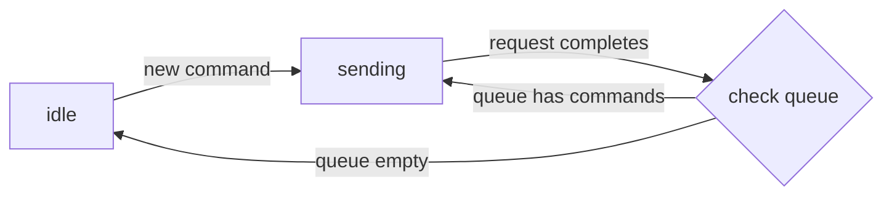

# Assistant Transport

URL：`/docs/runtimes/custom/assistant-transport`

将 Agent 状态流式传输到前端，并处理自定义 Agent 的用户命令。

> 对于 AI Agent：文档索引位于 [llms.txt](/llms.txt)。请使用带 `.md` 的页面作为规范 Markdown 页面；在支持的 URL 路径中，`.mdx` 仅作为向后兼容的别名保留。

`AssistantTransport` 是构建在 `ExternalStoreRuntime` 之上的状态流协议（参见[架构](/docs/runtimes/concepts/architecture)）。后端不再传输消息片段，而是传输完整 Agent 状态的快照，由 runtime 将其转换为 UI 消息。

它主要解决三个问题：

- **状态流**：高效更新 Agent 状态（可以是任意 JSON 对象）。
- **UI 集成**：将 Agent 的原生状态转换为 assistant-ui 消息。
- **命令处理**：用户操作（消息、工具结果、自定义命令）可以回传给 Agent。

## 何时使用

以下情况适合使用 `AssistantTransport`：

- 后端尚未提供流式协议，需要建立一套协议。
- Agent 有值得直接呈现在 UI 中的内部状态。
- 正在构建自定义 Agent 框架，或使用没有内置流式协议的框架（例如开源 LangGraph）。
- 需要支持超越简单消息轮次的双向命令。

如果只需要消息流式传输，[DataStream](/docs/runtimes/custom/data-stream) 更简单。

## 心智模型


前端接收状态快照，并将其转换为 React 组件。UI 是构建在 Agent 状态之上的无状态视图。

Agent 服务端接收来自前端的命令。当用户与 UI 交互（发送消息、点击按钮）时，前端会将命令加入队列并发送。`AssistantTransport` 内置 `add-message` 和 `add-tool-result`，你也可以定义更多命令。

### 命令生命周期


runtime 在 **idle**（没有活跃的后端请求）和 **sending**（请求进行中）两种状态之间交替。当 idle 时创建新命令，会立即发送；否则命令会排队，直到当前请求完成。



要实现这一机制，需要构建两部分：

1. **后端端点**：接收命令，并返回状态快照流。
2. **前端状态转换器**：将状态快照映射为 assistant-ui 数据格式。

## 构建后端端点

端点接收带有以下负载的 POST 请求：

```
{
  state: T,                                     // 前端持有的上一个状态
  commands: AssistantTransportCommand[],
  system?: string,
  tools?: Record<string, ToolJSONSchema>,       // 以名称为键的工具定义
  threadId: string | null,                      // 新线程为 null
  parentId?: string | null,                     // 编辑或创建分支时存在
  callSettings?: { maxTokens, temperature, topP, presencePenalty, frequencyPenalty, seed },
  config?: { apiKey, baseUrl, modelName },
}
```

> [!warn]
>
> 旧版 wire 格式会将 `callSettings` 和 `config` 字段展开到顶层（例如 `body.modelName`）。目前为兼容性会同时发送两种格式，但顶层字段已弃用。请从嵌套对象中读取这些值。

端点使用 [`assistant-stream`](https://www.npmjs.com/package/assistant-stream) 库（[PyPI](https://pypi.org/project/assistant-stream/)）返回状态快照流。

### 处理命令

```
for command in request.commands:
    if command.type == "add-message":
        # 处理添加用户消息
    elif command.type == "add-tool-result":
        # 处理工具执行结果
    elif command.type == "my-custom-command":
        # 处理自定义命令
```

### 流式更新

在运行回调中修改 `controller.state`：

```
from assistant_stream import RunController, create_run
from assistant_stream.serialization import DataStreamResponse

@app.post("/assistant")
async def chat_endpoint(request: ChatRequest):
    async def run_callback(controller: RunController):
        controller.state["message"] = "Hello"      # 在 ["message"] 发出 "set"
        controller.state["message"] += " World"     # 发出 "append-text"

    stream = create_run(run_callback, state=request.state)
    return DataStreamResponse(stream)
```

状态变化会按照[流式协议](#流式协议)中描述的操作自动发送。

### 取消

`create_run` 提供 `controller.is_cancelled` 和 `controller.cancelled_event`。如果响应流提前关闭（用户取消或客户端断开连接），这些值会被设置，从而让循环能够正常退出。`create_run` 会为回调提供约 50 毫秒的协作式关闭窗口，之后才强制取消。关键清理逻辑应放在 `finally` 块中。

```
async def run_callback(controller: RunController):
    while not controller.is_cancelled:
        await asyncio.sleep(0.05)
```

```
async def run_callback(controller: RunController):
    await controller.cancelled_event.wait()
    # 感知取消信号并执行关闭操作
```

### 后端参考实现

选择一种实现方式：

**自定义 Agent**

```
from assistant_stream.serialization import DataStreamResponse
from assistant_stream import RunController, create_run

@app.post("/assistant")
async def chat_endpoint(request: ChatRequest):
    async def run_callback(controller: RunController):
        if controller.state is None:
            controller.state = {"messages": []}

        for command in request.commands:
            if command.type == "add-message":
                controller.state["messages"].append(command.message)

        async for message in your_agent.stream():
            controller.state["messages"].append(message)

    stream = create_run(run_callback, state=request.state)
    return DataStreamResponse(stream)
```

**LangGraph**

```
from assistant_stream.serialization import DataStreamResponse
from assistant_stream import RunController, create_run
from assistant_stream.modules.langgraph import append_langgraph_event

@app.post("/assistant")
async def chat_endpoint(request: ChatRequest):
    async def run_callback(controller: RunController):
        if controller.state is None:
            controller.state = {"messages": []}

        input_messages = []
        for command in request.commands:
            if command.type == "add-message":
                text_parts = [
                    p.text for p in command.message.parts
                    if p.type == "text" and p.text
                ]
                if text_parts:
                    input_messages.append(HumanMessage(content=" ".join(text_parts)))

        async for namespace, event_type, chunk in graph.astream(
            {"messages": input_messages},
            stream_mode=["messages", "updates"],
            subgraphs=True,
        ):
            append_langgraph_event(controller.state, namespace, event_type, chunk)

    stream = create_run(run_callback, state=request.state)
    return DataStreamResponse(stream)
```

完整的 LangGraph 示例：[`python/assistant-transport-backend-langgraph`](https://github.com/assistant-ui/assistant-ui/tree/main/python/assistant-transport-backend-langgraph)。

## 流式协议

assistant-stream 使用两种操作复制任意 JSON 对象。

### 操作

以下两种操作覆盖所有复杂的状态变更：`set` 用于值更新和结构更新，`append-text` 用于高效流式传输文本内容。

#### `set`

```json
// 操作
{ "type": "set", "path": ["status"], "value": "completed" }

// 之前
{ "status": "pending" }

// 之后
{ "status": "completed" }
```

#### `append-text`

```json
// 操作
{ "type": "append-text", "path": ["message"], "value": " World" }

// 之前
{ "message": "Hello" }

// 之后
{ "message": "Hello World" }
```

### Wire 格式

> [!warn]
>
> Wire 格式将在未来版本迁移为 Server-Sent Events（SSE）。

该格式受到 [AI SDK 数据流协议](https://sdk.vercel.ai/docs/ai-sdk-ui/stream-protocol)的启发。

**状态更新：**

```
aui-state:[{"type":"set","path":["status"],"value":"completed"}]
```

**错误：**

```
3:"error message"
```

## 构建前端

`useAssistantTransportRuntime` 接受以下配置：

```
{
  initialState: T,
  api: string,
  resumeApi?: string,
  resumeStateApi?: string,
  protocol?: "data-stream" | "assistant-transport",
  converter: (state: T, connectionMetadata: ConnectionMetadata) => AssistantTransportState,
  headers?: Record<string, string> | Headers | (() => Promise<Record<string, string> | Headers>),
  body?: object | (() => Promise<object | undefined>),
  prepareSendCommandsRequest?: (body: SendCommandsRequestBody) => Record<string, unknown> | Promise<Record<string, unknown>>,
  capabilities?: { edit?: boolean },
  adapters?: { attachments?: AttachmentAdapter; history?: ThreadHistoryAdapter },
  onResponse?: (response: Response) => void | Promise<void>,
  onFinish?: () => void,
  onError?: (error: Error, params: { commands: AssistantTransportCommand[]; updateState: (updater: (state: T) => T) => void }) => void | Promise<void>,
  onCancel?: (params: { commands: AssistantTransportCommand[]; updateState: (updater: (state: T) => T) => void; error?: Error }) => void
}
```

### 状态转换器

状态转换器将 Agent 状态转换为 assistant-ui 消息格式：

```
(
  state: T,
  connectionMetadata: {
    pendingCommands: Command[],          // 尚未发送的命令
    isSending: boolean,                  // 是否有请求正在进行
    toolStatuses: Record<string, ToolExecutionStatus>,
  },
) => {
  messages: ThreadMessage[],
  isRunning: boolean,
  state?: ReadonlyJSONValue,
};
```

### 转换消息

`unstable_createMessageConverter` 将 Agent 消息转换为 assistant-ui 格式。

选择一种实现：

**示例**

```
import { unstable_createMessageConverter as createMessageConverter } from "@assistant-ui/react";

type YourMessage = {
  id: string;
  role: "user" | "assistant";
  content: string;
  timestamp: number;
};

const messageConverter = createMessageConverter((message: YourMessage) => ({
  role: message.role,
  content: [{ type: "text", text: message.content }],
}));

const converter = (state: YourAgentState) => ({
  messages: messageConverter.toThreadMessages(state.messages),
  isRunning: false,
});
```

**LangChain**

```
import { unstable_createMessageConverter as createMessageConverter } from "@assistant-ui/react";
import { convertLangChainMessages } from "@assistant-ui/react-langgraph";

const messageConverter = createMessageConverter(convertLangChainMessages);

const converter = (state: YourAgentState) => ({
  messages: messageConverter.toThreadMessages(state.messages),
  isRunning: false,
});
```

可以通过 `messageConverter.toOriginalMessage(threadMessage)` 或 `toOriginalMessages(threadMessage)`，在任意位置获取原始消息格式。

### 命令带来的乐观更新

转换器还会接收 `connectionMetadata.pendingCommands`。可以利用它在后端响应之前显示乐观 UI：

```
const converter = (state: State, connectionMetadata: ConnectionMetadata) => {
  const optimisticMessages = connectionMetadata.pendingCommands
    .filter((c) => c.type === "add-message")
    .map((c) => c.message);

  return {
    messages: [...state.messages, ...optimisticMessages],
    isRunning: connectionMetadata.isSending || false,
  };
};
```

## 错误与取消

`onError` 和 `onCancel` 会接收 `updateState`，因此可以在客户端修改状态，而无需发起服务器请求：

```
const runtime = useAssistantTransportRuntime({
  // ... 其他选项
  onError: (error, { commands, updateState }) => {
    updateState((s) => ({ ...s, lastError: error.message }));
  },
  onCancel: ({ commands, updateState }) => {
    updateState((s) => ({ ...s, status: "cancelled" }));
  },
});
```

`onError` 接收正在传输中的命令。用户直接取消时，`onCancel` 会同时接收正在传输和排队中的命令；错误发生后调用 `onCancel` 时，只接收排队中的命令（正在传输的命令会传给 `onError`）。

## 自定义请求头和请求体

```
const runtime = useAssistantTransportRuntime({
  // ...
  headers: { Authorization: "Bearer token", "X-Custom-Header": "value" },
  body: { customField: "value" },
});
```

按请求动态计算：

```
const runtime = useAssistantTransportRuntime({
  // ...
  headers: async () => ({
    Authorization: `Bearer ${await getAccessToken()}`,
    "X-Request-ID": crypto.randomUUID(),
  }),
  body: async () => ({
    customField: "value",
    requestId: crypto.randomUUID(),
    timestamp: Date.now(),
  }),
});
```

### 转换请求体

`prepareSendCommandsRequest` 允许你在发送前转换整个请求体：

```
const runtime = useAssistantTransportRuntime({
  // ...
  prepareSendCommandsRequest: (body) => ({
    ...body,
    trackingId: crypto.randomUUID(),
    commands: body.commands.map((cmd) =>
      cmd.type === "add-message"
        ? { ...cmd, trackingId: crypto.randomUUID() }
        : cmd,
    ),
  }),
});
```

## 编辑消息

默认禁用编辑功能。启用方式如下：

```
const runtime = useAssistantTransportRuntime({
  // ...
  capabilities: { edit: true },
});
```

`add-message` 命令始终包含 `parentId` 和 `sourceId`：

```
{
  type: "add-message",
  message: { role: "user", parts: [...] },
  parentId: "msg-3",   // 在此消息之后插入
  sourceId: "msg-4",   // 被替换消息的 ID（新消息为 null）
}
```

### 后端处理

当后端收到带有 `parentId` 的 `add-message` 时：

1. 截断父消息之后的所有消息。
2. 添加新消息。
3. 将更新后的状态流式传回。

```
for command in request.commands:
    if command.type == "add-message":
        if hasattr(command, "parentId") and command.parentId is not None:
            parent_idx = next(
                i for i, m in enumerate(messages) if m.id == command.parentId
            )
            messages = messages[:parent_idx + 1]
        messages.append(command.message)
```

## 从同步服务器恢复

> [!info]
>
> 同步服务器目前属于企业版功能，详情请联系我们。

当用户刷新页面或重新连接时，后端可能仍在生成内容。`resumeRun` 可以重新连接到活跃流。

```
const runtime = useAssistantTransportRuntime({
  // ...
  api: "http://localhost:8010/assistant",
  resumeApi: "http://localhost:8010/resume",
});
```

设置 `resumeStateApi` 后，还可以使用服务器保留的起始状态填充恢复中的运行。它要求同步服务器提供初始状态路由；不要对没有该路由的服务器进行配置，因为预检失败会导致恢复失败：

```
const runtime = useAssistantTransportRuntime({
  // ...
  resumeStateApi: "http://localhost:8010/initial-state",
});
```

恢复前，runtime 会向 `resumeStateApi` POST `{ threadId }`。端点必须返回启动活跃运行时的状态及其身份标识：

```
{ "runId": "8b3a...", "state": { "messages": [] } }
```

runtime 会用该快照替换本地基准状态，并在恢复请求中加入 `runId`；请求不携带 `state`，因为服务器会从保留的快照重放。同步服务器应在该 ID 不再对应同一运行时拒绝恢复，避免将重放操作应用到已漂移或被替换的基准状态。当没有活跃运行时，端点返回 `204 No Content`，runtime 会跳过恢复且不抛出错误。恢复时，`runId` 优先于通过 `body` 提供的字段，并且会保留在 `prepareSendCommandsRequest` 处理之后；如果这两处提供了 `state`，它都会被移除。

```
import { useAui } from "@assistant-ui/react";
import { useEffect, useRef } from "react";

function useResumeOnMount(threadId: string) {
  const aui = useAui();
  const checkedRef = useRef(false);

  useEffect(() => {
    if (checkedRef.current) return;
    checkedRef.current = true;

    (async () => {
      const status = await fetch(`/api/sync-server/status/${threadId}`).then((r) =>
        r.json(),
      );
      if (status.isRunning) {
        const parentId = aui.thread.getState().messages.at(-1)?.id ?? null;
        aui.thread.resumeRun({ parentId });
      }
    })();
  }, [aui, threadId]);
}
```

对于 `AssistantTransport`，不要传入 `stream` 参数；runtime 会使用已配置的 `resumeApi`。

## 访问 runtime 状态

`useAssistantTransportState` 可以在任意组件中读取当前 Agent 状态：

```
import { useAssistantTransportState } from "@assistant-ui/react";

function MyComponent() {
  const state = useAssistantTransportState();
  return <div>{JSON.stringify(state)}</div>;
}

function MessageCount() {
  const messages = useAssistantTransportState((state) => state.messages);
  return <div>消息数量：{messages.length}</div>;
}
```

### 类型安全

通过模块扩展为 Agent 状态添加类型：

```
import "@assistant-ui/react";

declare module "@assistant-ui/react" {
  namespace Assistant {
    interface ExternalState {
      myState: {
        messages: Message[];
        customField: string;
      };
    }
  }
}
```

可以将此文件放在项目中的任意位置；TypeScript 会通过模块解析找到它。之后，`useAssistantTransportState` 将获得完整类型支持。

### 访问原始消息

如果使用了 `createMessageConverter`，可以从任意 assistant-ui 状态中取回原始消息：

```
import { useAuiState } from "@assistant-ui/react";

function MyMessageComponent() {
  const message = useAuiState((s) => s.message);
  const original = messageConverter.toOriginalMessage(message);
  return <div>{original.yourCustomField}</div>;
}
```

如果一个 `ThreadMessage` 由多个源消息创建，`toOriginalMessages` 会返回所有源消息。

## 前端参考实现

```
"use client";

import {
  AssistantRuntimeProvider,
  AssistantTransportConnectionMetadata,
  useAssistantTransportRuntime,
} from "@assistant-ui/react";

type State = { messages: Message[] };

const converter = (
  state: State,
  connectionMetadata: AssistantTransportConnectionMetadata,
) => {
  const optimistic = connectionMetadata.pendingCommands
    .filter((c) => c.type === "add-message")
    .map((c) => c.message);

  return {
    messages: [...state.messages, ...optimistic],
    isRunning: connectionMetadata.isSending || false,
  };
};

export function MyRuntimeProvider({ children }) {
  const runtime = useAssistantTransportRuntime({
    initialState: { messages: [] },
    api: "http://localhost:8010/assistant",
    converter,
    headers: async () => ({ Authorization: "Bearer token" }),
    body: { "custom-field": "custom-value" },
    onError: (error, { commands, updateState }) => {
      updateState((s) => ({ ...s, lastError: error.message }));
    },
    onCancel: ({ commands, updateState }) => {
      updateState((s) => ({ ...s, status: "cancelled" }));
    },
  });

  return (
    <AssistantRuntimeProvider runtime={runtime}>
      {children}
    </AssistantRuntimeProvider>
  );
}
```

完整示例：[`examples/with-assistant-transport`](https://github.com/assistant-ui/assistant-ui/tree/main/examples/with-assistant-transport)。同一示例目录中还有 LangChain 版本。

## 自定义命令

### 定义

```
import "@assistant-ui/react";

declare module "@assistant-ui/react" {
  namespace Assistant {
    interface Commands {
      myCustomCommand: {
        type: "my-custom-command";
        data: string;
      };
    }
  }
}
```

### 发起

```
import { useAssistantTransportSendCommand } from "@assistant-ui/react";

function MyComponent() {
  const sendCommand = useAssistantTransportSendCommand();
  return (
    <button
      onClick={() => sendCommand({ type: "my-custom-command", data: "hello" })}
    >
      发送
    </button>
  );
}
```

### 在后端处理

```
for command in request.commands:
    if command.type == "my-custom-command":
        data = command.data
```

### 乐观更新

```
const converter = (state: State, connectionMetadata: ConnectionMetadata) => {
  const customCommands = connectionMetadata.pendingCommands.filter(
    (c) => c.type === "my-custom-command",
  );
  return {
    messages: state.messages,
    state: { ...state, customData: customCommands.map((c) => c.data) },
    isRunning: connectionMetadata.isSending || false,
  };
};
```

自定义命令与内置命令遵循相同的生命周期；如有需要，也可以在 `onError` 和 `onCancel` 中检查它们。

## Adapter 支持

| Adapter | 支持方式 |
| --- | --- |
| 附件 | `adapters.attachments` |
| 历史记录 | `adapters.history` |
| threadList | 通过 [thread list adapter](/docs/runtimes/concepts/threads) |

`AssistantTransport` 目前尚未暴露语音、听写、反馈和建议功能。如果需要这些功能，请降级使用 `ExternalStoreRuntime`。

## 相关内容

- [ExternalStoreRuntime](/docs/runtimes/custom/external-store) —— AssistantTransport 所构建于其上的核心 runtime。
- [Data Stream](/docs/runtimes/custom/data-stream) —— 构建在 LocalRuntime 之上的消息流协议。
- [Adapters](/docs/runtimes/concepts/adapters) —— 附件、历史记录以及其他共享 adapter 契约。
