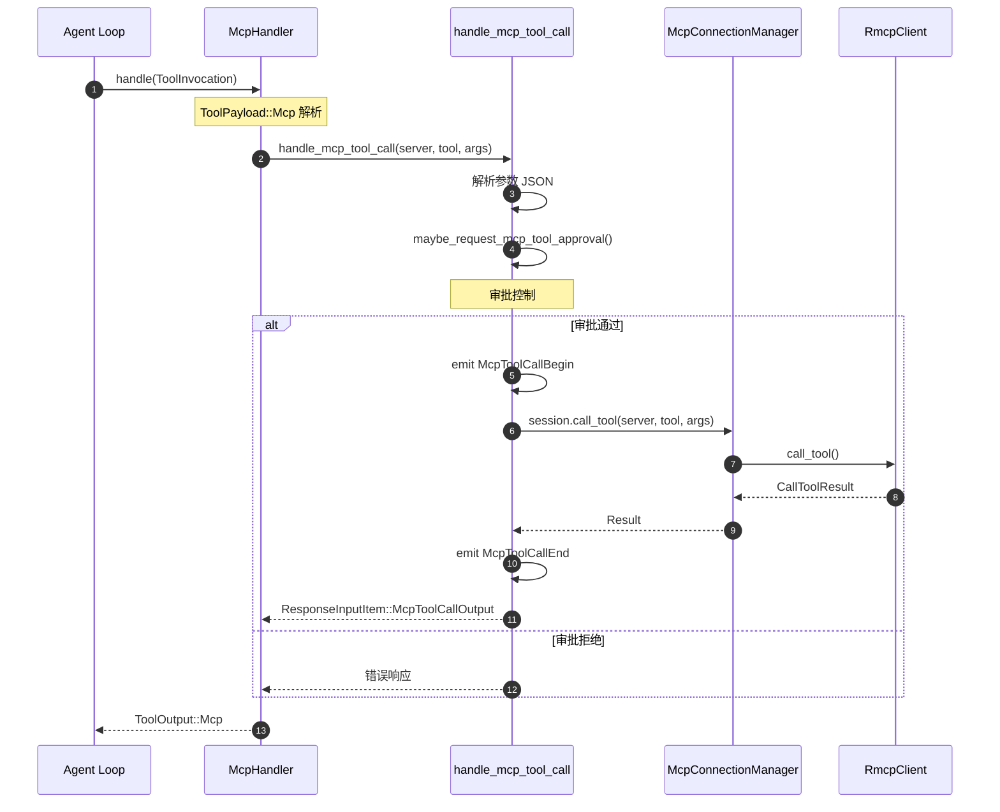
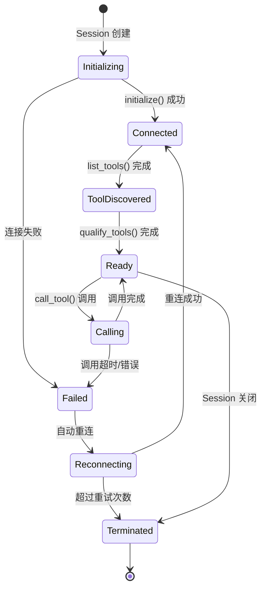
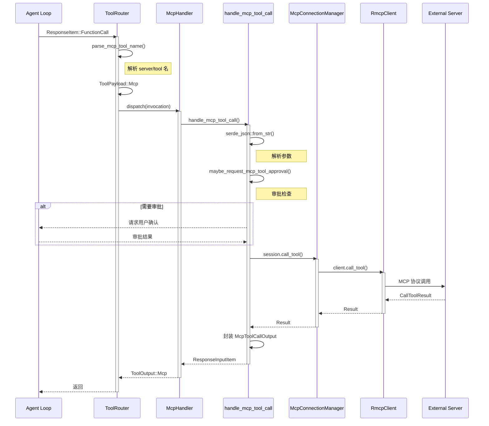
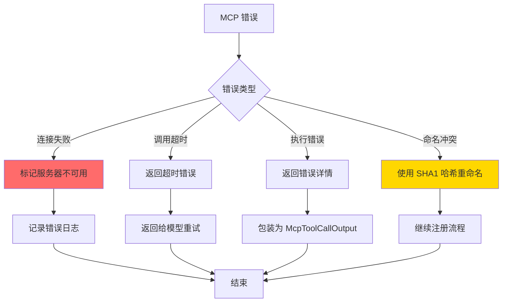
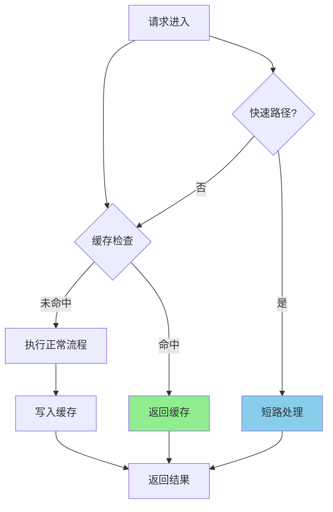
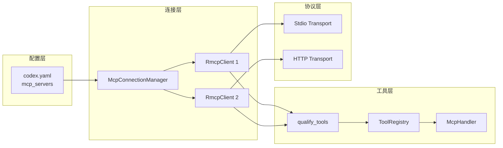
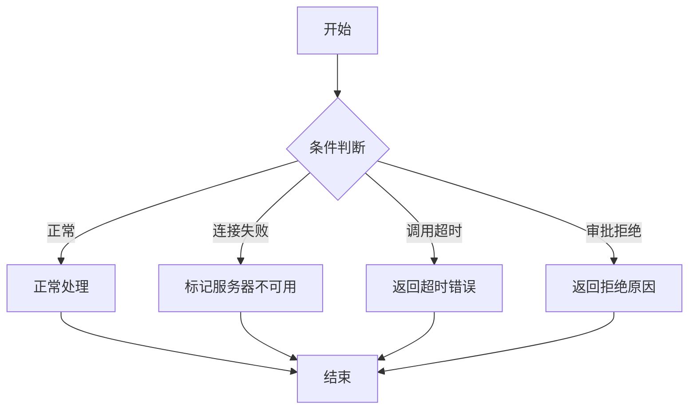
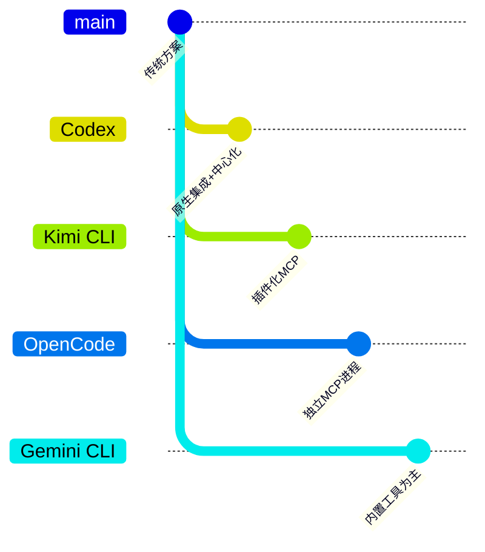

# MCP 集成（Codex）

> 📋 **阅读指南**
>
> | 属性 | 说明 |
> |-----|------|
> | 预计阅读 | 25-35 分钟 |
> | 前置文档 | `01-codex-overview.md`、`04-codex-agent-loop.md`、`05-codex-tools-system.md` |
> | 文档结构 | 速览 → 架构 → 机制 → 实现 → 对比 |
> | 代码呈现 | 关键代码直接展示，完整代码可折叠查看 |

---

## TL;DR（结论先行）

一句话定义：Codex 的 MCP 集成是**中心化管理的外部工具接入框架**，通过标准化协议将 MCP 服务器的能力无缝融入 Agent Loop。

Codex 的核心取舍：**原生集成 + 中心化连接管理 + 声明式插件扩展**（对比 Kimi CLI 的插件化 MCP、OpenCode 的独立 MCP 进程）

### 核心要点速览

| 维度 | 关键决策 | 代码位置 |
|-----|---------|---------|
| 核心机制 | 中心化 McpConnectionManager 管理多服务器连接 | `mcp_connection_manager.rs:225` |
| 命名空间 | `mcp__server__tool` 格式避免冲突，超长用 SHA1 哈希 | `mcp_connection_manager.rs:181` |
| 审批控制 | `maybe_request_mcp_tool_approval` 统一处理危险工具 | `mcp_tool_call.rs:297` |
| 插件扩展 | `PluginsManager` 整合插件贡献的 MCP 服务器 | `plugins.rs:73` |
| 传输协议 | 支持 stdio 和 streamable_http 两种传输 | `config/types.rs:88` |

**新增功能（2026-03）**：
- **插件系统**：通过 `[plugins.<name>]` 配置启用插件，插件可贡献 `skills/` 目录和 `.mcp.json` 配置的 MCP 服务器
- **OAuth Resource 支持**：为 Streamable HTTP 传输的 MCP 服务器配置 OAuth Resource 参数（RFC 8707）

---

## 1. 为什么需要这个机制？（解决什么问题）

### 1.1 问题场景

没有 MCP 集成：每个外部工具需要单独开发和维护适配代码

```
用户: "帮我查看 GitHub 上的 PR"
Agent: 抱歉，我没有访问 GitHub 的能力（需要单独开发 GitHub 工具）
```

有 MCP 集成：
```
配置: mcp_servers: { github: { command: npx ... } }
  ↓ 自动发现: list_tools() 获取服务器工具列表
  ↓ 自动注册: 工具名 mcp__github__get_pr 注册到 ToolRegistry
  ↓ 自动调用: 模型输出 → McpHandler → call_tool() → 远程执行
  ↓ 自动响应: 结果格式化为 ResponseInputItem 返回

用户: "帮我查看 GitHub 上的 PR"
Agent: 我来帮您查看（调用 mcp__github__get_pr）→ 返回 PR 详情
```

### 1.2 核心挑战

| 挑战 | 不解决的后果 |
|-----|-------------|
| 服务器管理 | 多服务器连接生命周期复杂，启动/关闭顺序混乱 |
| 工具命名冲突 | 不同服务器同名工具互相覆盖，导致调用错误 |
| 传输协议 | 需要支持多种通信方式（stdio/http），配置复杂 |
| 审批控制 | 外部工具可能执行危险操作，缺乏安全边界 |
| 错误隔离 | 单个服务器故障影响整体稳定性 |
| 扩展性 | 新增工具需要修改核心代码，无法动态扩展 |

---

## 2. 整体架构（ASCII 图）

### 2.1 在系统中的位置

```text
┌─────────────────────────────────────────────────────────────┐
│ Agent Loop / Session Runtime                                 │
│ codex-rs/core/src/loop.rs                                    │
└───────────────────────┬─────────────────────────────────────┘
                        │ 调用 MCP 工具
                        ▼
┌─────────────────────────────────────────────────────────────┐
│ ▓▓▓ MCP Integration ▓▓▓                                     │
│ codex-rs/core/src/mcp*.rs                                   │
│ - McpConnectionManager : 多服务器连接管理                    │
│ - McpHandler           : 统一工具处理器                      │
│ - handle_mcp_tool_call : 工具调用执行                        │
│ - PluginsManager       : 插件系统管理                        │
└───────────────────────┬─────────────────────────────────────┘
                        │ 依赖/调用
        ┌───────────────┼───────────────┐
        ▼               ▼               ▼
┌──────────────┐ ┌──────────────┐ ┌──────────────┐
│ RmcpClient   │ │ RmcpClient   │ │ ...          │
│ (stdio)      │ │ (http)       │ │              │
└──────┬───────┘ └──────┬───────┘ └──────────────┘
       │                │
       ▼                ▼
┌──────────────┐ ┌──────────────┐
│ MCP Server 1 │ │ MCP Server 2 │
│ filesystem   │ │ github       │
└──────────────┘ └──────────────┘
```

### 2.2 核心组件职责

| 组件 | 职责 | 代码位置 |
|-----|------|---------|
| `McpConnectionManager` | 多服务器连接生命周期管理 | `mcp_connection_manager.rs:225` |
| `McpHandler` | 统一处理所有 MCP 工具调用 | `tools/handlers/mcp.rs:248` |
| `handle_mcp_tool_call` | 执行具体 MCP 工具调用逻辑 | `mcp_tool_call.rs:285` |
| `qualify_tools` | 工具命名空间处理 | `mcp_connection_manager.rs:181` |
| `AsyncManagedClient` | rmcp SDK 客户端包装 | `mcp_connection_manager.rs:226` |
| `PluginsManager` | 插件管理，整合插件贡献的 MCP 服务器 | `plugins.rs:73` |
| `McpManager` | MCP 服务器配置管理（含插件来源） | `mcp/mod.rs:165` |

### 2.3 核心组件交互关系



**关键交互说明**：

| 步骤 | 交互内容 | 设计意图 |
|-----|---------|---------|
| 1 | McpHandler 接收调用 | 统一入口，解耦具体服务器 |
| 2 | 参数解析 | 验证 JSON 格式，提前发现错误 |
| 3 | 审批检查 | 危险工具需要用户确认 |
| 4-5 | 调用远程服务器 | 通过 ConnectionManager 路由到正确服务器 |
| 6 | 事件通知 | UI 可展示调用进度 |
| 7 | 结果封装 | 统一格式返回 |

---

## 3. 核心组件详细分析

### 3.1 McpConnectionManager 内部结构

#### 职责定位

McpConnectionManager 是 MCP 集成的核心枢纽，负责管理多个 MCP 服务器的连接、工具发现和生命周期。

#### 状态机图



**状态说明**：

| 状态 | 说明 | 进入条件 | 退出条件 |
|-----|------|---------|---------|
| Initializing | 初始化中 | Session 创建 | initialize() 完成或失败 |
| Connected | 已连接 | initialize() 成功 | 开始工具发现 |
| ToolDiscovered | 工具已发现 | list_tools() 完成 | qualify_tools() 完成 |
| Ready | 就绪可用 | 命名空间处理完成 | 调用工具或关闭 |
| Calling | 调用中 | call_tool() 开始 | 调用完成或失败 |
| Failed | 失败状态 | 连接或调用失败 | 重连或终止 |
| Terminated | 已终止 | Session 关闭或重连失败 | - |

#### 内部数据流

```text
┌─────────────────────────────────────────────────────────────┐
│  输入层                                                      │
│  ├── codex.yaml 配置加载                                     │
│  │   └── mcp_servers: { server1, server2, ... }             │
│  ├── 默认配置合并 (Codex Apps MCP)                          │
│  └── 插件配置加载 (.mcp.json)                               │
└──────────────────────────┬──────────────────────────────────┘
                           ▼
┌─────────────────────────────────────────────────────────────┐
│  处理层                                                      │
│  ├── 为每个 server 创建 RmcpClient                           │
│  │   ├── Stdio transport: command + args                    │
│  │   └── StreamableHttp: url + bearer_token                 │
│  ├── initialize() MCP 握手                                   │
│  ├── list_tools() 获取工具列表                              │
│  └── qualify_tools() 命名空间处理                           │
│       └── mcp__{server}__{tool} 格式转换                     │
└──────────────────────────┬──────────────────────────────────┘
                           ▼
┌─────────────────────────────────────────────────────────────┐
│  输出层                                                      │
│  ├── HashMap<String, AsyncManagedClient>                    │
│  ├── HashMap<String, ToolInfo> (qualified_tools)            │
│  └── 工具注册到 ToolRegistry                                │
└─────────────────────────────────────────────────────────────┘
```

#### 关键算法逻辑

```rust
// mcp_connection_manager.rs:181-202
fn qualify_tools<I>(tools: I) -> HashMap<String, ToolInfo>
where I: IntoIterator<Item = ToolInfo> {
    for tool in tools {
        // 原始格式: mcp__{server_name}__{tool_name}
        let qualified_name_raw = format!(
            "mcp{}{}{}{}",
            MCP_TOOL_NAME_DELIMITER,
            tool.server_name,
            MCP_TOOL_NAME_DELIMITER,
            tool.tool_name
        );

        // 清理非法字符（OpenAI API 限制：^[a-zA-Z0-9_-]+$）
        let mut qualified_name = sanitize_responses_api_tool_name(&qualified_name_raw);

        // 长度限制处理（超过64字符使用 SHA1 哈希）
        if qualified_name.len() > MAX_TOOL_NAME_LENGTH {
            let sha1_str = sha1_hex(&qualified_name_raw);
            let prefix_len = MAX_TOOL_NAME_LENGTH - sha1_str.len();
            qualified_name = format!("{}{}", &qualified_name[..prefix_len], sha1_str);
        }

        qualified_tools.insert(qualified_name, tool);
    }
}
```

**算法要点**：

1. **命名空间隔离**：`mcp__server__tool` 格式避免跨服务器冲突
2. **字符清理**：移除 OpenAI API 不允许的特殊字符
3. **长度处理**：64 字符限制，超长使用 SHA1 哈希保证唯一性
4. **元数据保留**：原始工具信息保留在 ToolInfo 中

#### 关键接口

| 接口 | 输入 | 输出 | 说明 | 代码位置 |
|-----|------|------|------|---------|
| `new()` | McpConfig | McpConnectionManager | 初始化连接管理器 | `mcp_connection_manager.rs:225` |
| `list_all_tools()` | - | Vec<Tool> | 获取所有服务器工具 | `mcp_connection_manager.rs:156` |
| `call_tool()` | server, tool, args | CallToolResult | 执行工具调用 | `mcp_connection_manager.rs:285` |
| `qualify_tools()` | Vec<Tool> | HashMap<String, ToolInfo> | 命名空间处理 | `mcp_connection_manager.rs:181` |

### 3.2 McpHandler 内部结构

#### 职责定位

McpHandler 是 ToolHandler trait 的实现，统一处理所有 MCP 工具调用，是 MCP 与 Tool System 的桥梁。

#### 关键接口

| 接口 | 输入 | 输出 | 说明 | 代码位置 |
|-----|------|------|------|---------|
| `kind()` | - | ToolKind::Mcp | 标识为 MCP 类型 | `handlers/mcp.rs:252` |
| `matches_kind()` | ToolPayload | bool | 验证类型匹配 | `registry.rs:167` |
| `handle()` | ToolInvocation | ToolOutput | 执行工具调用 | `handlers/mcp.rs:256` |

### 3.3 组件间协作时序



**协作要点**：

1. **调用方与 ToolRouter**：ToolRouter 负责解析工具名称，识别 MCP 工具并路由到 McpHandler
2. **McpHandler 与 handle_mcp_tool_call**：Handler 是入口，具体执行逻辑委托给 handle_mcp_tool_call
3. **McpConnectionManager 与 RmcpClient**：ConnectionManager 管理客户端生命周期，实际调用通过 RmcpClient

### 3.4 关键数据路径

#### 主路径（正常流程）

```mermaid
flowchart LR
    subgraph Input["输入阶段"]
        I1[codex.yaml 配置] --> I2[McpConnectionManager::new]
        I2 --> I3[initialize + list_tools]
    end

    subgraph Process["处理阶段"]
        P1[qualify_tools 命名] --> P2[ToolRegistry 注册]
        P2 --> P3[Agent Loop 工具发现]
        P3 --> P4[模型输出 tool_call]
        P4 --> P5[McpHandler::handle]
        P5 --> P6[call_tool 远程执行]
    end

    subgraph Output["输出阶段"]
        O1[CallToolResult] --> O2[McpToolCallOutput]
        O2 --> O3[返回模型]
    end

    I3 --> P1
    P6 --> O1

    style Process fill:#e1f5e1,stroke:#333
```



#### 异常路径（错误恢复）



#### 优化路径（缓存/短路）



### 3.5 插件系统集成

#### 架构定位

插件系统是 Codex 的扩展机制，允许第三方通过声明式配置贡献技能和 MCP 服务器，而无需修改核心代码。

#### 插件目录结构

```text
plugin-root/
├── .codex-plugin/
│   └── plugin.json          # 插件清单（名称、版本）
├── skills/                  # 可选：技能目录
│   └── search/
│       └── SKILL.md
└── .mcp.json               # 可选：MCP 服务器配置
```

#### 插件加载流程

```mermaid
flowchart TD
    A[config.toml] --> B[解析 [plugins.name] 配置]
    B --> C{插件功能是否启用?}
    C -->|否| D[返回空结果]
    C -->|是| E[加载插件清单]
    E --> F[读取 .mcp.json]
    F --> G[归一化 MCP 配置]
    G --> H[合并到 effective_servers]

    style C fill:#e1f5e1
```

#### 配置优先级规则

**核心原则：用户配置优先于插件配置**

```rust
// mcp/mod.rs:193-196
for (name, plugin_server) in loaded_plugins.effective_mcp_servers() {
    servers.entry(name).or_insert(plugin_server);  // 仅当用户未配置时才插入
}
```

| 配置来源 | 优先级 | 说明 |
|---------|-------|------|
| 用户 codex.yaml | 最高 | 显式配置的 mcp_servers |
| Codex Apps MCP | 中 | connectors_enabled 时自动添加 |
| 插件 .mcp.json | 低 | 仅当名称未被占用时生效 |

---

## 4. 端到端数据流转

### 4.1 正常流程（详细版）

```mermaid
sequenceDiagram
    participant Config as codex.yaml
    participant Session as Session::new
    participant Mgr as McpConnectionManager
    participant Router as ToolRouter
    participant Loop as Agent Loop
    participant LLM as LLM

    Config->>Session: mcp_servers 配置
    Session->>Mgr: new(config)

    loop 每个服务器
        Mgr->>Mgr: 创建 RmcpClient
        Mgr->>Mgr: initialize()
        Mgr->>Mgr: list_tools()
    end

    Mgr->>Mgr: qualify_tools()
    Mgr->>Router: 注册到 ToolRegistry

    Router->>Loop: specs() 获取工具列表
    Loop->>LLM: 发送 tools 定义
    LLM->>Loop: 输出 tool_call

    Loop->>Router: build_tool_call()
    Router->>Router: parse_mcp_tool_name()
    Router->>Router: ToolPayload::Mcp
    Router->>Mgr: dispatch_tool_call()

    Mgr->>Mgr: call_tool()
    Mgr-->>Router: CallToolResult

    Router->>Router: 格式化为 ResponseInputItem
    Router-->>Loop: 返回结果
    Loop->>LLM: 发送执行结果
```

**数据变换详情**：

| 阶段 | 输入 | 处理 | 输出 | 代码位置 |
|-----|------|------|------|---------|
| 配置 | codex.yaml | 解析服务器配置 | McpServerConfig | `config/types.rs:88` |
| 发现 | RmcpClient | list_tools() | Vec<Tool> | `mcp_connection_manager.rs:156` |
| 命名 | ToolInfo | qualify_tools() | qualified_name | `mcp_connection_manager.rs:181` |
| 解析 | FunctionCall | parse_mcp_tool_name() | (server, tool) | `tools/router.rs:372` |
| 调用 | server, tool, args | call_tool() | CallToolResult | `mcp_connection_manager.rs:285` |
| 响应 | CallToolResult | 封装 | McpToolCallOutput | `mcp_tool_call.rs:309` |

### 4.2 数据流向图



### 4.3 异常/边界流程



---

## 5. 关键代码实现

### 5.1 核心数据结构

```rust
// codex-rs/core/src/config/types.rs:88-106
pub struct McpServerConfig {
    #[serde(flatten)]
    pub transport: McpServerTransportConfig,
    pub enabled: bool,
    pub required: bool,
    pub startup_timeout_sec: Option<Duration>,
    pub tool_timeout_sec: Option<Duration>,
    pub enabled_tools: Option<Vec<String>>,
    pub disabled_tools: Option<Vec<String>>,
    pub scopes: Option<Vec<String>>,
    /// Optional OAuth resource parameter (RFC 8707)
    pub oauth_resource: Option<String>,
}

pub enum McpServerTransportConfig {
    Stdio { command: String, args: Vec<String>, env: Option<HashMap<String, String>> },
    StreamableHttp { url: String, bearer_token_env_var: Option<String> },
}
```

**字段说明**：

| 字段 | 类型 | 用途 |
|-----|------|------|
| `transport` | `McpServerTransportConfig` | 传输协议配置 |
| `enabled_tools` | `Option<Vec<String>>` | 允许列表（白名单） |
| `disabled_tools` | `Option<Vec<String>>` | 禁止列表（黑名单） |
| `tool_timeout_sec` | `Option<Duration>` | 工具调用超时 |
| `scopes` | `Option<Vec<String>>` | OAuth 授权范围 |
| `oauth_resource` | `Option<String>` | OAuth Resource 参数（RFC 8707） |

### 5.2 主链路代码

**关键代码**（核心逻辑）：

```rust
// codex-rs/core/src/mcp_tool_call.rs:285-314
pub(crate) async fn handle_mcp_tool_call(
    sess: Arc<Session>,
    turn_context: &TurnContext,
    call_id: String,
    server: String,
    tool_name: String,
    arguments: String,
) -> ResponseInputItem {
    // 1. 解析参数
    let arguments_value = serde_json::from_str::<serde_json::Value>(&arguments)?;

    // 2. 检查审批（destructive/open_world 工具）
    if let Some(decision) = maybe_request_mcp_tool_approval(...).await {
        match decision {
            McpToolApprovalDecision::Accept => {
                // 3. 发送开始事件
                emit_event(McpToolCallBegin { ... });

                // 4. 执行工具调用
                let result = sess.call_tool(&server, &tool_name, arguments_value).await;

                // 5. 发送结束事件
                emit_event(McpToolCallEnd { ... });

                ResponseInputItem::McpToolCallOutput { call_id, result }
            }
            McpToolApprovalDecision::Decline => {
                // 处理拒绝
                ResponseInputItem::McpToolCallOutput { ... }
            }
        }
    }
}
```

**设计意图**：

1. **参数验证**：早期 JSON 解析失败可快速返回错误
2. **审批集成**：`maybe_request_mcp_tool_approval` 统一处理危险工具确认
3. **事件驱动**：`McpToolCallBegin/End` 支持 UI 展示调用进度
4. **错误封装**：所有结果统一包装为 `McpToolCallOutput`

<details>
<summary>📋 查看完整实现</summary>

```rust
// codex-rs/core/src/mcp_tool_call.rs:285-350
pub(crate) async fn handle_mcp_tool_call(
    sess: Arc<Session>,
    turn_context: &TurnContext,
    call_id: String,
    server: String,
    tool_name: String,
    arguments: String,
) -> Result<ResponseInputItem, anyhow::Error> {
    // 解析参数
    let arguments_value = match serde_json::from_str::<serde_json::Value>(&arguments) {
        Ok(v) => v,
        Err(e) => {
            return Ok(ResponseInputItem::McpToolCallOutput {
                call_id,
                result: Err(McpToolCallError::InvalidArguments(e.to_string())),
            });
        }
    };

    // 审批检查
    let approval_decision = maybe_request_mcp_tool_approval(
        turn_context,
        &server,
        &tool_name,
        &arguments_value,
    ).await;

    match approval_decision {
        Some(McpToolApprovalDecision::Accept) | None => {
            // 发送开始事件
            emit_event(McpToolCallBegin {
                call_id: call_id.clone(),
                server: server.clone(),
                tool: tool_name.clone(),
            });

            // 执行调用
            let result = sess.call_tool(&server, &tool_name, arguments_value).await;

            // 发送结束事件
            emit_event(McpToolCallEnd {
                call_id: call_id.clone(),
                server: server.clone(),
                tool: tool_name.clone(),
            });

            Ok(ResponseInputItem::McpToolCallOutput { call_id, result })
        }
        Some(McpToolApprovalDecision::Decline) => {
            Ok(ResponseInputItem::McpToolCallOutput {
                call_id,
                result: Err(McpToolCallError::Declined),
            })
        }
    }
}
```

</details>

### 5.3 关键调用链

```text
dispatch_tool_call()          [tools/router.rs:372]
  -> ToolPayload::Mcp 匹配
  -> McpHandler::handle()     [tools/handlers/mcp.rs:256]
    -> handle_mcp_tool_call() [mcp_tool_call.rs:285]
      - 解析参数
      - maybe_request_mcp_tool_approval() [mcp_tool_call.rs:297]
      - emit McpToolCallBegin
      -> session.call_tool()  [session/mod.rs:485]
        -> McpConnectionManager::call_tool() [mcp_connection_manager.rs:285]
          -> AsyncManagedClient::call_tool() [mcp_connection_manager.rs:226]
            -> rmcp SDK 调用
      - emit McpToolCallEnd
      -> ResponseInputItem::McpToolCallOutput
```

### 5.4 插件系统实现

```rust
// codex-rs/core/src/plugins.rs:73-131
pub struct PluginsManager {
    cache_by_cwd: RwLock<HashMap<PathBuf, PluginLoadOutcome>>,
}

impl PluginsManager {
    pub fn plugins_for_config(&self, config: &Config) -> PluginLoadOutcome {
        self.plugins_for_layer_stack(&config.cwd, &config.config_layer_stack, false)
    }

    pub fn plugins_for_layer_stack(
        &self,
        cwd: &Path,
        config_layer_stack: &ConfigLayerStack,
        force_reload: bool,
    ) -> PluginLoadOutcome {
        // 检查插件功能是否启用
        if !plugins_feature_enabled_from_stack(config_layer_stack) {
            return PluginLoadOutcome::default();
        }

        // 缓存检查
        if !force_reload && let Some(outcome) = self.cached_outcome_for_cwd(cwd) {
            return outcome;
        }

        // 从配置层加载插件
        let outcome = load_plugins_from_layer_stack(config_layer_stack);
        // 缓存结果...
        outcome
    }
}

// PluginLoadOutcome 提供有效贡献
impl PluginLoadOutcome {
    pub fn effective_mcp_servers(&self) -> HashMap<String, McpServerConfig> {
        let mut mcp_servers = HashMap::new();
        for plugin in self.plugins.iter().filter(|p| p.is_active()) {
            for (name, config) in &plugin.mcp_servers {
                mcp_servers.entry(name.clone()).or_insert_with(|| config.clone());
            }
        }
        mcp_servers
    }
}
```

### 5.5 OAuth Resource 支持

```rust
// codex-rs/rmcp-client/src/perform_oauth_login.rs:43-73
pub async fn perform_oauth_login(
    server_name: &str,
    server_url: &str,
    store_mode: OAuthCredentialsStoreMode,
    http_headers: Option<HashMap<String, String>>,
    env_http_headers: Option<HashMap<String, String>>,
    scopes: &[String],
    oauth_resource: Option<&str>,  // RFC 8707 resource parameter
    callback_port: Option<u16>,
    callback_url: Option<&str>,
) -> Result<()> {
    // ... OAuth 流程初始化 ...

    // 构建授权 URL，附加 resource 参数
    let auth_url = append_query_param(
        &oauth_state.get_authorization_url().await?,
        "resource",
        oauth_resource,  // 如: "https://api.example.com"
    );

    // ... 继续 OAuth 流程 ...
}
```

**设计意图**：OAuth Resource 参数（RFC 8707）允许客户端指定要访问的资源，授权服务器可以据此返回针对性的访问令牌。这对于支持多租户的 MCP 服务器尤为重要。

### 5.6 配置示例

#### 基础 MCP 配置（codex.yaml）

```yaml
mcp_servers:
  filesystem:
    command: npx
    args: ["-y", "@modelcontextprotocol/server-filesystem", "/path/to/files"]
    enabled: true
    required: false
    startup_timeout_sec: 30
    tool_timeout_sec: 60

  github:
    type: http
    url: https://api.github.com/mcp
    bearer_token_env_var: GITHUB_TOKEN
    enabled_tools: ["get_pr", "list_issues"]
    scopes: ["repo", "read:user"]
```

#### 插件配置（config.toml）

```toml
[features]
plugins = true  # 启用插件功能

[plugins.my-plugin]
path = "/path/to/plugin"
enabled = true
```

#### 插件 .mcp.json 示例

```json
{
  "mcpServers": {
    "github": {
      "type": "http",
      "url": "https://api.github.com/mcp",
      "oauth": {
        "clientId": "github-client-id"
      }
    }
  }
}
```

#### OAuth Resource 配置

```toml
[mcp_servers.enterprise-api]
type = "http"
url = "https://api.enterprise.com/mcp"
oauth_resource = "https://api.enterprise.com/resource"  # RFC 8707
scopes = ["read", "write"]
```

---

## 6. 设计意图与 Trade-off

### 6.1 Codex 的选择

| 维度 | Codex 的选择 | 替代方案 | 取舍分析 |
|-----|-------------|---------|---------|
| 集成方式 | 原生集成到 core | 插件化 (Kimi) / 独立进程 | 性能更好，但增加核心体积 |
| 命名空间 | mcp__server__tool 格式 | 无命名空间 / UUID | 可读性好，但增加长度限制处理 |
| 连接管理 | 中心化 McpConnectionManager | 每个 Handler 独立管理 | 统一生命周期，但单点风险 |
| 传输支持 | stdio + streamable_http | 仅 stdio / 自定义协议 | 覆盖主要场景，但配置复杂 |
| 错误处理 | 统一封装为 McpToolCallOutput | 透传原始错误 | 格式统一，但丢失部分信息 |
| 扩展机制 | 声明式插件系统 | 代码级扩展 | 配置简单，但灵活性受限 |

### 6.2 为什么这样设计？

**核心问题**：如何在单一 Agent 中高效管理多个外部 MCP 服务器？

**Codex 的解决方案**：
- 代码依据：`mcp_connection_manager.rs:225-238` 的 HashMap 管理多客户端
- 设计意图：中心化连接管理，统一工具发现和调用
- 带来的好处：
  - 生命周期统一管理（启动、重连、关闭）
  - 工具聚合（list_all_tools 一次性返回）
  - 配置集中（codex.yaml 一处配置）
- 付出的代价：
  - 单点故障风险（Manager 故障影响所有 MCP）
  - 启动时间增加（需要初始化所有服务器）

### 6.3 与其他项目的对比



| 项目 | 核心差异 | 适用场景 |
|-----|---------|---------|
| Codex | 原生集成 + 中心化连接管理 + 声明式插件扩展 | 需要稳定高性能的企业场景 |
| Kimi CLI | 插件化 MCP，灵活扩展 | 第三方工具生态丰富的场景 |
| OpenCode | 独立 MCP 进程，进程隔离 | 安全要求高、需要强隔离的场景 |
| Gemini CLI | 内置工具为主，MCP 为辅 | 官方工具优先、稳定性优先的场景 |

**Codex 插件系统特点**：
- **声明式配置**：通过 `.mcp.json` 和 `plugin.json` 声明贡献，无需编写代码
- **配置优先级**：用户配置 > 插件配置，避免冲突
- **功能开关**：通过 `features.plugins` 控制，可随时禁用
- **缓存机制**：按工作目录缓存插件加载结果，提升性能

---

## 7. 边界情况与错误处理

### 7.1 终止条件

| 终止原因 | 触发条件 | 代码位置 |
|---------|---------|---------|
| 服务器启动超时 | startup_timeout_sec 超时 | `mcp_connection_manager.rs:156` |
| 服务器未启用 | enabled = false | `config/types.rs:132` |
| 工具被禁用 | 在 disabled_tools 列表中 | `config/types.rs:138` |
| 调用超时 | tool_timeout_sec 超时 | `mcp_connection_manager.rs:285` |
| 命名冲突 | 不同服务器同名工具 | `mcp_connection_manager.rs:181` |
| 插件功能未启用 | features.plugins = false | `plugins.rs:94` |
| 插件加载失败 | 缺少 plugin.json 或格式错误 | `plugins.rs:250` |
| 插件 MCP 配置错误 | .mcp.json 解析失败 | `plugins.rs:328` |

### 7.2 超时/资源限制

```rust
// codex-rs/core/src/config/types.rs:88-106
pub struct McpServerConfig {
    pub startup_timeout_sec: Option<Duration>,  // 服务器启动超时
    pub tool_timeout_sec: Option<Duration>,     // 工具调用超时
}

// codex-rs/core/src/mcp_connection_manager.rs:181
const MAX_TOOL_NAME_LENGTH: usize = 64;  // OpenAI API 限制
```

### 7.3 错误恢复策略

| 错误类型 | 处理策略 | 代码位置 |
|---------|---------|---------|
| 连接失败 | 标记服务器不可用，记录日志 | `mcp_connection_manager.rs:156` |
| 调用超时 | 返回超时错误给模型 | `mcp_tool_call.rs:285` |
| 参数解析失败 | 返回格式错误 | `mcp_tool_call.rs:294` |
| 审批拒绝 | 返回拒绝原因 | `mcp_tool_call.rs:311` |
| 服务器断开 | 自动重连或标记失效 | `mcp_connection_manager.rs:225` |
| OAuth Resource 无效 | 授权请求不包含 resource 参数 | `perform_oauth_login.rs:348` |

---

## 8. 关键代码索引

| 功能 | 文件 | 行号 | 说明 |
|-----|------|------|------|
| 配置 | `config/types.rs` | 88 | McpServerConfig 结构 |
| 连接管理 | `mcp_connection_manager.rs` | 225 | McpConnectionManager |
| 工具命名 | `mcp_connection_manager.rs` | 181 | qualify_tools 函数 |
| Handler | `tools/handlers/mcp.rs` | 248 | McpHandler 结构 |
| 调用执行 | `mcp_tool_call.rs` | 285 | handle_mcp_tool_call |
| 审批控制 | `mcp_tool_call.rs` | 297 | maybe_request_mcp_tool_approval |
| 工具解析 | `tools/router.rs` | 372 | parse_mcp_tool_name |
| 插件管理 | `plugins.rs` | 73 | PluginsManager 结构 |
| 插件加载 | `plugins.rs` | 175 | load_plugins_from_layer_stack |
| MCP 配置整合 | `mcp/mod.rs` | 165 | McpManager 结构 |
| OAuth Resource | `perform_oauth_login.rs` | 50 | perform_oauth_login 函数 |

---

## 9. 延伸阅读

- 前置知识：`01-codex-overview.md`
- 相关机制：`04-codex-agent-loop.md`、`05-codex-tools-system.md`
- 传输协议：[MCP Specification](https://modelcontextprotocol.io/specification)
- 插件系统：`docs/codex/questions/codex-plugin-system.md`（如存在）

---

*✅ Verified: 基于 codex/codex-rs/core/src/mcp*.rs, plugins.rs, perform_oauth_login.rs 源码分析*
*基于版本：2026-03-01 (d94f0b6) | 最后更新：2026-03-03*
