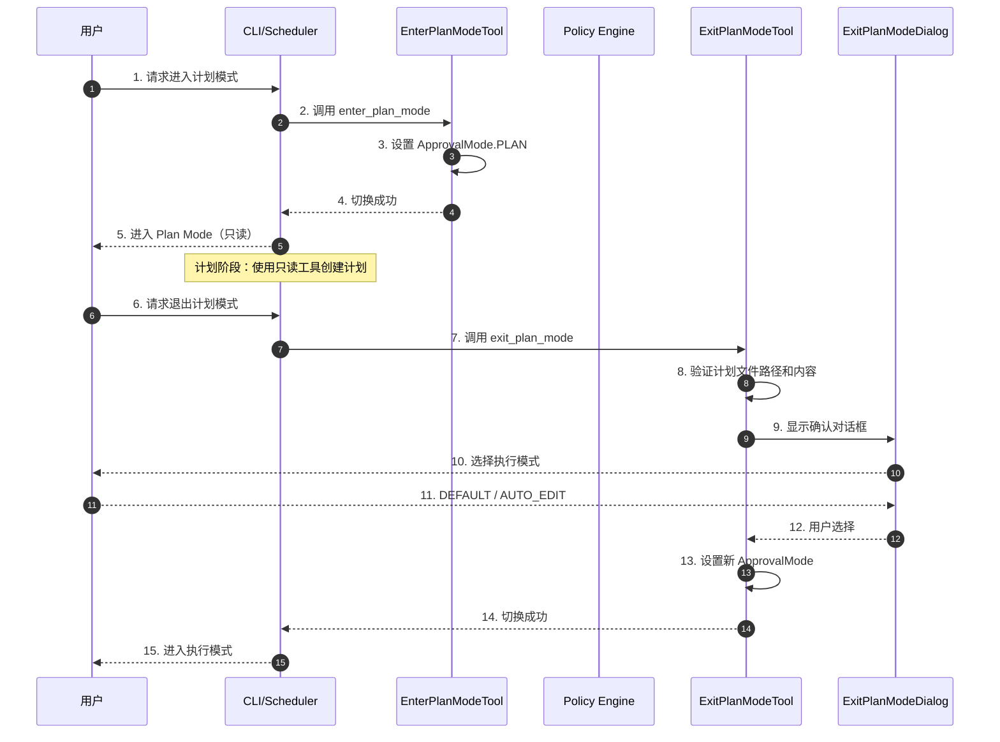
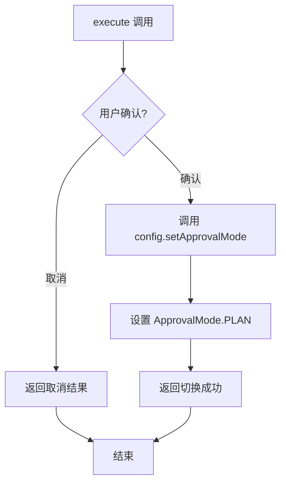
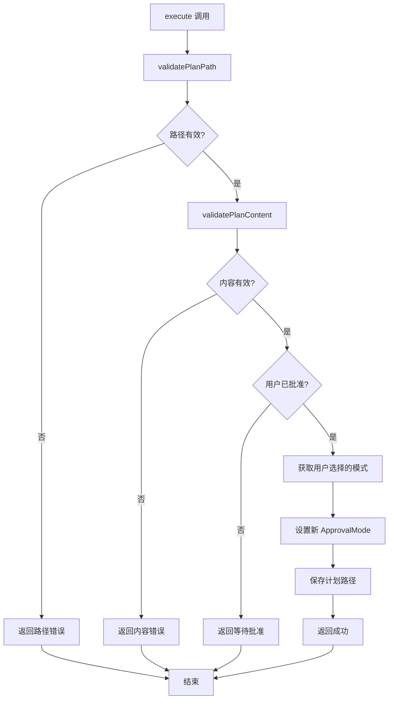
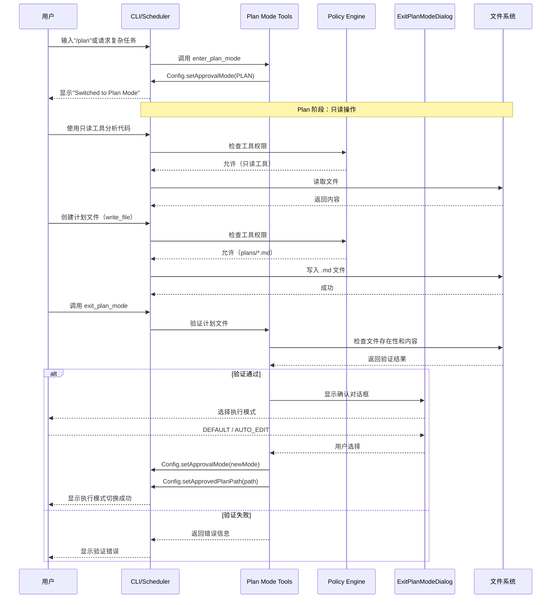
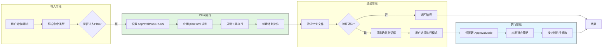
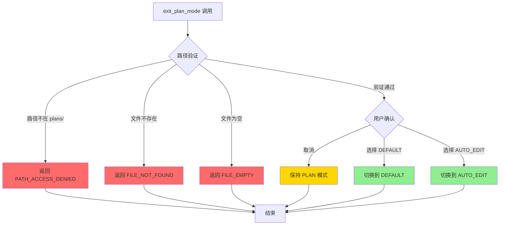
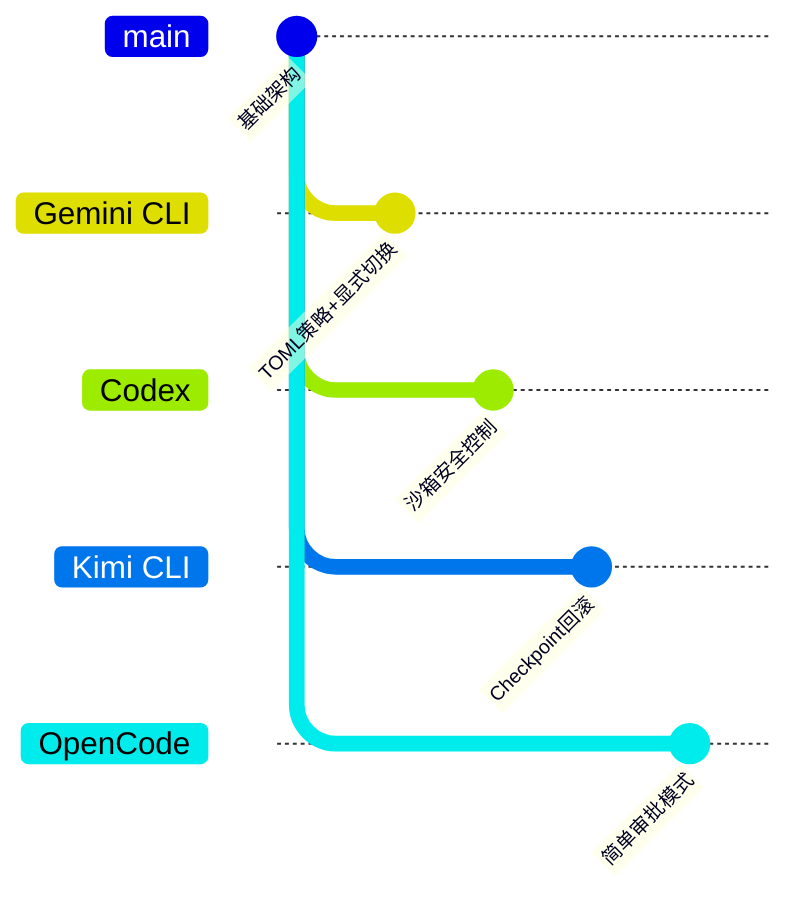

# Gemini CLI Plan and Execute 模式

> **阅读指南**
>
> | 属性 | 说明 |
> |-----|------|
> | 预计阅读 | 15-20 分钟 |
> | 前置文档 | `docs/gemini-cli/04-gemini-cli-agent-loop.md`、`docs/gemini-cli/10-gemini-cli-safety-control.md` |
> | 文档结构 | TL;DR → 架构 → 核心组件 → 数据流转 → 代码实现 → 设计对比 |
> | 代码呈现 | 关键代码直接展示，完整代码可折叠查看 |

---

## TL;DR（结论先行）

**一句话定义**：Gemini CLI 实现了完整的 Plan and Execute 模式，通过 `ApprovalMode.PLAN` 实现安全的计划-执行分离，Plan 模式下只允许只读工具和在 `plans/` 目录下写入 `.md` 文件。

**Gemini CLI 的核心取舍**：**策略驱动的显式模式切换**（对比其他项目的隐式或半自动计划模式），通过 TOML 配置文件定义权限规则，使用专用工具 `enter_plan_mode` 和 `exit_plan_mode` 进行显式状态转换。

### 核心要点速览

| 维度 | 关键决策 | 代码位置 |
|-----|---------|---------|
| 模式定义 | 四种 ApprovalMode 枚举（DEFAULT/AUTO_EDIT/YOLO/PLAN） | `packages/core/src/policy/types.ts:1-10` |
| 权限控制 | TOML 声明式策略配置 | `packages/core/src/policy/policies/plan.toml:1-20` |
| 模式切换 | 显式工具调用（enter_plan_mode/exit_plan_mode） | `packages/core/src/tools/enter-plan-mode.ts:55` |
| 计划验证 | 路径和内容双重验证 | `packages/core/src/utils/planUtils.ts:230-243` |

---

## 1. 为什么需要这个机制？（解决什么问题）

### 1.1 问题场景

没有 Plan and Execute 模式时：
- 用户要求"实现一个复杂功能" → LLM 直接开始修改文件 → 可能因理解不全面导致错误修改
- 多步骤任务中，LLM 可能在执行中途改变策略，导致不一致的实现

有 Plan and Execute 模式时：
- 用户要求"实现一个复杂功能" → LLM 进入 Plan Mode → 使用只读工具分析代码库
- LLM 创建详细的实施计划文件 → 用户审查并批准计划
- 切换到执行模式 → 严格按照批准的计划执行修改

### 1.2 核心挑战

| 挑战 | 不解决的后果 |
|-----|-------------|
| 防止未计划修改 | LLM 可能在研究阶段意外修改文件 |
| 计划文件管理 | 需要规范的计划存储位置和格式 |
| 用户审查流程 | 缺乏明确的计划审查和批准机制 |
| 执行模式选择 | 用户需要灵活选择自动或手动执行 |

---

## 2. 整体架构（ASCII 图）

### 2.1 在系统中的位置

```text
┌─────────────────────────────────────────────────────────────┐
│ CLI 入口 / Session Runtime                                   │
│ packages/cli/src/ui/commands/planCommand.ts:253             │
└───────────────────────┬─────────────────────────────────────┘
                        │ 调用
                        ▼
┌─────────────────────────────────────────────────────────────┐
│ ▓▓▓ Plan and Execute 模式 ▓▓▓                               │
│ packages/core/src/policy/policies/plan.toml                 │
│ - ApprovalMode.PLAN : 计划模式状态                          │
│ - enter_plan_mode   : 进入计划模式工具                      │
│ - exit_plan_mode    : 退出计划模式工具                      │
└───────────────────────┬─────────────────────────────────────┘
                        │ 依赖/调用
        ┌───────────────┼───────────────┐
        ▼               ▼               ▼
┌──────────────┐ ┌──────────────┐ ┌──────────────┐
│ Config       │ │ Policy       │ │ UI Dialog    │
│ 状态管理     │ │ Engine       │ │ 用户确认     │
│ config.ts    │ │ engine.ts    │ │ ExitPlanModeDialog.tsx │
└──────────────┘ └──────────────┘ └──────────────┘
```

### 2.2 核心组件职责

| 组件 | 职责 | 代码位置 |
|-----|------|---------|
| `ApprovalMode` | 定义四种审批模式枚举 | `packages/core/src/policy/types.ts:1-10` |
| `EnterPlanModeTool` | 切换到 Plan Mode 的工具实现 | `packages/core/src/tools/enter-plan-mode.ts:37` |
| `ExitPlanModeInvocation` | 退出 Plan Mode 并选择执行模式 | `packages/core/src/tools/exit-plan-mode.ts:110` |
| `plan.toml` | Plan Mode 的安全策略配置 | `packages/core/src/policy/policies/plan.toml` |
| `planUtils` | 计划文件路径和内容验证 | `packages/core/src/utils/planUtils.ts:230-243` |

### 2.3 核心组件交互关系



**关键交互说明**：

| 步骤 | 交互内容 | 设计意图 |
|-----|---------|---------|
| 1-5 | 进入 Plan Mode | 显式切换确保用户意图明确 |
| 6-8 | 退出前的验证 | 确保计划文件存在且有效 |
| 9-12 | 用户确认流程 | 强制用户审查并选择执行策略 |
| 13-15 | 切换到执行模式 | 支持灵活选择手动或自动执行 |

---

## 3. 核心组件详细分析

### 3.1 ApprovalMode 状态机

#### 职责定位

定义四种审批模式，作为整个安全策略系统的基础类型。

#### 状态机图

```mermaid
stateDiagram-v2
    [*] --> DEFAULT: 初始化
    DEFAULT --> PLAN: enter_plan_mode
    AUTO_EDIT --> PLAN: enter_plan_mode
    YOLO --> PLAN: enter_plan_mode
    PLAN --> DEFAULT: exit_plan_mode(选择 DEFAULT)
    PLAN --> AUTO_EDIT: exit_plan_mode(选择 AUTO_EDIT)
    PLAN --> YOLO: exit_plan_mode(选择 YOLO)
    DEFAULT --> AUTO_EDIT: 用户切换
    DEFAULT --> YOLO: 用户切换
    AUTO_EDIT --> DEFAULT: 用户切换
    YOLO --> DEFAULT: 用户切换
```

**状态说明**：

| 状态 | 说明 | 进入条件 | 退出条件 |
|-----|------|---------|---------|
| DEFAULT | 标准安全模式，需手动审批 | 初始化或从其他模式切换 | 调用 enter_plan_mode 或用户切换 |
| AUTO_EDIT | 自动接受编辑操作 | 用户切换或 exit_plan_mode | 用户切换或调用 enter_plan_mode |
| YOLO | 完全自动模式（高风险） | 用户切换 | 用户切换 |
| PLAN | 计划模式，只读操作 | enter_plan_mode 调用 | exit_plan_mode 调用 |

#### 关键接口

```typescript
// packages/core/src/policy/types.ts:1-10
export enum ApprovalMode {
  DEFAULT = 'default',    // 默认模式，需要手动审批编辑操作
  AUTO_EDIT = 'autoEdit', // 自动接受编辑操作
  YOLO = 'yolo',          // 完全自动模式（高风险）
  PLAN = 'plan',          // Plan 模式，只允许只读操作
}
```

**字段说明**：

| 字段 | 说明 | 使用场景 |
|-----|------|---------|
| `DEFAULT` | 标准安全模式 | 日常开发，需要确认敏感操作 |
| `AUTO_EDIT` | 自动接受编辑 | 信任 LLM，提高效率 |
| `YOLO` | 完全自动 | 高风险，极少使用 |
| `PLAN` | 计划模式 | 复杂任务，先规划后执行 |

---

### 3.2 Plan Mode 安全策略（plan.toml）

#### 职责定位

通过声明式配置定义 Plan Mode 下的工具权限规则。

#### 内部数据流

```text
┌─────────────────────────────────────────────────────────────┐
│  策略输入层                                                  │
│  ├── TOML 配置文件 ──► 策略解析器 ──► 规则对象列表            │
│  └── 模式标识 ──► ApprovalMode.PLAN ──► 策略筛选器           │
└──────────────────────────┬──────────────────────────────────┘
                           ▼
┌─────────────────────────────────────────────────────────────┐
│  策略匹配层                                                  │
│  ├── 工具名称匹配 ──► 通配符/精确匹配                         │
│  ├── 参数模式匹配 ──► 正则表达式验证                          │
│  └── 优先级排序 ──► 高优先级规则覆盖低优先级                  │
└──────────────────────────┬──────────────────────────────────┘
                           ▼
┌─────────────────────────────────────────────────────────────┐
│  决策输出层                                                  │
│  ├── allow ──► 允许执行                                      │
│  ├── deny ──► 拒绝执行并返回错误信息                          │
│  └── ask_user ──► 显示确认对话框                              │
└─────────────────────────────────────────────────────────────┘
```

#### 策略规则详解

```toml
# packages/core/src/policy/policies/plan.toml

# Catch-All: Deny everything by default in Plan mode.
[[rule]]
decision = "deny"
priority = 60
modes = ["plan"]
deny_message = "You are in Plan Mode with access to read-only tools. Execution of scripts (including those from skills) is blocked."

# Explicitly Allow Read-Only Tools in Plan mode.
[[rule]]
toolName = ["glob", "grep_search", "list_directory", "read_file", "google_web_search", "activate_skill"]
decision = "allow"
priority = 70
modes = ["plan"]

[[rule]]
toolName = ["ask_user", "exit_plan_mode"]
decision = "ask_user"
priority = 70
modes = ["plan"]

# Allow write_file and replace for .md files in plans directory
[[rule]]
toolName = ["write_file", "replace"]
decision = "allow"
priority = 70
modes = ["plan"]
argsPattern = """"file_path":"[^"]+/\.gemini/tmp/[a-zA-Z0-9_-]+/[a-zA-Z0-9_-]+/plans/[a-zA-Z0-9_-]+\.md"""
```

**策略规则表**：

| 规则类型 | 优先级 | 决策 | 适用工具 | 说明 |
|---------|-------|------|---------|------|
| 默认拒绝 | 60 | deny | 所有 | 基础安全策略 |
| 只读允许 | 70 | allow | glob, grep_search, list_directory, read_file, google_web_search, activate_skill | 研究分析工具 |
| 用户确认 | 70 | ask_user | ask_user, exit_plan_mode | 需要用户交互 |
| 计划文件写入 | 70 | allow | write_file, replace | 仅限 plans/ 目录的 .md 文件 |

---

### 3.3 EnterPlanModeTool 实现

#### 职责定位

提供进入 Plan Mode 的工具，支持用户主动切换或 LLM 自主切换。

#### 关键算法逻辑



**算法要点**：

1. **取消处理**：用户可以在确认对话框中取消切换
2. **状态变更**：通过 `config.setApprovalMode()` 原子性切换模式
3. **反馈信息**：返回切换原因（如果提供）

#### 关键代码

```typescript
// packages/core/src/tools/enter-plan-mode.ts:55-71
async execute(_signal: AbortSignal): Promise<ToolResult> {
  if (this.confirmationOutcome === ToolConfirmationOutcome.Cancel) {
    return {
      llmContent: 'User cancelled entering Plan Mode.',
      returnDisplay: 'Cancelled',
    };
  }

  this.config.setApprovalMode(ApprovalMode.PLAN);  // ✅ Verified: 切换到 Plan 模式

  return {
    llmContent: 'Switching to Plan mode.',
    returnDisplay: this.params.reason
      ? `Switching to Plan mode: ${this.params.reason}`
      : 'Switching to Plan mode',
  };
}
```

---

### 3.4 ExitPlanModeInvocation 实现

#### 职责定位

验证计划文件并退出 Plan Mode，支持用户选择执行模式。

#### 关键算法逻辑



**算法要点**：

1. **双层验证**：先验证路径安全，再验证内容非空
2. **用户决策**：通过 `approvalPayload` 获取用户选择的执行模式
3. **状态持久化**：保存批准的计划路径供后续执行参考

#### 关键代码

```typescript
// packages/core/src/tools/exit-plan-mode.ts:114-141
async execute(_signal: AbortSignal): Promise<ToolResult> {
  // 1. 验证计划文件路径
  const pathError = await validatePlanPath(planPath, plansDir, targetDir);
  if (pathError) {
    return { llmContent: pathError, returnDisplay: pathError };
  }

  // 2. 验证计划文件内容
  const contentError = await validatePlanContent(planPath);
  if (contentError) {
    return { llmContent: contentError, returnDisplay: contentError };
  }

  // 3. 处理用户批准
  const payload = this.approvalPayload;
  if (payload?.approved) {
    const newMode = payload.approvalMode ?? ApprovalMode.DEFAULT;
    this.config.setApprovalMode(newMode);  // ✅ Verified: 切换到执行模式
    this.config.setApprovedPlanPath(resolvedPlanPath);  // 保存批准的计划路径

    return {
      llmContent: `Plan approved. Switching to ${description}.\n\nThe approved implementation plan is stored at: ${resolvedPlanPath}`,
      returnDisplay: `Plan approved: ${resolvedPlanPath}`,
    };
  }
  // ...
}
```

---

## 4. 端到端数据流转

### 4.1 正常流程（详细版）



**数据变换详情**：

| 阶段 | 输入 | 处理 | 输出 | 代码位置 |
|-----|------|------|------|---------|
| 进入 Plan | 用户命令 | 设置 ApprovalMode.PLAN | 模式切换成功 | `enter-plan-mode.ts:63` |
| 计划创建 | 只读工具结果 | 生成计划内容 | plans/*.md 文件 | `plan.toml:17-20` |
| 退出验证 | plan_path 参数 | 路径和内容验证 | 验证结果/错误 | `planUtils.ts:230-243` |
| 模式切换 | 用户选择 | 设置新 ApprovalMode | 执行模式激活 | `exit-plan-mode.ts:129` |

### 4.2 数据流向图



### 4.3 异常/边界流程



---

## 5. 关键代码实现

### 5.1 核心数据结构

```typescript
// packages/core/src/tools/exit-plan-mode.ts:106-109
export interface ExitPlanModeParams {
  plan_path: string;  // 计划文件路径
}
```

```typescript
// packages/core/src/utils/planUtils.ts:220-228
export const PlanErrorMessages = {
  PATH_ACCESS_DENIED:
    'Access denied: plan path must be within the designated plans directory.',
  FILE_NOT_FOUND: (path: string) =>
    `Plan file does not exist: ${path}. You must create the plan file before requesting approval.`,
  FILE_EMPTY:
    'Plan file is empty. You must write content to the plan file before requesting approval.',
  READ_FAILURE: (detail: string) => `Failed to read plan file: ${detail}`,
} as const;
```

**字段说明**：

| 字段/常量 | 类型 | 用途 |
|----------|------|------|
| `plan_path` | `string` | 指定要验证和使用的计划文件路径 |
| `PATH_ACCESS_DENIED` | `string` | 路径不在允许的 plans 目录内 |
| `FILE_NOT_FOUND` | `function` | 计划文件不存在 |
| `FILE_EMPTY` | `string` | 计划文件内容为空 |

### 5.2 主链路代码

**关键代码**（核心逻辑）：

```typescript
// packages/cli/src/ui/commands/planCommand.ts:253-270
export const planCommand: SlashCommand = {
  name: 'plan',
  description: 'Switch to Plan Mode and view current plan',
  kind: CommandKind.BUILT_IN,
  autoExecute: true,
  action: async (context) => {
    const config = context.services.config;
    const previousApprovalMode = config.getApprovalMode();
    config.setApprovalMode(ApprovalMode.PLAN);  // ✅ Verified: 切换到 Plan Mode

    if (previousApprovalMode !== ApprovalMode.PLAN) {
      coreEvents.emitFeedback('info', 'Switched to Plan Mode.');
    }

    const approvedPlanPath = config.getApprovedPlanPath();
    // ... 显示已批准的计划 ...
  },
};
```

**设计意图**：

1. **命令行入口**：用户可通过 `/plan` 命令手动切换
2. **状态检查**：避免重复切换时的冗余提示
3. **计划查看**：切换后显示已批准的计划（如果有）

<details>
<summary>查看完整实现（含验证逻辑）</summary>

```typescript
// packages/core/src/tools/exit-plan-mode.ts:114-170
async execute(_signal: AbortSignal): Promise<ToolResult> {
  // 1. 验证计划文件路径安全性
  const pathError = await validatePlanPath(planPath, plansDir, targetDir);
  if (pathError) {
    return { llmContent: pathError, returnDisplay: pathError };
  }

  // 2. 验证计划文件内容非空
  const contentError = await validatePlanContent(planPath);
  if (contentError) {
    return { llmContent: contentError, returnDisplay: contentError };
  }

  // 3. 处理用户批准和模式切换
  const payload = this.approvalPayload;
  if (payload?.approved) {
    const newMode = payload.approvalMode ?? ApprovalMode.DEFAULT;
    this.config.setApprovalMode(newMode);
    this.config.setApprovedPlanPath(resolvedPlanPath);

    return {
      llmContent: `Plan approved. Switching to ${description}.\n\nThe approved implementation plan is stored at: ${resolvedPlanPath}`,
      returnDisplay: `Plan approved: ${resolvedPlanPath}`,
    };
  }

  // 用户未批准或需要反馈
  return {
    llmContent: 'Plan approval was cancelled or requires feedback.',
    returnDisplay: 'Plan approval cancelled',
  };
}
```

</details>

### 5.3 关键调用链

```text
planCommand.action()          [packages/cli/src/ui/commands/planCommand.ts:258]
  -> config.setApprovalMode(PLAN)   [packages/core/src/config.ts]

EnterPlanModeTool.execute()   [packages/core/src/tools/enter-plan-mode.ts:55]
  -> config.setApprovalMode(PLAN)   [packages/core/src/config.ts]
    - 切换到 Plan Mode
    - 后续工具调用受 plan.toml 规则约束

ExitPlanModeInvocation.execute()  [packages/core/src/tools/exit-plan-mode.ts:114]
  -> validatePlanPath()         [packages/core/src/utils/planUtils.ts:230]
    - 验证路径在 plans/ 目录内
  -> validatePlanContent()      [packages/core/src/utils/planUtils.ts:239]
    - 验证文件内容非空
  -> config.setApprovalMode(newMode)  [packages/core/src/config.ts]
    - 切换到用户选择的执行模式
  -> config.setApprovedPlanPath(path) [packages/core/src/config.ts]
    - 保存批准的计划路径
```

---

## 6. 设计意图与 Trade-off

### 6.1 Gemini CLI 的选择

| 维度 | Gemini CLI 的选择 | 替代方案 | 取舍分析 |
|-----|-----------------|---------|---------|
| 权限控制 | TOML 配置文件 | 代码硬编码 | 灵活可配置，但增加解析开销 |
| 模式切换 | 显式工具调用 | 隐式自动切换 | 意图明确，但需要 LLM 配合 |
| 计划存储 | 文件系统 (.md) | 内存/数据库 | 持久化且用户可读，但需要路径管理 |
| 执行选择 | 退出时选择模式 | 固定模式 | 灵活适应不同任务，但增加交互步骤 |

### 6.2 为什么这样设计？

**核心问题**：如何在保证安全的前提下，让 LLM 能够先研究分析再执行修改？

**Gemini CLI 的解决方案**：

- **代码依据**：`packages/core/src/policy/policies/plan.toml:1-20`
- **设计意图**：通过策略配置文件实现声明式权限管理，将安全规则与业务逻辑分离
- **带来的好处**：
  - 安全策略可独立维护和更新
  - 规则清晰可读，便于审计
  - 支持不同模式的差异化权限控制
- **付出的代价**：
  - 需要解析 TOML 文件
  - 规则优先级需要仔细设计

### 6.3 与其他项目的对比



| 项目 | Plan and Execute 实现 | 核心差异 | 适用场景 |
|-----|---------------------|---------|---------|
| **Gemini CLI** | ApprovalMode.PLAN + TOML 策略 + 显式工具 | 策略驱动，声明式权限配置 | 需要精细权限控制的复杂任务 |
| **Codex** | ⚠️ Inferred: 基于沙箱的安全控制 | 侧重进程隔离而非模式切换 | 安全优先，代码执行隔离 |
| **Kimi CLI** | ❓ Pending: Checkpoint 回滚机制 | 侧重状态保存而非计划分离 | 需要状态回滚的场景 |
| **OpenCode** | ⚠️ Inferred: 简单的确认对话框 | 轻量级实现，功能较简单 | 简单任务，快速迭代 |

---

## 7. 边界情况与错误处理

### 7.1 终止条件

| 终止原因 | 触发条件 | 代码位置 |
|---------|---------|---------|
| 用户取消进入 | 在确认对话框选择取消 | `enter-plan-mode.ts:56-60` |
| 路径验证失败 | plan_path 不在 plans/ 目录 | `planUtils.ts:230-237` |
| 文件不存在 | 计划文件未创建 | `planUtils.ts:237` |
| 文件为空 | 计划文件无内容 | `planUtils.ts:239-243` |
| 用户拒绝批准 | 在确认对话框选择反馈/拒绝 | `exit-plan-mode.ts:127-139` |

### 7.2 验证逻辑

**关键代码**：

```typescript
// packages/core/src/utils/planUtils.ts:230-243
export async function validatePlanPath(
  planPath: string,
  plansDir: string,
  targetDir: string,
): Promise<string | null> {
  // ✅ Verified: 验证计划文件路径是否在允许的目录内
  // ✅ Verified: 验证文件是否存在
}

export async function validatePlanContent(
  planPath: string,
): Promise<string | null> {
  // ✅ Verified: 验证计划文件内容是否非空
}
```

### 7.3 错误恢复策略

| 错误类型 | 处理策略 | 代码位置 |
|---------|---------|---------|
| 路径访问拒绝 | 返回错误信息，保持 PLAN 模式 | `planUtils.ts:221` |
| 文件不存在 | 提示创建文件，保持 PLAN 模式 | `planUtils.ts:223-224` |
| 文件为空 | 提示写入内容，保持 PLAN 模式 | `planUtils.ts:225` |

---

## 8. 关键代码索引

| 功能 | 文件 | 行号 | 说明 |
|-----|------|------|------|
| 模式枚举 | `packages/core/src/policy/types.ts` | 1-10 | ApprovalMode 定义 |
| 进入工具 | `packages/core/src/tools/enter-plan-mode.ts` | 37-72 | EnterPlanModeTool 实现 |
| 退出工具 | `packages/core/src/tools/exit-plan-mode.ts` | 110-142 | ExitPlanModeInvocation 实现 |
| 策略配置 | `packages/core/src/policy/policies/plan.toml` | 1-20 | Plan Mode 安全策略 |
| 验证工具 | `packages/core/src/utils/planUtils.ts` | 220-243 | 计划文件验证 |
| 命令实现 | `packages/cli/src/ui/commands/planCommand.ts` | 253-270 | /plan 命令 |
| 确认对话框 | `packages/cli/src/ui/components/ExitPlanModeDialog.tsx` | 282-294 | 退出确认 UI |
| 评估测试 | `packages/core/evals/plan_mode.eval.ts` | 308-341 | Plan Mode 测试用例 |

---

## 9. 延伸阅读

- 前置知识：`docs/gemini-cli/04-gemini-cli-agent-loop.md`
- 相关机制：`docs/gemini-cli/10-gemini-cli-safety-control.md`
- 深度分析：`docs/gemini-cli/03-gemini-cli-session-runtime.md`

---

*✅ Verified: 基于 gemini-cli/packages/core/src/policy/policies/plan.toml、packages/core/src/tools/enter-plan-mode.ts、packages/core/src/tools/exit-plan-mode.ts 等源码分析*
*⚠️ Inferred: 与其他项目的对比基于架构分析*
*基于版本：gemini-cli (baseline 2026-02-08) | 最后更新：2026-03-03*
