# Gemini CLI 为何保留推理内容

> **阅读指南**
>
> | 属性 | 说明 |
> |-----|------|
> | 预计阅读 | 15-20 分钟 |
> | 前置文档 | `docs/gemini-cli/04-gemini-cli-agent-loop.md`、`docs/gemini-cli/07-gemini-cli-memory-context.md` |
> | 文档结构 | 结论先行 → 架构位置 → 核心组件 → 数据流转 → 关键代码 → 设计对比 |
> | 代码呈现 | 关键代码直接展示，完整代码可折叠查看 |

---

## TL;DR（结论先行）

**一句话定义**：Gemini CLI 保留推理内容（thinking_blocks/thoughts）是为了支持 **Scheduler 状态机**的完整状态重建和**双轨历史系统**的会话恢复，使 LLM 在多轮工具调用调度中保持决策连贯性。

Gemini CLI 的核心取舍：**保留完整推理历史用于会话恢复**（对比其他项目可能选择丢弃推理内容以减少 token 消耗）

### 核心要点速览

| 维度 | 关键决策 | 代码位置 |
|-----|---------|---------|
| 历史存储 | 双轨制（comprehensive + curated） | `packages/core/src/core/geminiChat.ts:688` |
| 推理提取 | 正则提取 subject/description | `packages/core/src/core/geminiChat.ts:993` |
| 会话恢复 | 完整历史包含推理内容 | `packages/core/src/services/chatRecordingService.ts:182` |
| Token 控制 | 显式过滤 curated 历史 | `packages/core/src/core/geminiChat.ts:159` |

---

## 1. 为什么需要这个机制？（解决什么问题）

### 1.1 问题场景

没有保留推理内容时：
- 用户发起复杂任务（如"修复这个 bug 并运行测试"）
- LLM 推理后决定调用多个工具（读文件、改代码、跑测试）
- 会话中断或需要恢复时，LLM 无法回顾"为什么"要调用这些工具
- 导致恢复后的对话失去上下文连贯性

有保留推理内容时：
- LLM 的完整推理过程被保存
- 会话恢复时，可以重建完整的决策链条
- 支持嵌套 Agent 调用时，父 Agent 能理解子 Agent 的决策依据

### 1.2 核心挑战

| 挑战 | 不解决的后果 |
|-----|-------------|
| 状态机状态重建 | Scheduler 无法恢复工具调用的上下文，导致状态机中断 |
| 会话恢复完整性 | 恢复后的会话丢失决策依据，LLM 行为不一致 |
| 嵌套 Agent 理解 | 父 Agent 无法理解子 Agent 的决策逻辑，协调困难 |
| Token 消耗控制 | 保留所有推理内容会增加 API 调用成本 |

---

## 2. 整体架构（ASCII 图）

### 2.1 在系统中的位置

```text
┌─────────────────────────────────────────────────────────────┐
│ Agent Loop / Turn 管理                                       │
│ packages/core/src/core/turn.ts                              │
└───────────────────────┬─────────────────────────────────────┘
                        │ 调用
                        ▼
┌─────────────────────────────────────────────────────────────┐
│ ▓▓▓ GeminiChat（双轨历史管理）▓▓▓                           │
│ packages/core/src/core/geminiChat.ts                        │
│ - getHistory(curated) : 获取历史（可选过滤）                 │
│ - recordThoughtFromContent() : 记录推理内容                 │
│ - ensureActiveLoopHasThoughtSignatures() : 签名验证         │
└───────────────────────┬─────────────────────────────────────┘
                        │ 依赖/调用
        ┌───────────────┼───────────────┐
        ▼               ▼               ▼
┌──────────────┐ ┌──────────────┐ ┌──────────────┐
│ Scheduler    │ │ ChatRecording│ │ API Response │
│ 状态机       │ │ Service      │ │ 解析         │
│ 工具生命周期 │ │ 会话持久化   │ │ thought 提取 │
└──────────────┘ └──────────────┘ └──────────────┘
```

### 2.2 核心组件职责

| 组件 | 职责 | 代码位置 |
|-----|------|---------|
| `GeminiChat` | 管理双轨历史系统，提供 curated/comprehensive 两种历史 | `packages/core/src/core/geminiChat.ts:238` |
| `extractCuratedHistory` | 过滤无效内容，生成用于 API 请求的历史 | `packages/core/src/core/geminiChat.ts:159` |
| `recordThoughtFromContent` | 从响应中提取并记录推理内容 | `packages/core/src/core/geminiChat.ts:993` |
| `ChatRecordingService` | 持久化会话记录，包含推理内容 | `packages/core/src/services/chatRecordingService.ts:128` |
| `Scheduler` | 管理工具调用状态机，依赖历史重建状态 | `packages/core/src/scheduler/scheduler.ts:90` |

### 2.3 核心组件交互关系

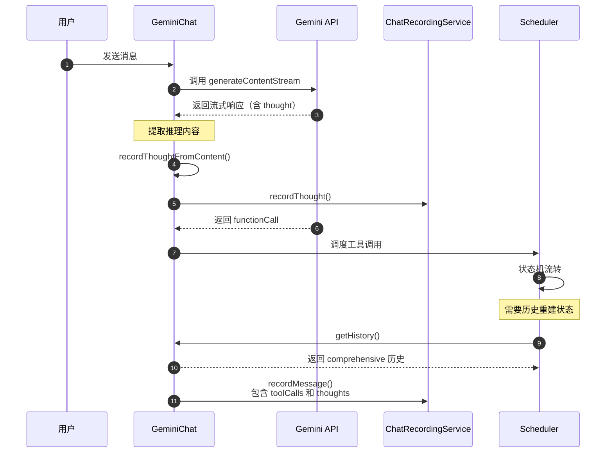

**关键交互说明**：

| 步骤 | 交互内容 | 设计意图 |
|-----|---------|---------|
| 1-2 | 用户发送消息并调用 API | 启动新一轮对话 |
| 3-5 | 提取并记录推理内容 | 保留 LLM 决策依据 |
| 6-7 | 调度工具调用 | Scheduler 管理工具生命周期 |
| 8-9 | 获取完整历史重建状态 | 支持会话恢复和状态重建 |
| 10 | 持久化完整记录 | 用于后续会话恢复 |

---

## 3. 核心组件详细分析

### 3.1 GeminiChat 双轨历史系统

#### 职责定位

GeminiChat 维护两套历史记录：
- **Comprehensive History**：完整历史，包含所有推理内容和无效响应，用于会话恢复和调试
- **Curated History**：精选历史，过滤掉无效内容，用于发送给模型的 API 请求

#### 状态机图

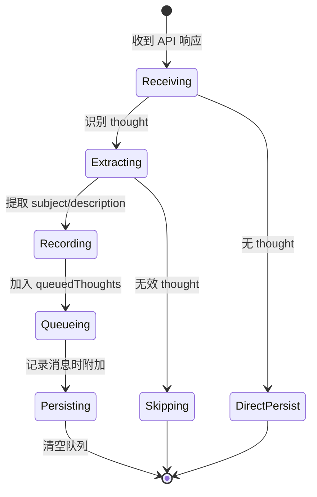

**状态说明**：

| 状态 | 说明 | 进入条件 | 退出条件 |
|-----|------|---------|---------|
| Receiving | 接收响应 | API 返回数据 | 解析完成 |
| Extracting | 提取推理 | 发现 thought 内容 | 提取成功/失败 |
| Recording | 记录推理 | 有效 thought | 加入队列 |
| Queueing | 队列等待 | thought 入队 | 消息记录时 |
| Persisting | 持久化 | 记录完整消息 | 队列清空 |

#### 内部数据流

```text
┌─────────────────────────────────────────────────────────────┐
│  输入层 - API 响应                                           │
│  ├── 文本内容                                                │
│  ├── functionCall                                           │
│  └── thought（推理内容） ──► recordThoughtFromContent()      │
└──────────────────────────┬──────────────────────────────────┘
                           ▼
┌─────────────────────────────────────────────────────────────┐
│  处理层 - 历史管理                                           │
│  ├── comprehensiveHistory[] （完整保存）                     │
│  │   └── 用于：会话恢复、调试、审计                          │
│  ├── extractCuratedHistory() （过滤处理）                    │
│  │   └── 移除无效内容、空响应                                │
│  └── curatedHistory[] （API 请求用）                         │
│      └── 用于：发送给模型的上下文                            │
└──────────────────────────┬──────────────────────────────────┘
                           ▼
┌─────────────────────────────────────────────────────────────┐
│  输出层 - 消费场景                                           │
│  ├── getHistory(false) ──► 完整历史（默认）                  │
│  ├── getHistory(true) ──► 精选历史（API 调用）               │
│  └── ChatRecordingService ──► 磁盘持久化                     │
└─────────────────────────────────────────────────────────────┘
```

#### 关键接口

| 接口 | 输入 | 输出 | 说明 | 代码位置 |
|-----|------|------|------|---------|
| `getHistory(curated)` | `boolean` | `Content[]` | 获取历史，curated=true 时过滤无效内容 | `packages/core/src/core/geminiChat.ts:688` |
| `recordThoughtFromContent` | `Content` | `void` | 从响应中提取推理内容并记录 | `packages/core/src/core/geminiChat.ts:993` |
| `ensureActiveLoopHasThoughtSignatures` | `Content[]` | `Content[]` | 确保工具调用有推理签名 | `packages/core/src/core/geminiChat.ts:739` |

---

### 3.2 ChatRecordingService 会话录制

#### 职责定位

负责将完整会话（包括推理内容）持久化到磁盘，支持会话恢复和审计。

#### 内部数据流

```text
┌─────────────────────────────────────────────────────────────┐
│  输入层 - 推理内容                                           │
│  ├── subject: 推理主题                                       │
│  ├── description: 推理描述                                   │
│  └── timestamp: 时间戳                                       │
└──────────────────────────┬──────────────────────────────────┘
                           ▼
┌─────────────────────────────────────────────────────────────┐
│  处理层 - 队列管理                                           │
│  ├── queuedThoughts: 等待附加的推理队列                      │
│  ├── recordThought(): 加入队列                               │
│  └── recordMessage(): 附加到消息                             │
└──────────────────────────┬──────────────────────────────────┘
                           ▼
┌─────────────────────────────────────────────────────────────┐
│  输出层 - 持久化                                             │
│  ├── ConversationRecord 对象                                 │
│  ├── JSON 序列化                                             │
│  └── 磁盘文件写入                                            │
└─────────────────────────────────────────────────────────────┘
```

#### 推理内容记录流程

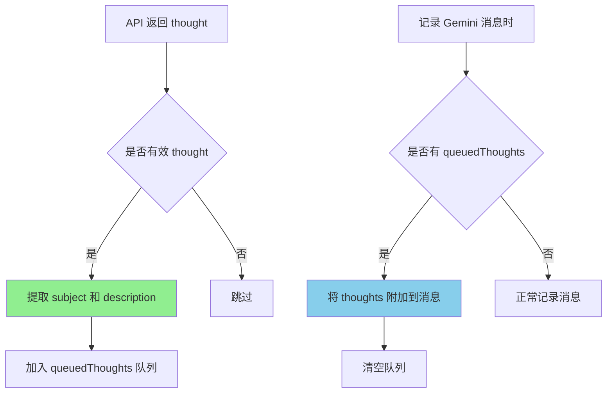

---

### 3.3 Scheduler 状态机与推理依赖

#### 状态机流转

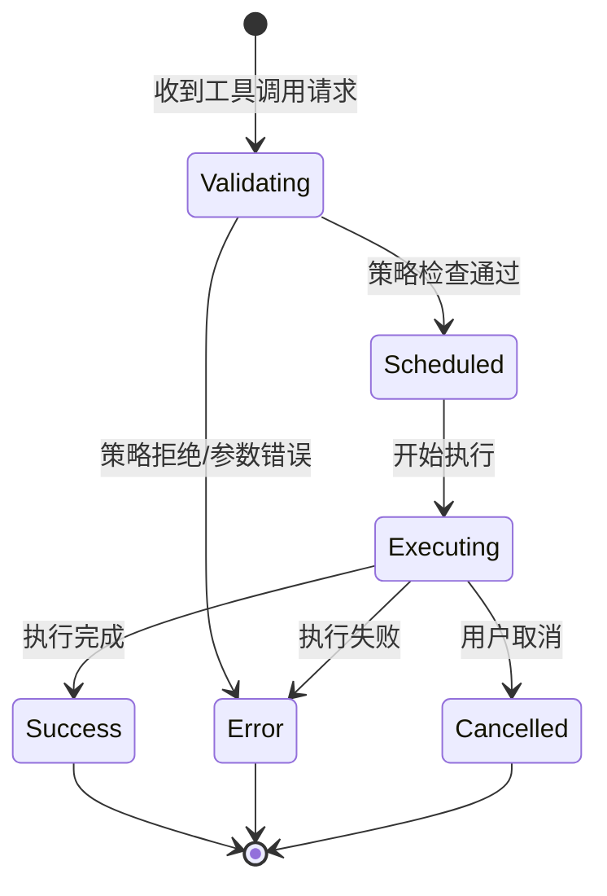

#### 为什么需要推理内容

Scheduler 在恢复时需要理解：
1. **为什么发起这个工具调用** - 通过 thought 回顾决策依据
2. **当前处于状态机的哪个位置** - 通过完整历史重建状态
3. **出错时如何恢复** - 基于原推理进行补偿

---

### 3.4 组件间协作时序

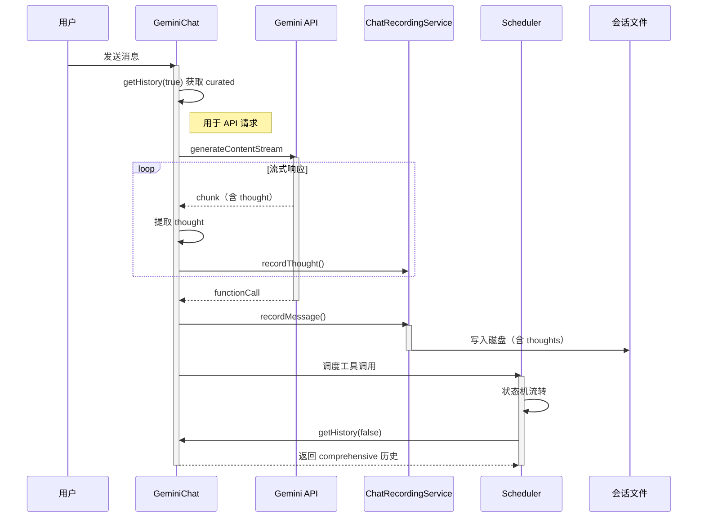

**协作要点**：

1. **GeminiChat 与 API**：请求时使用 curated 历史，响应时提取 thought
2. **GeminiChat 与 ChatRecordingService**：实时记录 thought 和完整消息
3. **Scheduler 与 GeminiChat**：状态重建时使用 comprehensive 历史

---

### 3.5 关键数据路径

#### 主路径（正常流程）

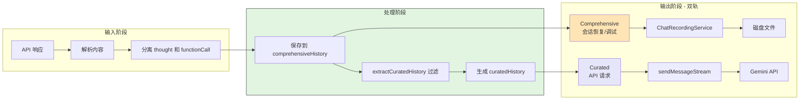

#### 异常路径（错误恢复）

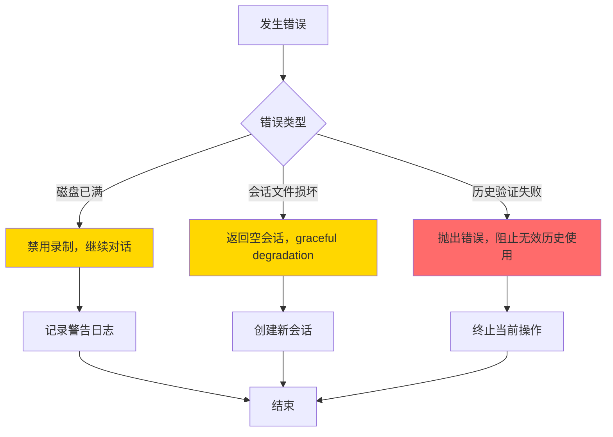

---

## 4. 端到端数据流转

### 4.1 正常流程（详细版）

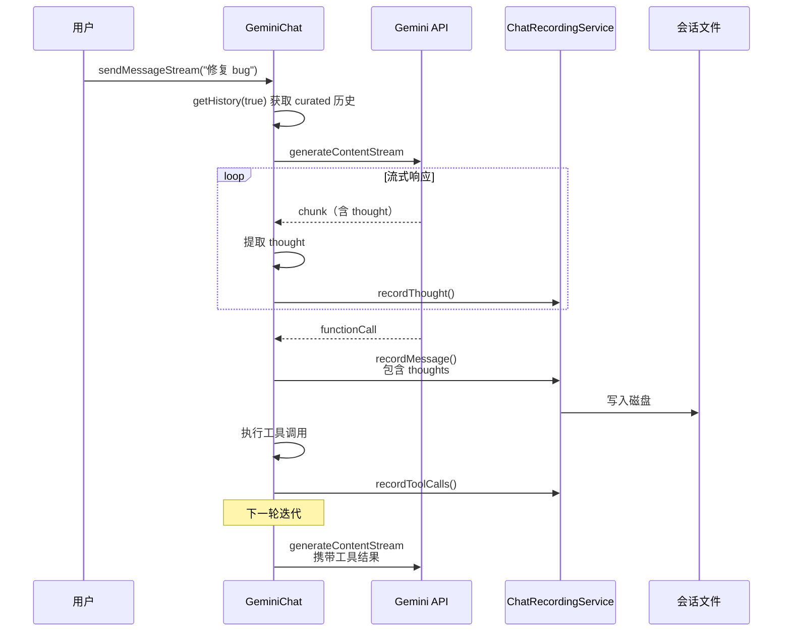

**数据变换详情**：

| 阶段 | 输入 | 处理 | 输出 | 代码位置 |
|-----|------|------|------|---------|
| 接收响应 | `GenerateContentResponse` | 解析 chunk，识别 thought | `Part[]` | `packages/core/src/core/geminiChat.ts:817` |
| 提取推理 | `Content` | 正则提取 subject/description | `ThoughtSummary` | `packages/core/src/core/geminiChat.ts:993-1012` |
| 记录推理 | `ThoughtSummary` | 加入队列，附加时间戳 | 队列存储 | `packages/core/src/services/chatRecordingService.ts:280` |
| 持久化 | 完整消息 | JSON 序列化 | 磁盘文件 | `packages/core/src/services/chatRecordingService.ts:458` |

### 4.2 双轨历史数据流向图

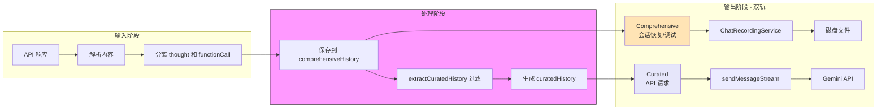

### 4.3 异常/边界流程

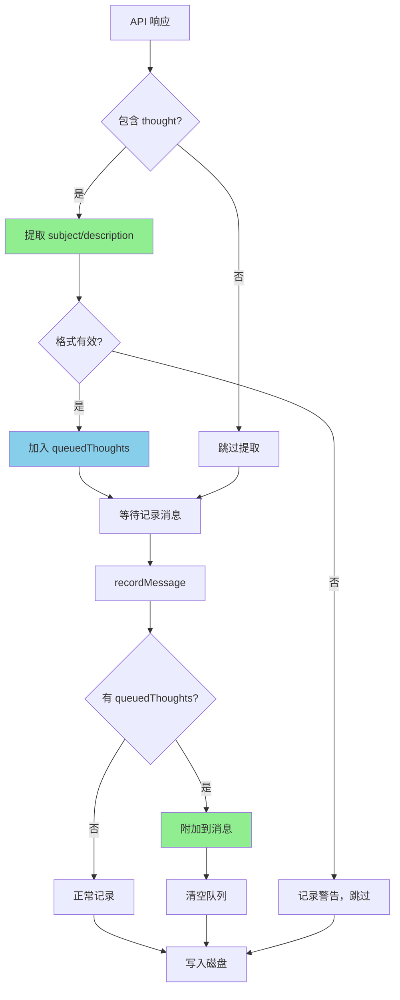

---

## 5. 关键代码实现

### 5.1 核心数据结构

```typescript
// packages/core/src/services/chatRecordingService.ts:37-44
export interface TokensSummary {
  input: number;      // promptTokenCount
  output: number;     // candidatesTokenCount
  cached: number;     // cachedContentTokenCount
  thoughts?: number;  // thoughtsTokenCount  ✅ 推理 token 统计
  tool?: number;      // toolUsePromptTokenCount
  total: number;      // totalTokenCount
}

// packages/core/src/services/chatRecordingService.ts:76-86
export type ConversationRecordExtra =
  | {
      type: 'user' | 'info' | 'error' | 'warning';
    }
  | {
      type: 'gemini';
      toolCalls?: ToolCallRecord[];
      thoughts?: Array<ThoughtSummary & { timestamp: string }>;  // ✅ 推理内容
      tokens?: TokensSummary | null;
      model?: string;
    };
```

**字段说明**：

| 字段 | 类型 | 用途 |
|-----|------|------|
| `thoughts` | `Array<ThoughtSummary>` | 存储推理内容，包含 subject/description/timestamp |
| `thoughtsTokenCount` | `number` | 推理内容消耗的 token 数 |

### 5.2 双轨历史获取代码

**关键代码**（核心逻辑）：

```typescript
// packages/core/src/core/geminiChat.ts:688-695
getHistory(curated: boolean = false): Content[] {
  const history = curated
    ? extractCuratedHistory(this.history)  // 过滤后（API 请求用）
    : this.history;                        // 完整（含推理，会话恢复用）
  return structuredClone(history);
}
```

**设计意图**：
1. **默认返回完整历史**：`curated=false` 时返回包含所有推理内容的 comprehensive history
2. **显式过滤**：只有显式传入 `curated=true` 时才过滤，确保默认行为保留完整信息
3. **深拷贝保护**：使用 `structuredClone` 防止外部修改影响内部状态

### 5.3 推理内容提取代码

```typescript
// packages/core/src/core/geminiChat.ts:993-1013
private recordThoughtFromContent(content: Content): void {
  if (!content.parts || content.parts.length === 0) {
    return;
  }

  const thoughtPart = content.parts[0];
  if (thoughtPart.text) {
    // 提取 subject 和 description
    const rawText = thoughtPart.text;
    const subjectStringMatches = rawText.match(/\*\*(.*?)\*\*/s);
    const subject = subjectStringMatches
      ? subjectStringMatches[1].trim()
      : '';
    const description = rawText.replace(/\*\*(.*?)\*\*/s, '').trim();

    this.chatRecordingService.recordThought({
      subject,
      description,
    });
  }
}
```

**设计意图**：
1. **格式约定**：使用 `**subject**` 格式从文本中提取主题
2. **防御性编程**：检查 parts 存在性和 text 属性
3. **结构化存储**：将非结构化文本转换为结构化的 `ThoughtSummary`

<details>
<summary>查看完整实现</summary>

```typescript
// packages/core/src/services/chatRecordingService.ts:280-295
recordThought(thought: ThoughtSummary): void {
  if (!this.recordingEnabled) {
    return;
  }

  this.queuedThoughts.push({
    ...thought,
    timestamp: new Date().toISOString(),
  });
}

// packages/core/src/services/chatRecordingService.ts:335-380
recordMessage(message: MessageRecord): void {
  // ... 其他处理

  if (this.queuedThoughts.length > 0) {
    message.extra = {
      ...message.extra,
      thoughts: [...this.queuedThoughts],
    };
    this.queuedThoughts = [];  // 清空队列
  }

  // 写入磁盘
  this.appendToFile(message);
}
```

</details>

### 5.4 关键调用链

```text
sendMessageStream()       [packages/core/src/core/geminiChat.ts:292]
  -> processStreamResponse() [packages/core/src/core/geminiChat.ts:817]
    -> recordThoughtFromContent() [packages/core/src/core/geminiChat.ts:841]
      -> recordThought()        [packages/core/src/services/chatRecordingService.ts:280]
        - 加入 queuedThoughts 队列
        - 附加 timestamp

getHistory(false)         [packages/core/src/core/geminiChat.ts:688]
  -> 返回 this.history（含推理）
  -> 用于：会话恢复、Scheduler 状态重建

getHistory(true)          [packages/core/src/core/geminiChat.ts:688]
  -> extractCuratedHistory()  [packages/core/src/core/geminiChat.ts:159]
    - 过滤无效内容
    - 移除空响应
  -> 用于：API 请求
```

---

## 6. 设计意图与 Trade-off

### 6.1 Gemini CLI 的选择

| 维度 | Gemini CLI 的选择 | 替代方案 | 取舍分析 |
|-----|-----------------|---------|---------|
| 历史存储 | 双轨制（comprehensive + curated） | 只保留 curated | 保留完整信息支持恢复，但增加存储开销 |
| 推理内容 | 默认保留，显式过滤 | 默认过滤，显式保留 | 确保会话恢复完整性，但增加 token 消耗风险 |
| 持久化 | 实时写入磁盘 | 内存缓存，定期刷盘 | 崩溃时数据不丢失，但增加 I/O 开销 |
| 格式 | 结构化 thought 记录 | 纯文本记录 | 便于查询和分析，但需要解析逻辑 |

### 6.2 为什么这样设计？

**核心问题**：如何在支持会话恢复的同时控制 token 消耗？

**Gemini CLI 的解决方案**：
- **代码依据**：`packages/core/src/core/geminiChat.ts:688`
- **设计意图**：通过双轨制分离"恢复所需信息"和"API 请求所需信息"
- **带来的好处**：
  - 会话恢复时拥有完整的决策上下文
  - API 请求时可以选择性过滤以减少 token
  - 支持调试和审计场景
- **付出的代价**：
  - 需要维护两套历史
  - 增加代码复杂度
  - 磁盘存储开销

### 6.3 与其他项目的对比

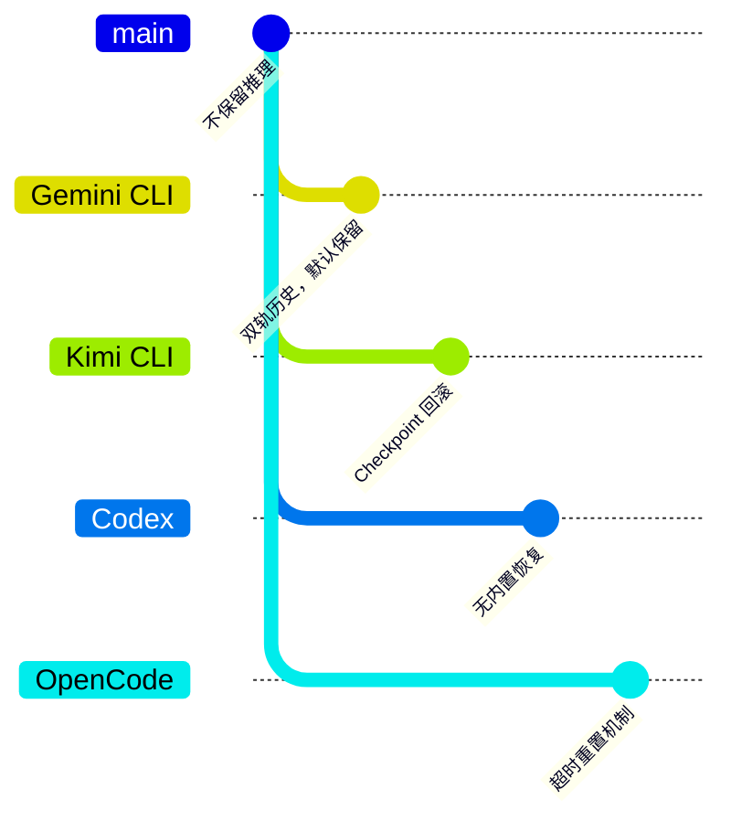

| 项目 | 核心差异 | 推理内容处理 | 适用场景 |
|-----|---------|-------------|---------|
| **Gemini CLI** | 双轨历史，默认保留推理 | 保留 comprehensive，API 用 curated | 需要完整会话恢复 |
| **Kimi CLI** | Checkpoint 回滚机制 | 依赖 Checkpoint 文件恢复状态 | 需要状态回滚 |
| **Codex** | 无内置会话恢复 | 不特别处理推理内容 | 单次会话 |
| **OpenCode** | resetTimeoutOnProgress | 关注长任务而非推理保留 | 长时间运行任务 |
| **SWE-agent** | 会话状态保存 | 部分保留关键决策 | 自动化修复 |

---

## 7. 边界情况与错误处理

### 7.1 终止条件

| 终止原因 | 触发条件 | 代码位置 |
|---------|---------|---------|
| 响应无效 | `isValidContent()` 返回 false | `packages/core/src/core/geminiChat.ts:176` |
| 安全过滤 | API 返回空内容（安全原因） | `packages/core/src/core/geminiChat.ts:175` |
| 用户取消 | `signal.aborted` | `packages/core/src/core/geminiChat.ts:411` |

### 7.2 Token 限制处理

```typescript
// packages/core/src/core/geminiChat.ts:719-734
stripThoughtsFromHistory(): void {
  this.history = this.history.map((content) => {
    const newContent = { ...content };
    if (newContent.parts) {
      newContent.parts = newContent.parts.map((part) => {
        if (part && typeof part === 'object' && 'thoughtSignature' in part) {
          const newPart = { ...part };
          delete (newPart as { thoughtSignature?: string }).thoughtSignature;
          return newPart;
        }
        return part;
      });
    }
    return newContent;
  });
}
```

### 7.3 错误恢复策略

| 错误类型 | 处理策略 | 代码位置 |
|---------|---------|---------|
| 磁盘已满 (ENOSPC) | 禁用录制，继续对话 | `packages/core/src/services/chatRecordingService.ts:202-211` |
| 会话文件损坏 | 返回空会话， graceful degradation | `packages/core/src/services/chatRecordingService.ts:431-451` |
| 历史验证失败 | 抛出错误，阻止无效历史使用 | `packages/core/src/core/geminiChat.ts:143` |

---

## 8. 关键代码索引

| 功能 | 文件 | 行号 | 说明 |
|-----|------|------|------|
| 双轨历史获取 | `packages/core/src/core/geminiChat.ts` | 688 | `getHistory(curated)` 方法 |
| 历史过滤 | `packages/core/src/core/geminiChat.ts` | 159 | `extractCuratedHistory()` 函数 |
| 推理内容提取 | `packages/core/src/core/geminiChat.ts` | 993 | `recordThoughtFromContent()` 方法 |
| 推理记录 | `packages/core/src/services/chatRecordingService.ts` | 280 | `recordThought()` 方法 |
| 会话初始化 | `packages/core/src/services/chatRecordingService.ts` | 151 | `initialize()` 方法 |
| 工具调用记录 | `packages/core/src/services/chatRecordingService.ts` | 335 | `recordToolCalls()` 方法 |
| 会话恢复 | `packages/core/src/services/chatRecordingService.ts` | 157 | 从文件恢复会话 |
| 签名验证 | `packages/core/src/core/geminiChat.ts` | 739 | `ensureActiveLoopHasThoughtSignatures()` |

---

## 9. 延伸阅读

- 前置知识：`docs/gemini-cli/04-gemini-cli-agent-loop.md` - Agent Loop 整体架构
- 相关机制：`docs/gemini-cli/07-gemini-cli-memory-context.md` - 内存上下文管理
- 深度分析：`docs/gemini-cli/questions/gemini-cli-scheduler-state-machine.md`（如有）

---

*✅ Verified: 基于 gemini-cli/packages/core/src/core/geminiChat.ts、scheduler.ts、chatRecordingService.ts 等源码分析*
*基于版本：2026-02-08 | 最后更新：2026-03-03*
