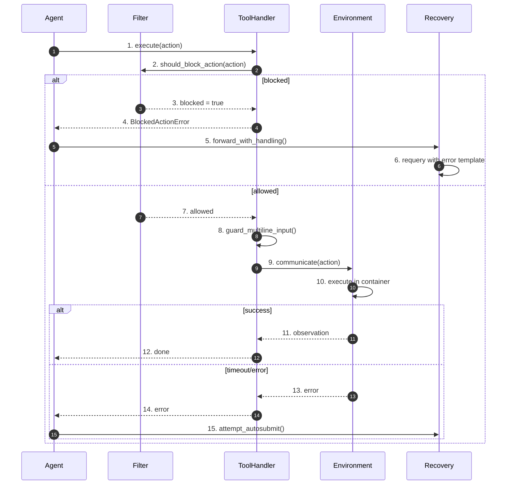
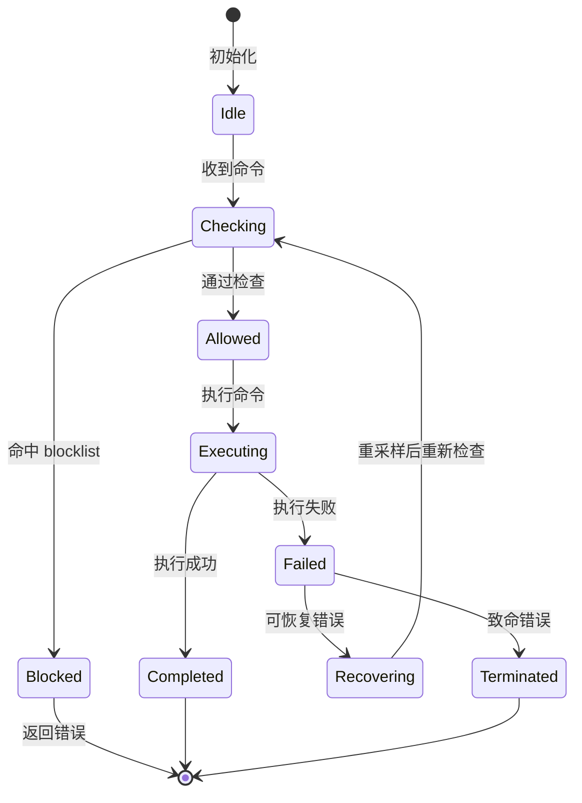
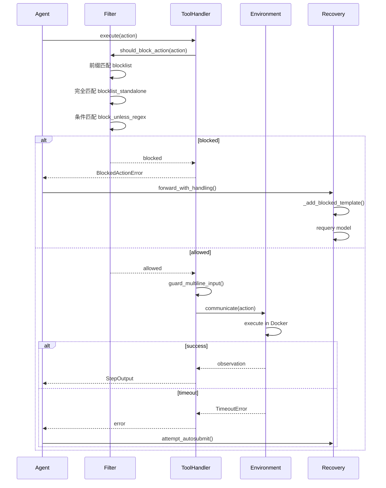
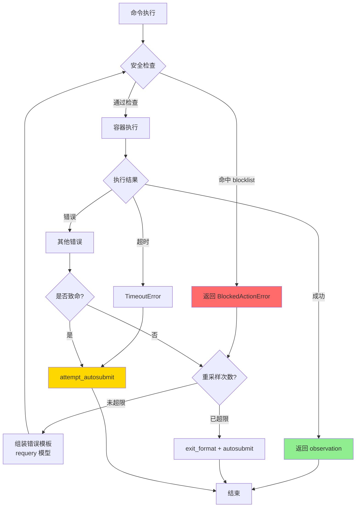
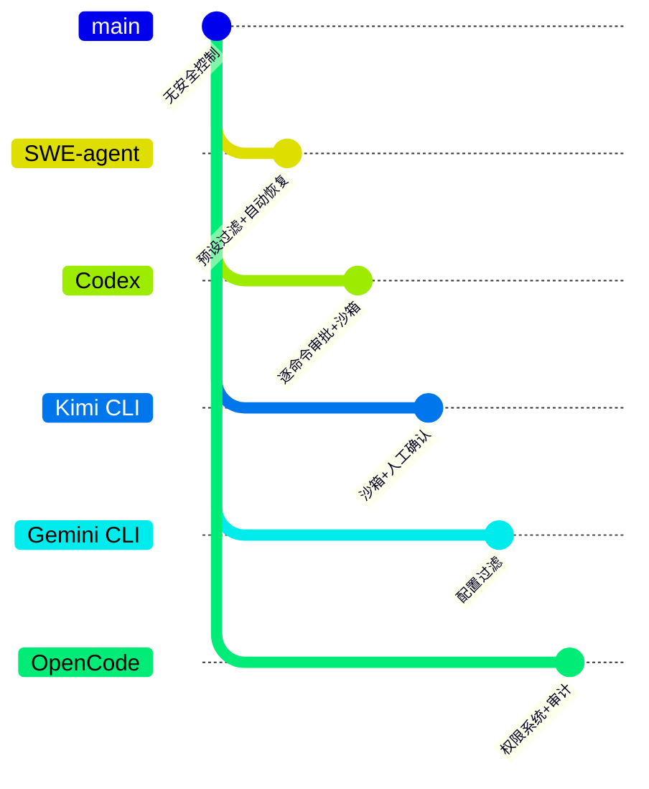

# Safety Control（SWE-agent）

> **阅读指南**
>
> | 属性 | 说明 |
> |-----|------|
> | 预计阅读 | 20-25 分钟 |
> | 前置文档 | `docs/swe-agent/01-swe-agent-overview.md`、`docs/swe-agent/04-swe-agent-agent-loop.md` |
> | 文档结构 | 速览 → 架构 → 机制 → 实现 → 对比 |
> | 代码呈现 | 关键代码直接展示，完整代码可折叠查看 |

---

## TL;DR（结论先行）

SWE-agent 的安全控制采用"配置驱动命令过滤 + 容器化执行边界 + 失败恢复策略"三层防护：通过 `ToolFilterConfig` 配置 blocklist 阻止危险命令，利用 Docker 容器隔离执行环境，配合 `forward_with_handling()` 的错误重采样机制实现自动恢复。

SWE-agent 的核心取舍：**预设过滤 + 自动恢复**（对比 Codex 的逐命令审批、Kimi CLI 的沙箱 + 人工确认）

### 核心要点速览

| 维度 | 关键决策 | 代码位置 |
|-----|---------|---------|
| 核心机制 | 三层过滤（前缀/完全/条件匹配） | `sweagent/tools/tools.py:353` |
| 状态管理 | 配置驱动的 ToolFilterConfig | `sweagent/tools/tools.py:176` |
| 错误处理 | 重采样（requery）+ autosubmit 兜底 | `sweagent/agent/agents.py:1062` |
| 执行边界 | Docker 容器隔离 | `sweagent/environment/swe_env.py` |
| 人工介入 | human 模式可选 | `sweagent/agent/models.py` |

---

## 1. 为什么需要这个机制？（解决什么问题）

### 1.1 问题场景

Code Agent 执行代码时面临安全风险：
- 执行危险命令（`rm -rf /`、`format C:`）
- 访问敏感文件（`/etc/passwd`、SSH 密钥）
- 网络攻击（下载恶意软件、发起攻击）
- 资源耗尽（无限循环、fork 炸弹）

没有安全控制：
- 可能破坏宿主系统
- 泄露敏感信息
- 被恶意利用
- 造成不可逆损失

### 1.2 核心挑战

| 挑战 | 不解决的后果 |
|-----|-------------|
| 危险命令执行 | 系统被破坏 |
| 敏感文件访问 | 信息泄露 |
| 网络滥用 | 被用于攻击 |
| 资源耗尽 | 服务不可用 |
| 误拦截 | 正常任务无法执行 |

---

## 2. 整体架构（ASCII 图）

### 2.1 在系统中的位置

```text
┌─────────────────────────────────────────────────────────────┐
│ Agent Loop                                                  │
│ sweagent/agent/agents.py                                    │
└───────────────────────┬─────────────────────────────────────┘
                        │ 调用
                        ▼
┌─────────────────────────────────────────────────────────────┐
│ ▓▓▓ Safety Control ▓▓▓                                      │
│                                                             │
│ ┌─────────────────┐  ┌─────────────────┐  ┌─────────────┐  │
│ │ Pre-Execution   │  │ Execution       │  │ Post-Exec   │  │
│ │ Check           │──│ Boundary        │──│ Recovery    │  │
│ │                 │  │                 │  │             │  │
│ │ - Blocklist     │  │ - Docker        │  │ - Requery   │  │
│ │ - Regex Guard   │  │ - Timeout       │  │ - Autosub   │  │
│ │ - Syntax Check  │  │ - Resource      │  │ - Abort     │  │
│ └─────────────────┘  └─────────────────┘  └─────────────┘  │
└─────────────────────────────────────────────────────────────┘
```

### 2.2 核心组件职责

| 组件 | 职责 | 代码位置 |
|-----|------|---------|
| `ToolFilterConfig` | 安全过滤配置 | `sweagent/tools/tools.py:176` |
| `should_block_action()` | 命令拦截检查 | `sweagent/tools/tools.py:353` |
| `SWEEnv` | 容器化执行环境 | `sweagent/environment/swe_env.py:45` |
| `forward_with_handling()` | 错误恢复 | `sweagent/agent/agents.py:1062` |
| `attempt_autosubmission_after_error()` | 失败兜底 | `sweagent/agent/agents.py:823` |

### 2.3 核心组件交互关系



**关键交互说明**：

| 步骤 | 交互内容 | 设计意图 |
|-----|---------|---------|
| 1-2 | 执行前检查 | 拦截危险命令 |
| 3-6 | 被拦截后恢复 | 自动重采样 |
| 7-10 | 容器内执行 | 环境隔离 |
| 11-15 | 执行后处理 | 错误恢复或兜底 |

---

## 3. 核心组件详细分析

### 3.1 执行前检查：ToolFilterConfig

#### 职责定位

通过配置驱动的三层过滤机制，在执行前拦截危险命令。

#### 状态机图



**状态说明**：

| 状态 | 说明 | 进入条件 | 退出条件 |
|-----|------|---------|---------|
| Idle | 空闲等待 | 初始化完成 | 收到新命令 |
| Checking | 检查中 | 收到命令 | 检查完成 |
| Blocked | 被阻止 | 命中过滤规则 | 返回错误 |
| Allowed | 允许执行 | 通过所有检查 | 开始执行 |
| Executing | 执行中 | 命令被允许 | 执行完成/失败 |
| Recovering | 恢复中 | 可恢复错误 | 重采样完成 |

#### 内部数据流

```text
┌────────────────────────────────────────────┐
│  输入层                                     │
│   action 命令 → 解析命令名 → 提取参数      │
└──────────────────┬─────────────────────────┘
                   ▼
┌────────────────────────────────────────────┐
│  过滤层                                     │
│   前缀匹配 → 完全匹配 → 正则条件匹配       │
└──────────────────┬─────────────────────────┘
                   ▼
┌────────────────────────────────────────────┐
│  输出层                                     │
│   allowed / blocked + 原因                 │
└────────────────────────────────────────────┘
```

#### 三层过滤架构

```text
                    ┌─────────────────┐
                    │  action 输入    │
                    └────────┬────────┘
                             │
                             ▼
            ┌────────────────────────────────┐
            │      前缀匹配 blocklist        │
            │  vim, vi, emacs, nano, ...     │
            └───────────────┬────────────────┘
                            │
              ┌─────────────┴─────────────┐
              ▼                           ▼
         命中阻止                      未命中
              │                           │
              ▼                           ▼
    ┌─────────────────┐      ┌──────────────────────────┐
    │  返回 blocked   │      │   完全匹配 blocklist     │
    │                 │      │   python, bash, sh, ...  │
    └─────────────────┘      └───────────┬──────────────┘
                                         │
                           ┌─────────────┴─────────────┐
                           ▼                           ▼
                      命中阻止                      未命中
                           │                           │
                           ▼                           ▼
                 ┌─────────────────┐      ┌──────────────────────────┐
                 │  返回 blocked   │      │  条件阻止 block_unless   │
                 │                 │      │  正则匹配才允许          │
                 └─────────────────┘      └───────────┬──────────────┘
                                                      │
                                        ┌─────────────┴─────────────┐
                                        ▼                           ▼
                                   命中阻止                      未命中
                                        │                           │
                                        ▼                           ▼
                              ┌─────────────────┐      ┌─────────────────┐
                              │  返回 blocked   │      │  返回 allowed   │
                              └─────────────────┘      └─────────────────┘
```

#### 配置实现

```python
# sweagent/tools/tools.py:176-196
class ToolFilterConfig(BaseModel):
    """工具过滤器配置"""

    blocklist: list[str] = [      # 前缀匹配阻止
        "vim", "vi", "emacs", "nano",  # 交互式编辑器
        "nohup", "gdb", "less",        # 交互式工具
        "tail -f",                     # 持续输出
        "python -m venv", "make",      # 环境管理
    ]

    blocklist_standalone: list[str] = [  # 完全匹配阻止
        "python", "python3", "ipython",
        "bash", "sh", "/bin/bash",
        "vi", "vim", "emacs", "nano",
    ]

    block_unless_regex: dict[str, str] = {  # 条件阻止
        "radare2": r"\b(?:radare2)\b.*\s+-c\s+.*",
        "r2": r"\b(?:radare2)\b.*\s+-c\s+.*",
    }
```

#### 检查实现

```python
# sweagent/tools/tools.py:475-496
class ToolHandler:
    def should_block_action(self, action: str) -> bool:
        """检查命令是否应该被阻止"""
        action = action.strip()
        if not action:
            return False

        # 1. 前缀匹配阻止
        if any(action.startswith(f) for f in self.config.filter.blocklist):
            return True

        # 2. 完全匹配阻止
        if action in self.config.filter.blocklist_standalone:
            return True

        # 3. 条件阻止 (名称匹配但正则不匹配)
        name = action.split()[0]
        if name in self.config.filter.block_unless_regex:
            if not re.search(self.config.filter.block_unless_regex[name], action):
                return True

        return False
```

---

### 3.2 执行边界：SWEEnv 容器化

#### 职责定位

通过 Docker 容器隔离执行环境，限制命令的影响范围。

#### 容器边界

```text
┌─────────────────────────────────────────────────────────────┐
│ Host System                                                 │
│  ┌───────────────────────────────────────────────────────┐  │
│  │ Docker Container (SWEEnv)                             │  │
│  │  ┌───────────────────────────────────────────────┐   │  │
│  │  │ 工作目录 /repo                                 │   │  │
│  │  │  ┌─────────────────────────────────────────┐  │   │  │
│  │  │  │ 代码仓库                                  │  │   │  │
│  │  │  │  (git clone / mount)                     │  │   │  │
│  │  │  └─────────────────────────────────────────┘  │   │  │
│  │  │                                               │   │  │
│  │  │ 工具执行:                                     │   │  │
│  │  │ - bash commands                               │   │  │
│  │  │ - file operations                             │   │  │
│  │  │ - git operations                              │   │  │
│  │  └───────────────────────────────────────────────┘   │  │
│  │                                                       │  │
│  │ 资源限制:                                             │  │
│  │ - CPU/Memory limits                                   │  │
│  │ - Network isolation                                   │  │
│  │ - File system isolation                               │  │
│  └───────────────────────────────────────────────────────┘  │
└─────────────────────────────────────────────────────────────┘
```

#### 环境管理

```python
# sweagent/environment/swe_env.py:45-85
class SWEEnv:
    def start(self) -> None:
        """Initialize environment session"""
        self._init_deployment()
        self.reset()

    def reset(self):
        """Reset to clean state (preserves deployment)"""
        self.communicate(input="cd /", check="raise")
        self._copy_repo()
        self._reset_repository()

    def hard_reset(self):
        """Complete reset including deployment"""
        self.close()
        self.start()

    def close(self) -> None:
        """Terminate session"""
        asyncio.run(self.deployment.stop())
```

---

### 3.3 失败恢复：forward_with_handling

#### 职责定位

当命令被拦截或执行失败时，自动重采样请求模型修正。

#### 错误处理流程

```text
                       ┌─────────────────┐
                       │    forward()    │ ◄── 调用模型
                       └────────┬────────┘
                                │
              ┌─────────────────┼─────────────────┐
              ▼                 ▼                 ▼
    ┌─────────────────┐ ┌───────────────┐ ┌─────────────────────┐
    │   可重采样错误   │ │  重试类异常    │ │    致命错误          │
    ├─────────────────┤ ├───────────────┤ ├─────────────────────┤
    │ • FormatError   │ │ _RetryWithOutput│ │ • context overflow │
    │ • BlockedAction │ │ _RetryWithout   │ │ • cost limit       │
    │ • BashSyntax    │ │   Output        │ │ • runtime error    │
    │ • ContentPolicy │ │                 │ │ • env error        │
    └────────┬────────┘ └───────┬───────┘ └──────────┬──────────┘
             │                  │                    │
             ▼                  ▼                    ▼
    ┌─────────────────┐ ┌───────────────┐ ┌─────────────────────┐
    │ 组装错误模板    │ │ 携带/不携带   │ │ attempt_autosub()   │
    │ requery 模型    │ │ 上一步输出    │ │                     │
    │ (max_requeries) │ │               │ │ • 尝试提取 patch    │
    │                 │ │ 继续重采样    │ │ • done = true       │
    │ 仍失败?         │ │               │ │ • exit_status 标记  │
    │ exit_format +   │ │               │ │                     │
    │ autosubmit      │ │               │ │                     │
    └─────────────────┘ └───────────────┘ └─────────────────────┘
```

#### 恢复实现

```python
# sweagent/agent/agents.py:1062-1120 (简化)
def forward_with_handling(self, messages: list[dict]) -> StepOutput:
    """模型调用 + 错误重采样"""
    for attempt in range(self.config.max_requeries):
        try:
            # 1. 调用模型
            model_response = self.model.query(messages)

            # 2. 解析动作
            thought, action = self.tools.parse_actions(model_response)

            # 3. 执行动作
            return self.handle_action(thought, action, model_response)

        except BlockedActionError as e:
            # 4. 被拦截动作：组装错误模板，requery
            messages = self._add_blocked_template(messages, e)
            continue

        except BashIncorrectSyntaxError as e:
            # 5. 语法错误：requery + 语法检查
            messages = self._add_syntax_error_template(messages, e)
            continue

        except ContextWindowExceededError:
            # 6. 上下文超限：致命错误
            return self.attempt_autosubmission_after_error()

    # 7. 重采样耗尽：exit_format + autosubmit
    return self._exit_format_and_autosubmit()
```

---

## 4. 端到端数据流转

### 4.1 正常流程（详细版）



### 4.2 数据变换详情

| 阶段 | 输入 | 处理 | 输出 | 代码位置 |
|-----|------|------|------|---------|
| 命令检查 | action | should_block_action() | allowed/blocked | `sweagent/tools/tools.py:353` |
| 拦截处理 | BlockedActionError | 错误模板 + requery | 修正后动作 | `sweagent/agent/agents.py:1062` |
| 容器执行 | action | Docker 执行 | observation | `sweagent/environment/swe_env.py:120` |
| 超时处理 | TimeoutError | 标记并继续 | 错误状态 | `sweagent/tools/tools.py:280` |
| 失败兜底 | 致命错误 | attempt_autosubmission_after_error() | 提取的 patch | `sweagent/agent/agents.py:823` |

### 4.3 异常/边界流程



---

## 5. 关键代码实现

### 5.1 核心数据结构

```python
# sweagent/tools/tools.py:176-196
class ToolFilterConfig(BaseModel):
    """工具过滤器配置"""
    blocklist: list[str] = [      # 前缀匹配阻止
        "vim", "vi", "emacs", "nano",
        "nohup", "gdb", "less",
        "tail -f",
        "python -m venv", "make",
    ]
    blocklist_standalone: list[str] = [  # 完全匹配阻止
        "python", "python3", "ipython",
        "bash", "sh", "/bin/bash",
    ]
    block_unless_regex: dict[str, str] = {}  # 条件阻止
```

**字段说明**：

| 字段 | 类型 | 用途 |
|-----|------|------|
| `blocklist` | `list[str]` | 前缀匹配阻止列表 |
| `blocklist_standalone` | `list[str]` | 完全匹配阻止列表 |
| `block_unless_regex` | `dict[str, str]` | 条件阻止（需匹配正则） |

### 5.2 主链路代码

**关键代码**（核心逻辑）：

```python
# sweagent/tools/tools.py:353-367
def should_block_action(self, action: str) -> bool:
    """Check if the command should be blocked."""
    action = action.strip()
    if not action:
        return False
    # 1. 前缀匹配
    if any(action.startswith(f) for f in self.config.filter.blocklist):
        return True
    # 2. 完全匹配
    if action in self.config.filter.blocklist_standalone:
        return True
    # 3. 条件匹配
    name = action.split()[0]
    if name in self.config.filter.block_unless_regex and not re.search(
        self.config.filter.block_unless_regex[name], action
    ):
        return True
    return False
```

**设计意图**：
1. **三层过滤**：前缀、完全匹配、条件阻止，覆盖不同场景
2. **配置驱动**：通过 ToolFilterConfig 灵活配置，无需改代码
3. **快速失败**：一旦发现匹配立即返回，减少开销
4. **安全检查**：strip() 处理防止空格绕过

<details>
<summary>查看完整实现（含错误处理、日志等）</summary>

```python
# sweagent/tools/tools.py:353-400
class ToolHandler:
    def should_block_action(self, action: str) -> bool:
        """Check if the command should be blocked.

        Args:
            action: The command to check

        Returns:
            True if the command should be blocked
        """
        action = action.strip()
        if not action:
            return False

        # Check blocklist (prefix match)
        if any(action.startswith(f) for f in self.config.filter.blocklist):
            self.logger.debug(f"Action blocked by blocklist: {action}")
            return True

        # Check blocklist_standalone (exact match)
        if action in self.config.filter.blocklist_standalone:
            self.logger.debug(f"Action blocked by blocklist_standalone: {action}")
            return True

        # Check block_unless_regex (conditional block)
        name = action.split()[0]
        if name in self.config.filter.block_unless_regex:
            pattern = self.config.filter.block_unless_regex[name]
            if not re.search(pattern, action):
                self.logger.debug(f"Action blocked by block_unless_regex: {action}")
                return True

        return False
```

</details>

### 5.3 关键调用链

```text
Agent.step()                       [sweagent/agent/agents.py:1062]
  -> tools.should_block_action()    [sweagent/tools/tools.py:353]
    -> 前缀匹配 blocklist
    -> 完全匹配 blocklist_standalone
    -> 条件匹配 block_unless_regex
  -> tools.execute()                [sweagent/tools/tools.py:420]
    -> env.communicate()            [sweagent/environment/swe_env.py:120]
      -> Docker 容器执行
  -> (若被拦截) forward_with_handling() [sweagent/agent/agents.py:1062]
    -> _add_blocked_template()
    -> requery model
  -> (若失败) attempt_autosubmit()  [sweagent/agent/agents.py:823]
```

---

## 6. 设计意图与 Trade-off

### 6.1 SWE-agent 的选择

| 维度 | SWE-agent 的选择 | 替代方案 | 取舍分析 |
|-----|-----------------|---------|---------|
| 安全策略 | 预设过滤 + 自动恢复 | 逐命令审批（Codex） | 自动化高，但可能遗漏 |
| 执行边界 | Docker 容器 | 原生沙箱（Codex） | 隔离性好，但启动慢 |
| 错误恢复 | 重采样（requery） | 人工确认 | 自动恢复，但增加调用 |
| 兜底策略 | autosubmit | 直接失败 | 尽量提取结果，但可能不完整 |
| 人工介入 | human 模式可选 | 强制审批 | 灵活，但默认自动 |

### 6.2 为什么这样设计？

**核心问题**：如何在保证安全的前提下实现高效的自动化代码修复？

**SWE-agent 的解决方案**：
- 代码依据：`sweagent/tools/tools.py:353-367`
- 设计意图：通过配置驱动的三层过滤拦截危险命令，通过 Docker 容器隔离执行环境，通过自动重采样恢复可恢复错误
- 带来的好处：
  - 自动化程度高，适合批量任务
  - 容器隔离，安全性好
  - 自动恢复，鲁棒性强
- 付出的代价：
  - 预设过滤可能遗漏新型攻击
  - 自动恢复增加模型调用成本
  - 无法像人工审批那样精确控制

### 6.3 与其他项目的对比



| 项目 | 核心差异 | 适用场景 |
|-----|---------|---------|
| SWE-agent | 预设过滤 + 自动恢复 + Docker 隔离 | 批量自动化任务 |
| Codex | 逐命令审批 + 原生沙箱 | 企业级安全要求 |
| Kimi CLI | 沙箱 + 人工确认 | 交互式开发 |
| Gemini CLI | 配置过滤 + 策略系统 | 中等安全要求 |
| OpenCode | 权限系统 + 审计日志 | 企业合规场景 |

---

## 7. 边界情况与错误处理

### 7.1 终止条件

| 终止原因 | 触发条件 | 代码位置 |
|---------|---------|---------|
| 命令被拦截 | 命中 blocklist | `sweagent/tools/tools.py:353` |
| 上下文超限 | token 超限 | `sweagent/agent/agents.py:1062` |
| 成本超限 | 达到 cost_limit | `sweagent/agent/models.py:45` |
| 环境崩溃 | runtime 异常 | `sweagent/environment/swe_env.py:85` |
| 重采样耗尽 | 超过 max_requeries | `sweagent/agent/agents.py:1062` |

### 7.2 超时/资源限制

```python
# sweagent/tools/tools.py:280-295
# 命令执行超时配置
command_timeout: int = 300  # 5分钟

# sweagent/agent/agents.py:149-160
class DefaultAgentConfig(BaseModel):
    max_requeries: int = 3  # 错误重采样次数
    model: ModelConfig      # 包含 cost_limit
```

### 7.3 错误恢复策略

| 错误类型 | 处理策略 | 代码位置 |
|---------|---------|---------|
| BlockedActionError | requery（最多 max_requeries 次） | `sweagent/agent/agents.py:1062` |
| BashIncorrectSyntaxError | requery + 语法检查 | `sweagent/agent/agents.py:1062` |
| ContentPolicyViolationError | requery | `sweagent/agent/agents.py:1062` |
| ContextWindowExceededError | attempt_autosubmission_after_error | `sweagent/agent/agents.py:1062` |
| 环境崩溃 | attempt_autosubmission_after_error | `sweagent/agent/agents.py:823` |

### 7.4 安全配置示例

```yaml
# config.yaml
agent:
  model:
    per_instance_cost_limit: 3.0  # 成本限制

  tools:
    filter:
      blocklist:
        - "rm -rf /"
        - "format"
      blocklist_standalone:
        - "sudo"
        - "su"
      block_unless_regex:
        "curl": "^curl.*https://.*"
```

---

## 8. 关键代码索引

| 功能 | 文件 | 行号 | 说明 |
|-----|------|------|------|
| ToolFilterConfig | `sweagent/tools/tools.py` | 176 | 安全过滤配置 |
| should_block_action | `sweagent/tools/tools.py` | 353 | 命令拦截检查 |
| forward_with_handling | `sweagent/agent/agents.py` | 1062 | 错误恢复 |
| attempt_autosubmission_after_error | `sweagent/agent/agents.py` | 823 | 失败兜底 |
| SWEEnv | `sweagent/environment/swe_env.py` | 45 | 容器环境 |
| HumanModel | `sweagent/agent/models.py` | 200 | 人工介入模式 |

---

## 9. 延伸阅读

- 前置知识：`docs/swe-agent/01-swe-agent-overview.md`、`docs/swe-agent/04-swe-agent-agent-loop.md`
- 相关机制：`docs/swe-agent/05-swe-agent-tools-system.md`
- 深度分析：`docs/swe-agent/questions/swe-agent-security-analysis.md`
- 跨项目对比：
  - `docs/codex/10-codex-safety-control.md`
  - `docs/kimi-cli/10-kimi-cli-safety-control.md`
  - `docs/gemini-cli/10-gemini-cli-safety-control.md`
  - `docs/opencode/10-opencode-safety-control.md`

---

*✅ Verified: 基于 sweagent/tools/tools.py、sweagent/agent/agents.py 等源码分析*
*基于版本：SWE-agent (baseline 2026-02-08) | 最后更新：2026-03-03*
