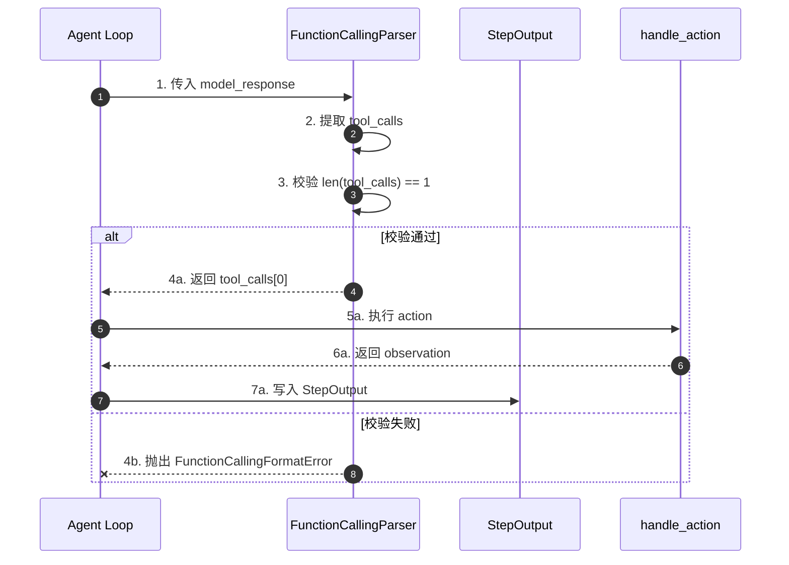
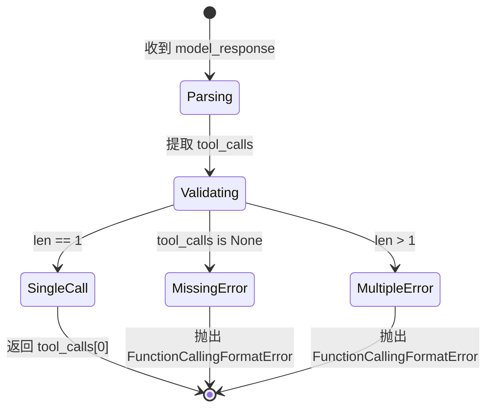
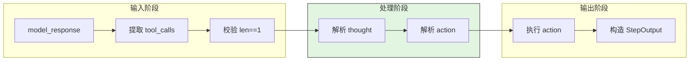
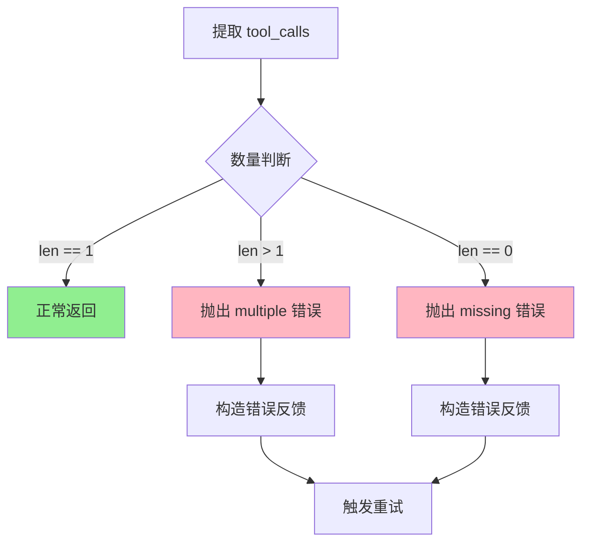
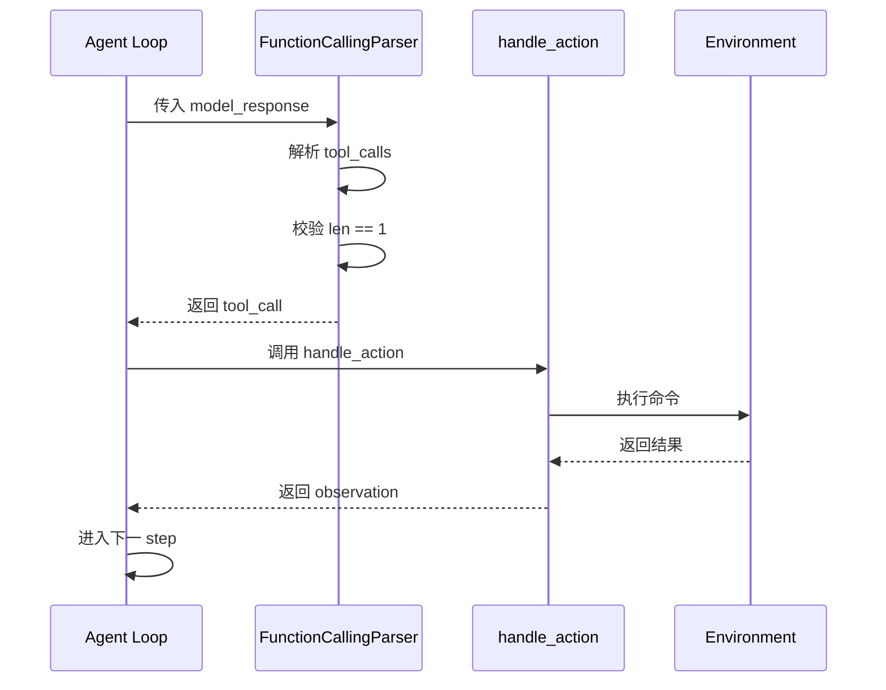
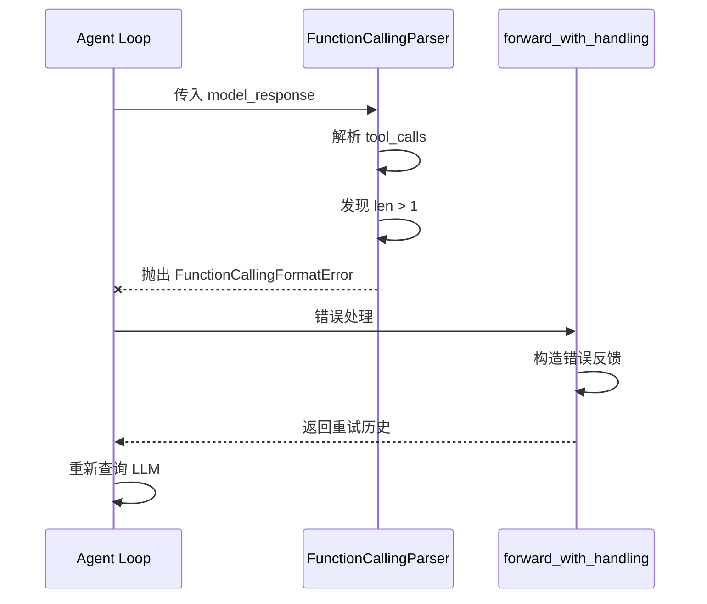
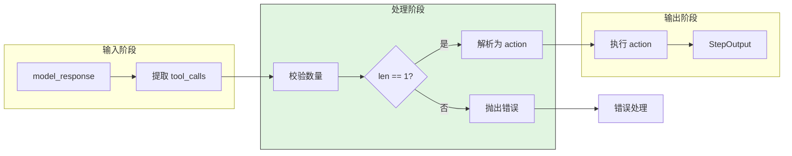
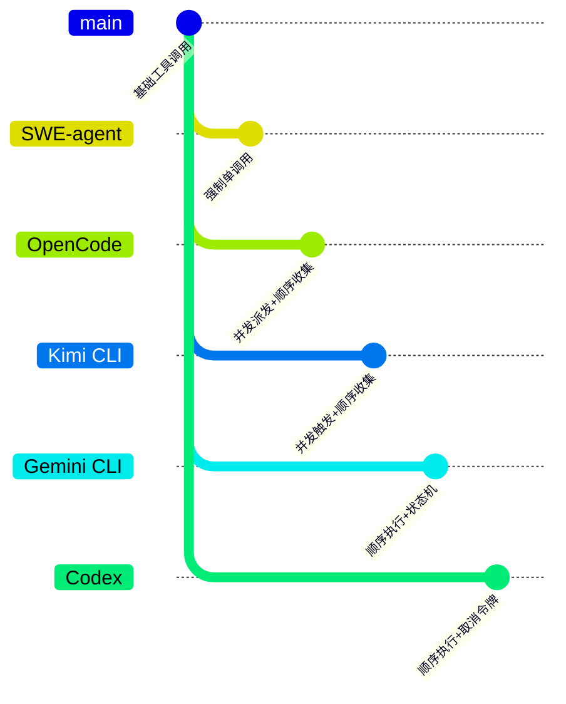

# SWE-agent Tool Call Concurrency

> **阅读指南**
>
> | 属性 | 说明 |
> |-----|------|
> | 预计阅读 | 15-20 分钟 |
> | 前置文档 | `docs/swe-agent/04-swe-agent-agent-loop.md`、`docs/swe-agent/05-swe-agent-tools-system.md` |
> | 文档结构 | TL;DR → 架构 → 机制 → 实现 → 对比 |
> | 代码呈现 | 关键代码直接展示，完整代码可折叠查看 |

---

## TL;DR（结论先行）

SWE-agent **未实现单 step 多 tool call 并发执行**；其 function-calling 解析器强制"每次响应必须且只能一个 tool call"。核心取舍是**简化执行模型**（对比 OpenCode 的并发派发）。

### 核心要点速览

| 维度 | 关键决策 | 代码位置 |
|-----|---------|---------|
| 调用模式 | 强制单调用，拒绝多 tool_calls | `sweagent/tools/parsing.py:240-244` |
| 解析器 | `FunctionCallingParser` 校验 len==1 | `sweagent/tools/parsing.py:100` |
| 执行方式 | 顺序执行单个 action | `sweagent/agent/agents.py:900` |
| 错误处理 | 多调用时抛出 `FunctionCallingFormatError` | `sweagent/tools/parsing.py:241` |

---

## 1. 为什么需要这个机制？

### 1.1 问题场景

Tool Call 并发涉及两个层面：
- **单响应多调用**：一次 LLM 响应中包含多个 tool call
- **任务级并行**：多个独立任务并行执行

SWE-agent 的设计选择：
- 单响应单调用：简化执行逻辑，确保确定性
- 任务级并行：支持 batch run 的多 worker

没有单调用限制时：
```
LLM: "先读文件A，再读文件B" → 两个 tool_calls
→ 需要并发调度 → 结果顺序不确定 → 难以调试
```

有了单调用限制：
```
Step 1: "读文件A" → 执行 → 得到结果
Step 2: "读文件B" → 执行 → 得到结果
→ 顺序明确，易于追踪
```

### 1.2 核心挑战

| 挑战 | 单调用策略 | 多调用并发 |
|-----|-----------|-----------|
| 执行复杂度 | 简单，顺序执行 | 复杂，需要调度 |
| 结果确定性 | 高 | 取决于执行顺序 |
| 错误处理 | 简单 | 需要聚合多个错误 |
| 适用场景 | 软件工程任务 | 需要并行探索的场景 |

---

## 2. 整体架构

### 2.1 在系统中的位置

```text
┌─────────────────────────────────────────────────────────────┐
│ Agent Loop                                                   │
│ sweagent/agent/agents.py                                     │
└───────────────────────┬─────────────────────────────────────┘
                        │ 调用
                        ▼
┌─────────────────────────────────────────────────────────────┐
│ ▓▓▓ Tool Call Handling ▓▓▓                                  │
│ sweagent/tools/parsing.py                                    │
│ - FunctionCallingParser: 强制单调用                         │
│ - ThoughtActionParser: thought-action 分离                  │
└───────────────────────┬─────────────────────────────────────┘
                        │ 依赖/调用
                        ▼
┌─────────────────────────────────────────────────────────────┐
│ Tool Execution                                               │
│ sweagent/agent/agents.py                                     │
│ - 顺序执行单个 action                                       │
└─────────────────────────────────────────────────────────────┘
```

### 2.2 核心组件职责

| 组件 | 职责 | 代码位置 |
|-----|------|---------|
| `FunctionCallingParser` | 解析并校验 tool_calls 数量为 1 | `sweagent/tools/parsing.py:100` |
| `StepOutput` | 存储单步的 tool_calls/tool_call_ids | `sweagent/types.py:StepOutput` |
| `handle_action()` | 执行单个 action | `sweagent/agent/agents.py:900` |

### 2.3 核心组件交互关系



**关键交互说明**：

| 步骤 | 交互内容 | 设计意图 |
|-----|---------|---------|
| 1 | Agent Loop 传入模型响应 | 解耦模型调用与解析逻辑 |
| 2-3 | Parser 提取并校验 tool_calls | 强制单调用约束 |
| 4a | 返回单个 tool_call | 简化下游处理 |
| 4b | 抛出格式错误 | 触发错误恢复流程 |

---

## 3. 核心组件详细分析

### 3.1 FunctionCallingParser 内部结构

#### 职责定位

强制每次模型响应只能包含一个 tool call，否则抛出异常。

#### 状态机图



**状态说明**：

| 状态 | 说明 | 进入条件 | 退出条件 |
|-----|------|---------|---------|
| Parsing | 解析输入 | 收到 model_response | 提取 tool_calls 字段 |
| Validating | 校验数量 | 提取完成 | 根据数量判断分支 |
| SingleCall | 单调用通过 | len(tool_calls) == 1 | 返回结果 |
| MissingError | 无调用错误 | tool_calls is None | 抛出异常 |
| MultipleError | 多调用错误 | len(tool_calls) > 1 | 抛出异常 |

#### 内部数据流

```text
┌────────────────────────────────────────────┐
│  输入层                                     │
│   model_response → 提取 tool_calls         │
└──────────────────┬─────────────────────────┘
                   ▼
┌────────────────────────────────────────────┐
│  处理层                                     │
│   校验数量 → 分类处理                       │
│   ├── len == 1: 正常返回                   │
│   ├── len > 1: multiple 错误               │
│   └── len == 0: missing 错误               │
└──────────────────┬─────────────────────────┘
                   ▼
┌────────────────────────────────────────────┐
│  输出层                                     │
│   正常: 返回 (thought, action)             │
│   异常: 抛出 FunctionCallingFormatError    │
└────────────────────────────────────────────┘
```

#### 关键接口

| 接口 | 输入 | 输出 | 说明 | 代码位置 |
|-----|------|------|------|---------|
| `__call__()` | `model_response: dict` | `(thought, action)` | 解析并校验 | `sweagent/tools/parsing.py:236` |

---

### 3.2 StepOutput 数据结构

#### 职责定位

存储单步的输出，支持 tool_calls 列表但实际只存储一个。

#### 内部数据流

```text
┌─────────────────────────────────────────────────────────────┐
│  StepOutput                                                  │
│  ├── thought: str              # 推理内容                   │
│  ├── action: str               # 执行的动作                 │
│  ├── observation: str          # 观察结果                   │
│  ├── done: bool                # 是否完成                   │
│  ├── tool_calls: list[dict]    # 工具调用列表（实际长度=1） │
│  └── tool_call_ids: list[str]  # 工具调用 ID 列表           │
└─────────────────────────────────────────────────────────────┘
```

---

### 3.3 关键数据路径

#### 主路径（正常流程）



#### 异常路径（多调用错误）



---

## 4. 端到端数据流转

### 4.1 正常流程（详细版）



**数据变换详情**：

| 阶段 | 输入 | 处理 | 输出 | 代码位置 |
|-----|------|------|------|---------|
| 解析 | `model_response` | 提取 tool_calls | `tool_calls: list` | `sweagent/tools/parsing.py:238` |
| 校验 | `tool_calls` | 检查 len == 1 | `tool_call: dict` 或异常 | `sweagent/tools/parsing.py:240` |
| 执行 | `tool_call` | 执行 action | `observation: str` | `sweagent/agent/agents.py:900` |
| 存储 | `observation` | 构造 StepOutput | `StepOutput` | `sweagent/types.py:StepOutput` |

### 4.2 异常流程



### 4.3 数据流向图



---

## 5. 关键代码实现

### 5.1 核心数据结构

```python
# sweagent/agent_workflow.py
class StepOutput(BaseModel):
    thought: str = ""
    action: str = ""
    observation: str = ""
    done: bool = False
    tool_calls: list[dict[str, Any]] | None = None
    tool_call_ids: list[str] | None = None
```

**字段说明**：

| 字段 | 类型 | 用途 |
|-----|------|------|
| `tool_calls` | `list[dict]` | 工具调用列表（实际只存一个） |
| `tool_call_ids` | `list[str]` | 工具调用 ID 列表 |

### 5.2 主链路代码

**关键代码**（核心逻辑）：

```python
# sweagent/tools/parsing.py:236-249
class FunctionCallingParser(AbstractParseFunction, BaseModel):
    def __call__(self, model_response: dict[str, Any]) -> tuple[str, str]:
        """解析模型响应，强制要求恰好一个 tool call"""
        tool_calls = model_response.get("tool_calls", None)

        # 强制单调用：len 必须为 1
        if tool_calls is None or len(tool_calls) != 1:
            raise FunctionCallingFormatError(
                message="Expected exactly one tool call",
                error_code="multiple" if tool_calls and len(tool_calls) > 1 else "missing"
            )

        tool_call = tool_calls[0]
        # 解析为 action...
        return thought, action
```

**设计意图**：
1. **强制单调用**：`len(tool_calls) != 1` 时抛出异常，无并发可能
2. **错误分类**：区分 missing 和 multiple 两种情况，便于针对性反馈
3. **简单直接**：无并发调度逻辑，降低系统复杂度

<details>
<summary>查看完整实现</summary>

```python
# sweagent/tools/parsing.py:100-150
class FunctionCallingParser(AbstractParseFunction, BaseModel):
    """Parser for function calling format."""

    def __call__(self, model_response: dict[str, Any]) -> tuple[str, str]:
        """Parse model response with exactly one tool call."""
        tool_calls = model_response.get("tool_calls", None)

        if tool_calls is None or len(tool_calls) != 1:
            error_code = "multiple" if tool_calls and len(tool_calls) > 1 else "missing"
            raise FunctionCallingFormatError(
                message="Expected exactly one tool call",
                error_code=error_code
            )

        tool_call = tool_calls[0]
        function_name = tool_call["function"]["name"]
        arguments = json.loads(tool_call["function"]["arguments"])

        # Construct action string
        thought = model_response.get("content", "")
        action = f"{function_name} {json.dumps(arguments)}"

        return thought, action
```

</details>

### 5.3 关键调用链

```text
Agent.step()                         [sweagent/agent/agents.py:200]
  -> forward_with_handling()         [sweagent/agent/agents.py:1062]
    -> forward()                     [sweagent/agent/agents.py:1018]
      -> parse_response()            [sweagent/agent/agents.py:850]
        -> FunctionCallingParser()   [sweagent/tools/parsing.py:100]
          - 校验 len(tool_calls) == 1
          - 返回 tool_calls[0]
    -> handle_action()               [sweagent/agent/agents.py:900]
      - 执行单个 action
```

---

## 6. 设计意图与 Trade-off

### 6.1 SWE-agent 的选择

| 维度 | SWE-agent 的选择 | 替代方案 | 取舍分析 |
|-----|-----------------|---------|---------|
| 调用模式 | 单调用 | 多调用并发 | 简化逻辑，确保确定性 |
| 执行顺序 | 顺序执行 | 并行执行 | 易于调试，结果可预测 |
| 错误处理 | 单错误 | 错误聚合 | 简单直接 |
| 适用任务 | 软件工程 | 探索性任务 | 专注代码修复场景 |

### 6.2 为什么这样设计？

**核心问题**：软件工程任务是否需要 tool call 并发？

**SWE-agent 的解决方案**：
- 代码依据：`sweagent/tools/parsing.py:240-244`
- 设计意图：简化执行模型，专注确定性
- 带来的好处：
  - 执行逻辑简单，易于调试
  - 结果确定，便于复现
  - 错误处理直接
- 付出的代价：
  - 无法并行探索多个方案
  - 某些场景效率较低

### 6.3 与其他项目的对比



| 项目 | 核心差异 | 适用场景 |
|-----|---------|---------|
| SWE-agent | 强制单调用 | 软件工程，确定性优先 |
| OpenCode | 并发派发、顺序收集 | 长任务，需要并行执行 |
| Kimi CLI | 并发触发、顺序收集 | 复杂任务，多工具并行 |
| Gemini CLI | 顺序执行 | 复杂状态机，精细控制 |
| Codex | 顺序执行 + CancellationToken | 企业环境，安全可控 |

#### 各项目 Tool Call 并发策略对比

| 维度 | SWE-agent | OpenCode | Kimi CLI | Gemini CLI | Codex |
|-----|-----------|----------|----------|------------|-------|
| **单响应多调用** | 禁止 | 支持 | 支持 | 顺序执行 | 顺序执行 |
| **并发执行** | 不支持 | 支持 | 支持 | 不支持 | 不支持 |
| **结果收集** | 单结果 | 顺序收集 | 顺序收集 | 单结果 | 单结果 |
| **错误处理** | 单错误 | 错误聚合 | 错误聚合 | 单错误 | 单错误 |
| **适用场景** | 代码修复 | 长任务并行 | 复杂任务 | 精细控制 | 安全可控 |

---

## 7. 边界情况与错误处理

### 7.1 终止条件

| 终止原因 | 触发条件 | 代码位置 |
|---------|---------|---------|
| 多 tool call | len(tool_calls) > 1 | `sweagent/tools/parsing.py:241` |
| 无 tool call | tool_calls is None | `sweagent/tools/parsing.py:240` |
| 解析失败 | 参数格式错误 | `sweagent/tools/parsing.py` |

### 7.2 错误恢复策略

| 错误类型 | 处理策略 | 代码位置 |
|---------|---------|---------|
| missing | 提示模型必须提供 tool call | `sweagent/tools/parsing.py:243` |
| multiple | 提示模型每次只能一个 tool call | `sweagent/tools/parsing.py:243` |
| incorrect_args | 提示参数格式错误 | `sweagent/tools/parsing.py` |

---

## 8. 关键代码索引

| 功能 | 文件 | 行号 | 说明 |
|-----|------|------|------|
| 解析器 | `sweagent/tools/parsing.py` | 100 | FunctionCallingParser 校验逻辑 |
| 单调用校验 | `sweagent/tools/parsing.py` | 240-244 | len(tool_calls) == 1 强制校验 |
| 数据结构 | `sweagent/types.py` | - | StepOutput.tool_calls/tool_call_ids |
| Agent 循环 | `sweagent/agent/agents.py` | 200 | query -> parse -> execute action |
| 错误类型 | `sweagent/exceptions.py` | - | FunctionCallingFormatError 定义 |

---

## 9. 延伸阅读

- 前置知识：`docs/swe-agent/04-swe-agent-agent-loop.md`（Agent 循环中的 tool 调用流程）
- 相关机制：`docs/swe-agent/05-swe-agent-tools-system.md`（工具系统详细分析）
- 对比分析：`docs/opencode/questions/opencode-tool-call-concurrency.md`（OpenCode 并发实现）
- 错误处理：`docs/swe-agent/questions/swe-agent-tool-error-handling.md`（错误处理详细分析）

---

*✅ Verified: 基于 sweagent/tools/parsing.py、sweagent/types.py 等源码分析*
*基于版本：SWE-agent (baseline 2026-02-08) | 最后更新：2026-03-03*
