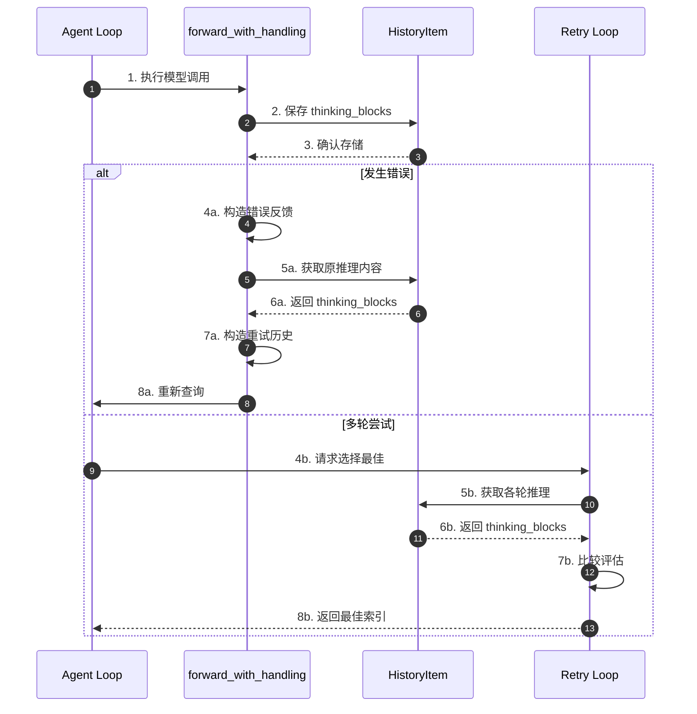
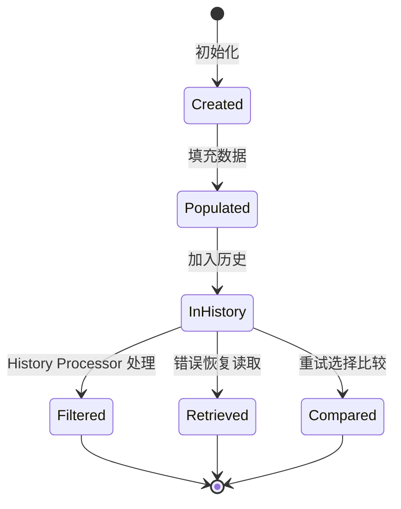
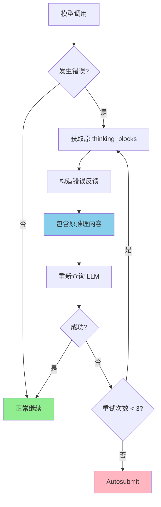
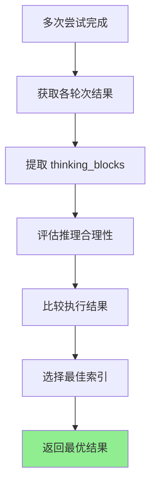
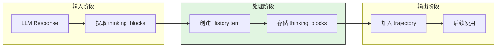
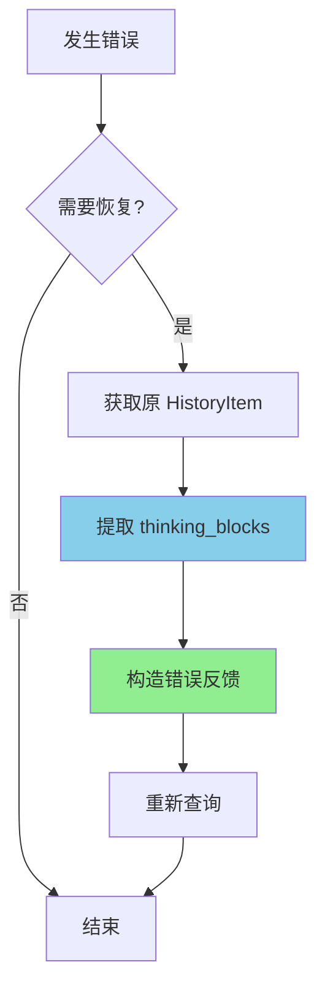
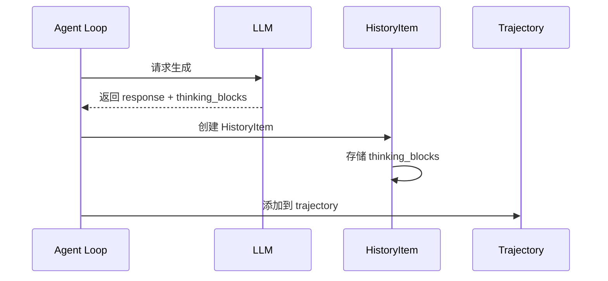
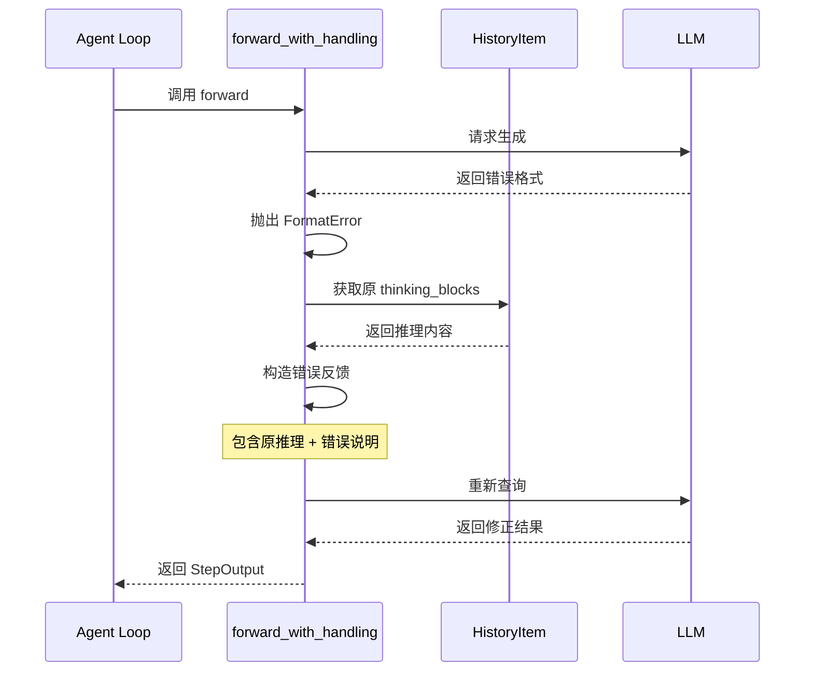
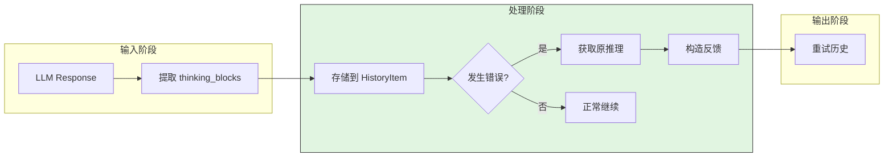
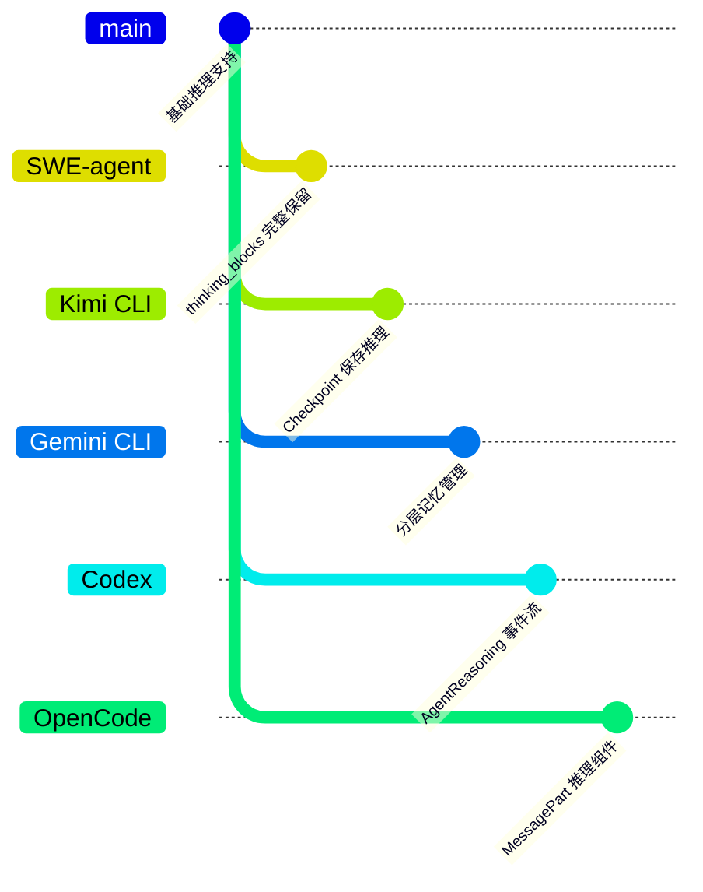

# SWE-agent Why Keep Reasoning

> **阅读指南**
>
> | 属性 | 说明 |
> |-----|------|
> | 预计阅读 | 15-20 分钟 |
> | 前置文档 | `docs/swe-agent/04-swe-agent-agent-loop.md`、`docs/swe-agent/questions/swe-agent-tool-error-handling.md` |
> | 文档结构 | TL;DR → 架构 → 机制 → 实现 → 对比 |
> | 代码呈现 | 关键代码直接展示，完整代码可折叠查看 |

---

## TL;DR（结论先行）

SWE-agent 保留 `thinking_blocks` 推理内容是为了支持 **forward_with_handling 的错误恢复**和**多轮尝试的最佳选择**，使 LLM 在代码修复任务中能自我纠错并从中学习。核心取舍是**完整历史保留**（对比简单截断策略）。

### 核心要点速览

| 维度 | 关键决策 | 代码位置 |
|-----|---------|---------|
| 存储位置 | `HistoryItem.thinking_blocks` | `sweagent/types.py:HistoryItem` |
| 错误恢复 | 利用原推理构造重试历史 | `sweagent/agent/agents.py:1062` |
| 重试选择 | `ScoreRetryLoop` 比较各轮推理 | `sweagent/agent/reviewer.py:559` |
| 历史过滤 | `History Processors` 智能过滤 | `sweagent/agent/history_processors.py` |

---

## 1. 为什么需要这个机制？

### 1.1 问题场景

没有保留推理内容时：
- LLM 发生格式错误后无法看到原来的思考过程
- 多轮尝试后无法比较不同策略的有效性
- Reviewer 无法评估各轮次推理的合理性

有了推理内容保留：
- 错误恢复时 LLM 能看到自己的思考过程
- 支持从多次尝试中选择最佳结果
- History Processors 可以智能过滤关键内容

### 1.2 核心挑战

| 挑战 | 不解决的后果 |
|-----|-------------|
| 错误恢复 | LLM 无法理解之前哪里出错 |
| 尝试比较 | 无法评估不同策略的效果 |
| 历史截断 | 重要思考内容被丢弃 |
| 调试分析 | 无法追踪模型决策过程 |

---

## 2. 整体架构

### 2.1 在系统中的位置

```text
┌─────────────────────────────────────────────────────────────┐
│ Agent Loop                                                   │
│ sweagent/agent/agents.py                                     │
└───────────────────────┬─────────────────────────────────────┘
                        │ 调用
                        ▼
┌─────────────────────────────────────────────────────────────┐
│ ▓▓▓ Reasoning Preservation ▓▓▓                              │
│ sweagent/types.py                                            │
│ - HistoryItem.thinking_blocks: 存储推理内容                 │
│ - StepOutput: 包含 thought 字段                             │
└───────────────────────┬─────────────────────────────────────┘
                        │ 依赖/调用
        ┌───────────────┼───────────────┐
        ▼               ▼               ▼
┌──────────────┐ ┌──────────────┐ ┌──────────────┐
│ Error        │ │ Retry Loop   │ │ History      │
│ Recovery     │ │ Selection    │ │ Processors   │
│ 错误恢复      │ │ 重试选择      │ │ 历史处理器    │
└──────────────┘ └──────────────┘ └──────────────┘
```

### 2.2 核心组件职责

| 组件 | 职责 | 代码位置 |
|-----|------|---------|
| `HistoryItem` | 存储 thinking_blocks | `sweagent/types.py:HistoryItem` |
| `StepOutput` | 包含 thought 字段 | `sweagent/types.py:StepOutput` |
| `forward_with_handling` | 利用推理内容错误恢复 | `sweagent/agent/agents.py:1062` |
| `ScoreRetryLoop` | 基于推理内容选择最佳结果 | `sweagent/agent/reviewer.py:559` |

### 2.3 核心组件交互关系



**关键交互说明**：

| 步骤 | 交互内容 | 设计意图 |
|-----|---------|---------|
| 1-3 | 执行并保存推理 | 确保推理内容持久化 |
| 4a-7a | 错误恢复流程 | 利用原推理帮助 LLM 自我纠正 |
| 4b-7b | 多轮尝试选择 | 基于推理质量选择最佳结果 |

---

## 3. 核心组件详细分析

### 3.1 HistoryItem 内部结构

#### 职责定位

存储对话历史中的单条记录，包含完整的推理内容。

#### 状态机图



**状态说明**：

| 状态 | 说明 | 进入条件 | 退出条件 |
|-----|------|---------|---------|
| Created | 创建空对象 | 初始化 | 填充数据 |
| Populated | 已填充数据 | 设置 thinking_blocks 等 | 加入历史列表 |
| InHistory | 在历史中 | 加入 trajectory | 被处理或读取 |
| Filtered | 被过滤 | History Processor 处理 | 保留或移除 |
| Retrieved | 被读取 | 错误恢复时读取 | 用于构造反馈 |
| Compared | 被比较 | 重试选择时 | 评估质量 |

#### 内部数据流

```text
┌────────────────────────────────────────────┐
│  输入层                                     │
│   LLM Response → 提取 thinking_blocks      │
└──────────────────┬─────────────────────────┘
                   ▼
┌────────────────────────────────────────────┐
│  处理层                                     │
│   解析 thought → 存储 thinking_blocks      │
│   ├── 正常: 直接存储                       │
│   └── 错误: 保留用于恢复                   │
└──────────────────┬─────────────────────────┘
                   ▼
┌────────────────────────────────────────────┐
│  输出层                                     │
│   加入 trajectory → 可供后续使用           │
└────────────────────────────────────────────┘
```

#### 关键接口

| 接口 | 输入 | 输出 | 说明 | 代码位置 |
|-----|------|------|------|---------|
| `__init__()` | 各字段值 | HistoryItem | 创建历史项 | `sweagent/types.py` |
| `to_template_format_dict()` | - | `dict` | 转为模板格式 | `sweagent/types.py` |

---

### 3.2 错误恢复与 Requery

#### 职责定位

利用保留的推理内容帮助 LLM 在发生错误时自我纠正。

#### 关键算法逻辑



---

### 3.3 Autosubmit 紧急恢复

#### 职责定位

即使环境崩溃，也尝试从 trajectory 中提取 patch。

#### 内部数据流

```text
┌─────────────────────────────────────────────────────────────┐
│  attempt_autosubmission_after_error                          │
│  ├── 检查运行时存活状态                                     │
│  ├── 获取最后一个 trajectory step                           │
│  ├── 提取 diff（如果存在）                                  │
│  ├── thinking_blocks 用于分析失败原因                       │
│  └── 生成部分提交                                           │
└─────────────────────────────────────────────────────────────┘
```

---

### 3.4 多轮尝试的最佳选择

#### 职责定位

Reviewer 基于各轮次的 `thinking_blocks` 选择最佳结果。

#### 关键算法逻辑



---

### 3.5 关键数据路径

#### 主路径（正常流程）



#### 异常路径（错误恢复）



---

## 4. 端到端数据流转

### 4.1 正常流程（详细版）



**数据变换详情**：

| 阶段 | 输入 | 处理 | 输出 | 代码位置 |
|-----|------|------|------|---------|
| 接收 | `response` | 提取 thinking_blocks | `thinking_blocks: list[dict]` | `sweagent/agent/agents.py:1018` |
| 存储 | `thinking_blocks` | 创建 HistoryItem | `HistoryItem` | `sweagent/types.py:HistoryItem` |
| 归档 | `HistoryItem` | 加入 trajectory | 更新历史列表 | `sweagent/agent/agents.py` |

### 4.2 错误恢复流程



### 4.3 数据流向图



---

## 5. 关键代码实现

### 5.1 核心数据结构

```python
# sweagent/agent_workflow.py
class HistoryItem(BaseModel):
    """历史记录项，包含推理内容"""
    thought: str = ""
    action: str = ""
    observation: str = ""
    thinking_blocks: list[dict[str, Any]] | None = None
    # ... 其他字段
```

**字段说明**：

| 字段 | 类型 | 用途 |
|-----|------|------|
| `thinking_blocks` | `list[dict]` | 存储模型的推理内容 |
| `thought` | `str` | 解析后的思考文本 |

### 5.2 主链路代码

**关键代码**（核心逻辑）：

```python
# sweagent/agent/agents.py:1062-1080
def forward_with_handling(self, history: list[dict[str, str]]) -> StepOutput:
    """Forward the model and handle errors, requerying the model if we can."""
    n_format_fails = 0
    while n_format_fails < self.max_requeries:
        try:
            return self.forward(history)
        except FormatError as e:
            # 基于原推理内容重新查询
            n_format_fails += 1
            history = handle_error_with_retry(...)
            # thinking_blocks 保留在历史中，帮助 LLM 理解错误
```

**设计意图**：
1. **保留上下文**：错误重试时原推理内容仍在历史中
2. **自我纠正**：LLM 能看到自己的思考过程并修正
3. **历史完整**：不丢弃任何推理内容

<details>
<summary>查看完整实现</summary>

```python
# sweagent/agent_workflow.py
class HistoryItem(BaseModel):
    """A single item in the history."""
    thought: str = ""
    action: str = ""
    observation: str = ""
    done: bool = False
    output: str = ""
    state: dict[str, Any] | None = None
    tool_calls: list[dict[str, Any]] | None = None
    tool_call_ids: list[str] | None = None
    thinking_blocks: list[dict[str, Any]] | None = None

    def to_template_format_dict(self) -> dict[str, str]:
        """Convert to dictionary for template rendering."""
        return {
            "thought": self.thought,
            "action": self.action,
            "observation": self.observation,
            "output": self.output,
            "state": json.dumps(self.state) if self.state else "",
        }
```

</details>

### 5.3 关键调用链

```text
Agent.step()                         [sweagent/agent/agents.py:200]
  -> forward_with_handling()         [sweagent/agent/agents.py:1062]
    -> forward()                     [sweagent/agent/agents.py:1018]
      -> 保存 thinking_blocks        [sweagent/types.py:HistoryItem]
    -> FormatError 捕获              [sweagent/agent/agents.py:1153]
      -> 利用原推理构造重试历史
  -> ScoreRetryLoop.get_best()       [sweagent/agent/reviewer.py:559]
    -> 比较各轮次 thinking_blocks
```

---

## 6. 设计意图与 Trade-off

### 6.1 SWE-agent 的选择

| 维度 | SWE-agent 的选择 | 替代方案 | 取舍分析 |
|-----|-----------------|---------|---------|
| 推理保留 | 完整保留 | 截断/摘要 | 支持完整错误恢复，但增加存储 |
| 历史长度 | 无限制 | 固定窗口 | 完整上下文，但可能超长 |
| 过滤策略 | History Processors | 简单截断 | 智能过滤，但增加复杂度 |
| 使用场景 | 错误恢复 + 重试选择 | 仅调试 | 功能更全面 |

### 6.2 为什么这样设计？

**核心问题**：如何在错误恢复时帮助 LLM 自我纠正？

**SWE-agent 的解决方案**：
- 代码依据：`sweagent/types.py:HistoryItem`
- 设计意图：完整保留推理过程，支持自我纠正
- 带来的好处：
  - 错误恢复时 LLM 能看到原思考
  - 支持多轮尝试比较
  - 便于调试和分析
- 付出的代价：
  - 增加存储开销
  - 可能超出上下文限制

### 6.3 与其他项目的对比



| 项目 | 核心差异 | 推理内容使用方式 | 适用场景 |
|-----|---------|-----------------|---------|
| SWE-agent | 完整保留 thinking_blocks | 错误恢复 + 重试选择 | 代码修复，需要错误恢复 |
| Kimi CLI | Checkpoint 保存完整状态 | 对话回滚时恢复推理 | 交互式对话，支持回滚 |
| Gemini CLI | 分层记忆管理 | 长期任务上下文保持 | 复杂任务，多层次上下文 |
| Codex | AgentReasoning 事件流 | 实时展示 + 可配置摘要 | 企业级应用，可观测性 |
| OpenCode | MessagePart 组件化 | UI 展示 + 调试分析 | 可视化交互，开发调试 |

#### 各项目推理内容处理对比

| 维度 | SWE-agent | Kimi CLI | Gemini CLI | Codex | OpenCode |
|-----|-----------|----------|------------|-------|----------|
| **存储位置** | HistoryItem | Checkpoint 文件 | 分层内存 | 事件日志 | 消息组件 |
| **保留策略** | 完整保留 | 状态快照 | 智能压缩 | 可配置 | 结构化存储 |
| **主要用途** | 错误恢复 | 状态回滚 | 上下文保持 | 可观测性 | UI 展示 |
| **过滤机制** | History Processors | D-Mail 选择 | 分层淘汰 | 摘要配置 | 组件渲染 |
| **适用场景** | 代码修复 | 交互对话 | 复杂任务 | 企业应用 | 可视化交互 |

---

## 7. 边界情况与错误处理

### 7.1 存储限制

| 情况 | 处理策略 | 代码位置 |
|---------|---------|---------|
| thinking_blocks 为空 | 正常存储，值为 None | `sweagent/types.py` |
| 内容过长 | History Processors 过滤 | `sweagent/agent/history_processors.py` |
| 解析失败 | 保留原始内容 | `sweagent/tools/parsing.py` |

### 7.2 History Processors 过滤

```python
# sweagent/agent/history_processors.py
class LastNObservations:
    """Elide all but the last n observations"""
    always_keep_output_for_tags: set[str] = {"keep_output"}
    # 通过 tags 标记保留关键推理内容
```

---

## 8. 关键代码索引

| 功能 | 文件 | 行号 | 说明 |
|-----|------|------|------|
| 数据结构 | `sweagent/types.py` | - | HistoryItem.thinking_blocks |
| 错误恢复 | `sweagent/agent/agents.py` | 1062 | forward_with_handling |
| 重试选择 | `sweagent/agent/reviewer.py` | 559 | ScoreRetryLoop 类 |
| 历史处理 | `sweagent/agent/history_processors.py` | - | 智能过滤推理内容 |

---

## 9. 延伸阅读

- 前置知识：`docs/swe-agent/04-swe-agent-agent-loop.md`（Agent 循环中的历史管理）
- 相关机制：`docs/swe-agent/questions/swe-agent-tool-error-handling.md`（错误处理详细分析）
- 对比分析：`docs/kimi-cli/questions/kimi-cli-checkpoint-implementation.md`（Kimi CLI 的推理内容保存）
- 协议参考：`docs/codex/06-codex-mcp-integration.md`（Codex 的 AgentReasoning 事件）

---

*✅ Verified: 基于 sweagent/types.py、sweagent/agent/agents.py:1062 等源码分析*
*基于版本：SWE-agent (baseline 2026-02-08) | 最后更新：2026-03-03*
