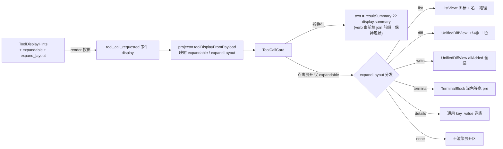

# Codex 风格工具调用卡片技术方案

> ⚠️ **本方案为历史文档**：文中 `ToolDisplayHints` 的 `summary_template` / `result_summary_template` /
> `render_fn` / `click_action` 与「后端 `display.summary` / `resultSummary`」等均为已被推翻的旧架构。
> 当前落地架构：后端 `ToolDisplayHints` 仅为纯静态声明（`verb`/`icon`/`expandable`/`expand_layout`），
> 所有摘要与 list/diff 条目由客户端共享渲染层 `apps/shared/ts/toolDisplayRules.ts` 生成；折叠态摘要来自
> `projectToolRequestSummary`、结果投影来自 `projectToolResult`。下文保留 Codex 风格卡片的布局/交互推导供追溯，
> 字段名以当前代码为准。

> 原方案摘要（已废弃）：在 `ToolDisplayHints` 声明式后端驱动架构之上把 `ToolCallCard` 升级为 Codex 风格，
> 新增 `expandable` / `expand_layout` 声明式字段，前端按字符串分发布局（list/diff/write/terminal/details/none）。
> 其中 `expandable` / `expand_layout` 的**纯静态声明**思路被保留，但其「后端渲染 summary」部分已被客户端渲染取代。
> 依赖策略（已与用户确认）：**零新依赖**——diff/list/terminal 三种展开态均为「按行前缀上色 / 列表映射 / 等宽 pre」级别，用已有 `lucide-react` + shadcn 原语手写为最优解；语法高亮库（shiki/prismjs，常 MB 级）与 diff 计算库（difflib/jsdiff）均不引入。
> 改动规模：中/大（后端 8 文件 + 前端 3 文件 + 扩展既有测试），按 `AGENTS.md` 第八节须走**独立审查 Agent + 独立测试 Agent** 闭环。

---

## 一、背景与目标

### 1.1 起点

「工具调用结果透传与前端渲染技术方案」（已落地）让前端 `ToolCallCard` 能基于 `display` + 结果字段做折叠/展开渲染。但当前前端有两个与 Codex 风格的差距：

1. **展开态无差异**：所有工具统一走「通用 `detail_keys` / 参数 key=value」兜底，缺少 Codex 那样的「目录/搜索列表（带图标）、patch 的 unified diff 上色、write 的全绿正文、terminal 的深色等宽输出」差异化呈现。
2. **可展开能力无声明**：前端没有「该工具能否展开、用哪种布局展开」的声明式信号，若要做差异化只能在前端 `switch(toolName)`，会把展示差异渗进前端、违反「前端零工具特化分支」既有约定。

> 说明（纠正初版设想）：初版曾以 "read_file 出现「读取 读取 main.py」动词重复" 作为痛点，但**经 `read_file` 实测**：`verb="读取"`、`summary_template="{path_basename} · L{start}-L{end}"`，前端拼接后为「读取 main.py · L1-L120」，**不存在动词重复**。故核心动机不是"修 verb 重复 bug"，而是「差异化展开态 + 声明式可展开能力」两条，以下据此重构。

### 1.2 目标

1. **声明式可展开能力**：后端 `ToolDisplayHints` 新增 `expandable` / `expand_layout`，前端只按字符串分发布局，**零工具名特化分支**。
2. **差异化展开态**：list（目录/搜索结果）、diff（patch unified diff）、write（写入全文绿色）、terminal（终端输出深色等宽）、details（通用 key=value 兜底）、none（不展开）。
3. **`read_file` 不展开**：`expandable=False` / `expand_layout="none"`，折叠行即全部区间信息；其 `open_file` 点击链路已存在，点「查看文件」打开 IDE 视图。
4. **`write_file` 全绿正文**：`content` 由 `"Wrote N bytes..."` 摘要改为写入的文件全文，由既有 `ToolOutputBudget`（默认 20_000 字符 + artifact 落盘）统一裁剪，Codex「write 展开=全绿正文」得以实现。
5. **零新依赖**：依赖成熟标准库与既有前端原语，不引入 MB 级库（用户约定：仅 MB 级以上依赖才需上报决策）。

设计取舍（已与用户确认）：

- **`expandable` / `expand_layout` 声明式字段**（而非前端 `switch(toolName)`）：全部展示差异收敛在后端 `ToolDisplayHints`，前端零分支，符合「前端零特化」既有约定。
- **手写展开组件**（而非引入语法高亮/diff 库）：参考图是无高亮的纯 `+`/`-` 上色 + 等宽 pre，成熟度与体积权衡下手写为最优解，不触碰「MB 级依赖须上报」红线。
- **不引入 `result_render_fn` 逃生舱**（YAGNI）：上一份透传方案 §11.1 已规划该逃生舱为「未来扩展」，本期验证 patch 单/多文件可由既有 `result_summary_template`（`{diff_stats[total_files]}` 单文件即 1）直接表达，**无真实触发条件**，故不落地。

---

## 二、现状与缺口

### 2.1 现状（已通读 7 个 handler + schema + 前端，行号为撰写时快照，落地前以 `read_file` 实际为准）

| 工具 | verb（现状） | summary_template（现状） | result_summary_template（现状） | 展开相关现状 |
|---|---|---|---|---|
| read_file | 读取 | `{path_basename} · L{start}-L{end}` | `已读取 {path_basename} · {line_count} 行` | `click_action="open_file:{path}"` 已存在；前端无 expandable 概念 |
| list_directory | 列目录 | `{path_basename}` | `{total} 个条目` | `click_action="open_file:{path}"` 已存在 |
| search_files | 搜索 | `{pattern}` | `共 {match_count} 条结果` | 无 |
| patch_tool | 编辑/补丁 | `{path_basename}` | `已修改 {diff_stats[total_files]} 个文件 · +{diff_stats[total_insertions]} -{diff_stats[total_deletions]}` | `content` 已是 diff；`click_action="open_file:{path}"` 已存在 |
| write_file | 写入 | `{path_basename}` | `已写入 {path_basename} · {byte_count} 字节` | `content` 为 `"Wrote N bytes..."` 摘要（**非全文**）；`click_action="open_file:{path}"` 已存在 |
| delete | 删除 | `{path_basename}` | `已删除 {path_basename}` | 无 |
| execute_terminal | 执行命令 | `{command}` | `退出码 {exit_code} · {line_count} 行输出` | `content` 已是输出 |

后端 `ToolDisplayHints` 当前字段：`verb / icon / summary_template / detail_keys / click_action / result_summary_template / render_fn`，**无** `expandable` / `expand_layout`。前端 `ToolDisplayInfo` 无 `expandable` / `expandLayout`。`ToolOutputBudget`（`tools/guard/tool_output_budget.py`）已对所有 observation 经 `tool_scheduler` 的 `_apply_output_budget` 统一截断（默认 `max_chars=20_000`），超限落盘 artifact 并写 `data["output_truncated"]` / `data["artifact_path"]`。

### 2.2 缺口

1. 前端展开态无差异（list/diff/write/terminal 全走 key=value 兜底），与 Codex 风格差距大。
2. 无声明式「可展开 / 布局」字段，前端无法零分支分发。
3. `write_file` 的 `content` 是摘要而非全文，Codex「write 展开=全绿正文」无法实现。
4. 展开态无统一 `data` 契约：list 布局需要 `entries` 列表，但 `list_directory` / `search_files` 当前 `data` 未提供前端可消费的 `entries` 元素结构。

---

## 三、方案概述（高层次）



### 3.1 后端核心改动

**A. `ToolDisplayHints` 扩展**：新增 `expandable: bool = True`、`expand_layout: str = "details"`（`none/details/list/diff/write/terminal`）。`render` 在算完基础 dict（默认或 `render_fn` 逃生舱路径）后**统一追加** `expandable` / `expand_layout`（`render_fn` 逃生舱无需感知这两个字段）。

**B. 7 个 handler `to_definition()` 声明补全**：按 §3.3 目标列声明 `expandable` / `expand_layout`，并在 `data` 补 `entries`（list 布局消费）；`write_file.content` 改为全文。

### 3.2 前端核心改动

**C. `projector.ts`**：`ToolDisplayInfo` 增加 `expandable: boolean`、`expandLayout: string`；`toolDisplayFromPayload` 映射 `display.expandable`（缺省 `true`）/ `display.expand_layout`（缺省 `"details"`）。

**D. `ToolCallCard.tsx`**：折叠行保持「`verb + summary` 前缀拼接」现状（`[display.verb, display.summary].filter(Boolean).join(" ")`）；展开区按 `expandLayout` 分发到 `ListView` / `UnifiedDiffView` / `TerminalBlock` / 通用兜底 / 不渲染；`>` 箭头仅 `expandable` 时渲染且可点。

**E. `ChatPanel.tsx`**：确认并透传 `display` 与 `resultData` 给 `ToolCallCard`（若无则补）。

### 3.3 7 个 handler 声明矩阵（现状 → 目标）

> 下表「现状」列为撰写时实测值；「目标」列仅列出**本期相对现状的变更**，未列出的字段保持不变（最小改动）。`expandable` 默认 `True`，故仅 `read_file` 需显式写 `False`；`expand_layout` 默认 `"details"`，故 `list/diff/write/terminal` 五工具需显式声明、其余（delete）沿用默认。

| 工具 | 现状 summary/result/其它 | 目标变更（相对现状） |
|---|---|---|
| read_file | 如上 | `expandable=False`、`expand_layout="none"`（其余不变，含既有 `open_file` clickAction） |
| list_directory | 如上 | `expandable=True`（默认可不写）、`expand_layout="list"`；`data` 补 `entries:[{name,type,path}]` |
| search_files | 如上 | `expandable=True`、`expand_layout="list"`；`data` 补 `entries`（content 模式 `[{file_path,line_number,content}]` / files 模式 `[{name,path}]`） |
| patch_tool | 如上 | `expandable=True`、`expand_layout="diff"`（其余不变，`content` 已是 diff） |
| write_file | 如上 | `expandable=True`、`expand_layout="write"`；`content` 改为写入的文件全文（摘要仍由 `result_summary_template` 承载） |
| delete | 如上 | 沿用默认 `expandable=True` / `expand_layout="details"`，**零变更** |
| execute_terminal | 如上 | `expandable=True`、`expand_layout="terminal"`（其余不变，`content` 已是输出） |

约定（已与代码核对）：

- **`list_directory` 保持现状 `result_summary_template="{total} 个条目"`**：本期不改其完成态折叠文案，仅新增 `expand_layout="list"` 让展开区呈现 `entries`；不把完成态覆盖回「读取 path」（避免无谓行为变更）。
- **`read_file` 最小改动**：仅加 `expandable=False` / `expand_layout="none"`，`data` 与 `summary` 一律不动（折叠行即全部区间信息，已满足 Codex 不展开语义）。
- **`search_files`**：`entries` 来自搜索引擎返回匹配列表（`search_content` / `search_filenames` 当前返回 `tuple[str,int]`，需同时捕获匹配项；该引擎改动已在上一份透传方案落地）。

---

## 四、`expandable` / `expand_layout` 声明式设计

### 4.1 背景

当前前端无「可展开 / 布局」概念；若做差异化展开只能前端 `switch(toolName)`，把展示差异渗进前端、违反「前端零工具特化分支」。

### 4.2 设计

后端 `ToolDisplayHints` 新增两字段，前端只消费字符串：

```python
expandable: bool = True          # 是否可展开
expand_layout: str = "details"   # none / details / list / diff / write / terminal
```

`render` 在基础 dict 后统一追加（逃生舱 `render_fn` 返回值形状不变，不感知这两字段）：

```python
def render(self, arguments: dict[str, Any]) -> dict[str, Any]:
    base = self.render_fn(arguments) if self.render_fn else self._render_default(arguments)
    base["expandable"] = self.expandable
    base["expand_layout"] = self.expand_layout
    return base
```

要点：

- `expandable` 默认 `True`，仅 `read_file` 显式 `False`；其余工具无需写 `expandable`（不冗余）。
- `expand_layout` 默认 `"details"`（delete 沿用），`list/diff/write/terminal` 五工具须显式声明各自布局——该字段对这五工具承载真实语义，非冗余。
- 前端 `toolDisplayFromPayload` 只做字段透传，不 `switch(toolName)`；布局分发在 `ToolCallCard` 内按 `expandLayout` 字符串 `switch` 一次，分支按**布局语义**（非工具名）划分。
- `read_file` 显式 `expand_layout="none"` → 折叠行即全部区间信息，无需展开区。

### 4.3 list 布局的 `entries` 数据契约

为避免前端在 list 分支内按工具名二次判别，统一 `entries` 元素 schema，前端 `ListView` 仅按**元素字段形状**渲染：

- `list_directory`：`entries:[{name:str, type:"file"|"dir", path:str}]` → 用 `Folder`/`File` 图标 + 名 + 路径。
- `search_files` content 模式：`entries:[{file_path:str, line_number:int, content:str}]` → 渲染 `file_path:line_number  content`。
- `search_files` files 模式：`entries:[{name:str, path:str}]` → 渲染 `name + path`。

`ListView` 判别逻辑（纯字段形状，不依赖工具名）：元素含 `file_path` → 搜索命中行；元素含 `type` → 目录/文件图标；元素含 `name`+`path` 且不含 `file_path` → 文件名+路径。这样前端零工具名特化。

---

## 五、代码落点（精确落点）

> **行号声明**：下表及 §5 中的所有行号均为本方案撰写时的源码快照，落地实现前须以 `read_file` 实际读取的最新行号为准，不得直接按本方案行号机械替换。

### 5.1 后端

#### A. `tools/schemas/tool_display.py` — 扩字段 + `render` 追加

`ToolDisplayHints` 新增：

```python
expandable: bool = True
expand_layout: str = "details"
```

`render` 在基础 dict 后追加 `expandable` / `expand_layout`（见 §4.2）。`render_fn` 逃生舱路径返回值形状不变（不含这两字段）。同步更新 docstring（参数/返回）。

#### B. 7 个 handler `to_definition()` 映射补全

按 §3.3 目标列逐文件改：

- `read_file.py:244`：补 `expandable=False, expand_layout="none"`（其余不变）。
- `list_directory.py:229`：补 `expand_layout="list"`；`data` 补 `entries:[{name,type,path}]`（result 观察构造点）。
- `search_files.py:231`：补 `expand_layout="list"`；`data` 补 `entries`（content/files 两模式各异，见 §4.3）。
- `patch_tool.py:451`：补 `expand_layout="diff"`（其余不变）。
- `write_file.py:208`：补 `expand_layout="write"`；`content` 改为写入的文件全文（摘要仍走 `result_summary_template`）。
- `delete.py:335`：零变更（沿用默认 `expandable=True` / `expand_layout="details"`）。
- `execute_terminal.py:184`：补 `expand_layout="terminal"`（其余不变）。

#### C. 前端（3 文件）

`services/timeline/projector.ts`：`ToolDisplayInfo` 增加 `expandable: boolean`、`expandLayout: string`；`toolDisplayFromPayload` 映射 `display.expandable`（缺省 `true`）/ `display.expand_layout`（缺省 `"details"`）。

`components/chat/ToolCallCard.tsx`：折叠行保持 `verb + summary` 拼接现状；展开态按 `expandLayout` 分发，新增/复用三个子组件（同文件或就近模块）：

- `ListView`：list 布局，按 §4.3 元素字段形状渲染（不依赖工具名）。
- `UnifiedDiffView`：diff / write 布局，按行前缀上色（`+` 绿 / `-` 红 / `@@` 蓝 / `diff --git` 加粗 / 其余普通；write 模式 `allAdded` 每行加 `+` 绿块）。写全文受 `ToolOutputBudget` 截断，前端展开态据 `data["output_truncated"]` / `data["artifact_path"]` 显示「完整输出已截断，见 artifact」提示。
- `TerminalBlock`：terminal 布局，深色等宽 `pre`、可滚动 + 复制按钮。

`components/layout/ChatPanel.tsx`：确认并透传 `display` 与 `resultData`（若无则补）。

### 5.2 改动最小化核对

- 不新增事件类型、不破坏 `tool_call_finished` payload 结构（沿用上一份方案已落地字段）。
- `expandable` / `expand_layout` 均有默认值（`True` / `"details"`）→ 仅 `read_file` 写 `expandable=False`、`read_file/list/search/patch/write/terminal` 写 `expand_layout`；`delete` 零变更。
- `render` 现有声明式路径完全保留，仅统一追加两字段；`render_fn` 逃生舱形状不变。
- 前端展开态分发为「按布局语义」单一 `switch`，不按工具名分支；list 分支按元素字段形状判别（§4.3），不按工具名。
- `ToolObservation` 契约零改动；`write_file` 的 `content` 改为全文，由既有 `ToolOutputBudget` 统一裁剪（非新造截断逻辑）。

---

## 六、测试计划（独立测试 Agent 执行）

### 6.1 后端测试

**扩展 `tests/test_tool_display.py`**：

- `expandable` / `expand_layout` 默认值（`True` / `"details"`）与 handler 覆盖值（read_file `False` / `none`）在 `render` 输出 dict 中正确出现。
- `render_fn` 逃生舱返回值自动附带 `expandable` / `expand_layout`（无需 handler 感知）。

**扩展 `tests/test_tool_execution_service.py`**：

- `TOOL_CALL_FINISHED` 事件 payload 的 `summary` / `data` 透传正确；`expand_layout` 目标值经 `display.render` 进入 `tool_call_requested` 的 `display`。
- `write_file` 全文受 `ToolOutputBudget` 裁剪后 `data["output_truncated"]` 出现在 payload（集成断言）。

### 6.2 前端测试

- `projector.test.ts`：`tool_call_requested` 的 `display` 含 `expandable` / `expandLayout`，缺省值正确。
- `ToolCallCard` 折叠行保持 `verb + summary` 拼接断言；`expandLayout` 各分支（list/diff/write/terminal/details/none）渲染分发断言；list 分支按元素字段形状判别（不依赖工具名）断言。

### 6.3 闭环

- `uv run ruff check` 零新增告警。
- `uv run mypy` 零新增类型错误。
- 覆盖率 >80%（新增/修改模块）。
- 独立审查 Agent + 独立测试 Agent 闭环至全通过。

---

## 七、已知限制与风险

1. **`write_file` 全文受 `ToolOutputBudget` 覆盖**：实测 `ToolOutputBudget` 已由 `tool_scheduler._apply_output_budget` 对所有 observation（含 write_file）统一截断（默认 `max_chars=20_000`），超限落盘 artifact 并写 `data["output_truncated"]` / `data["artifact_path"]`。本期**不在 write_file 构造点加等长截断**（避免重复造轮子），仅前端展开态据 `data["output_truncated"]` / `data["artifact_path"]` 显示截断提示。
2. **手写展开组件不语法高亮**：diff/list/terminal 均为纯前缀上色 + 等宽 pre，无语义高亮；与参考图一致，符合「零新依赖」取舍。
3. **前端兼容性**：旧 SSE 消息不携带 `expandable` / `expand_layout` → `projector` 缺省值（`true` / `"details"`）保证旧记录降级为通用展开兜底，不崩不报错。

---

## 八、实施分期

| 阶段 | 内容 | 涉及文件 |
|---|---|---|
| P0 | `ToolDisplayHints` 扩 `expandable` / `expand_layout` + `render` 追加 | `tool_display.py` |
| P1 | 7 个 handler 补全 `expandable` / `expand_layout` + `data` 补 `entries` + `write_file` 正文改全文 | 7 个 handler 文件 |
| P2 | 前端 `projector.ts` 扩 `ToolDisplayInfo` + `toolDisplayFromPayload` 映射 | `projector.ts` |
| P3 | 前端 `ToolCallCard.tsx` 展开态分发 + 子组件（`ListView` / `UnifiedDiffView` / `TerminalBlock`）+ `ChatPanel.tsx` 透传 | `ToolCallCard.tsx`、`ChatPanel.tsx` |
| P4 | 测试 + `ruff check` / `mypy` 清零 | `tests/` |
| P5 | 独立审查 Agent + 独立测试 Agent 闭环 | — |

---

## 九、闭环与验收

1. 本技术方案经**独立审查 Agent** 审核（对照 `rules/Agent代码开发规范.md`：单一职责、改动最小化、不重复造轮子、依赖锁版本、分层、无跨层、docstring 同步），输出 符合/不符合 + 问题清单。
2. 按审查意见落地代码（P0–P4 逐阶段）。
3. 走**独立测试 Agent** 补测试，覆盖率 >80%，`pytest` / 前端测试全绿。
4. 交付前 `uv run ruff check` + `uv run mypy` 零新增告警；开发 Agent 不自判完成。

---

## 十、风险与回滚

- `ToolDisplayHints` 的 `expandable` / `expand_layout` 均有默认值（`True` / `"details"`）→ 不传时不触发任何行为改变；回滚仅删字段声明，构造点自动用旧 args。
- `render` 仅在基础 dict 后追加两字段，不改变既有 `verb` / `icon` / `summary` / `detail_keys` / `click_action` 形状，前端旧分支（若暂未升级）仍可工作。
- `write_file` 的 `content` 改为全文属观察内容调整，回滚仅恢复为短摘要，不影响落盘正确性（裁剪仍由 `ToolOutputBudget` 兜底）。
- 前端 `projector` 的 `expandable` / `expandLayout` 缺省值保证旧 SSE 消息降级为通用展开，无兼容崩溃。

---

## 十一、未来扩展（非本期）

### 11.1 语法高亮

若需 diff / 终端输出语义高亮，可引入轻量高亮库；但 shiki/prismjs 常 MB 级，按用户约定须上报决策，本期明确不引入。

### 11.2 `result_render_fn` 逃生舱（YAGNI，本期不落地）

上一份透传方案 §11.1 规划了 `result_render_fn` 作为条件式结果摘要逃生舱。本期验证 patch 单/多文件可由既有 `result_summary_template`（`{diff_stats[total_files]}` 单文件即 1）直接表达，**无真实触发条件**，故不引入。若后续出现模板确实无法表达的条件式结果摘要（非"单/多文件"这类模板可覆盖的用例），再对称加 `result_render_fn`。

### 11.3 列表虚拟化 / 超长自动折叠

目录/搜索条目极多时前端 `ListView` 可加虚拟滚动；结果正文超阈值时自动折叠并显示「显示完整输出」。均为性能/交互增强，不影响后端契约。
