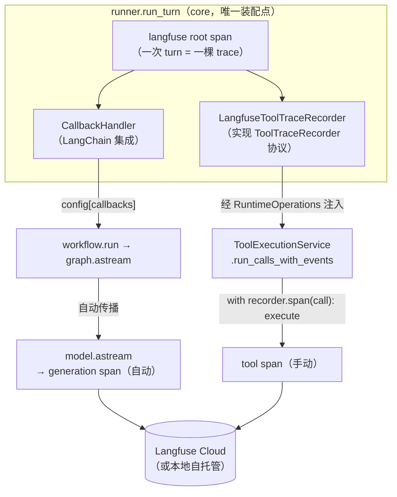

# Langfuse 可观测性集成技术方案（含工具调用 Trace）

> 状态：方案评审中（未实施）
> 日期：2026-07-28
> 范围：后端 LLM 调用追踪 + 工具调用追踪；前端展示为后续独立任务
> 部署形态：Langfuse Cloud 起步（零 Docker），代码预留一键切换本地自托管

---

## 一、背景与目标

项目当前的可排查手段是 JSONL 结构化日志 + `runtime_events` 表，缺少「一次 turn 的完整调用树视图」：模型每步的 token/耗时/成本、每个工具调用的输入/输出/耗时无法在一个界面串起来看。

目标：

1. **LLM 调用自动追踪**：每次 `model.astream` 的 prompt / completion / token 用量 / 耗时自动上报。
2. **工具调用纳入 trace**（本方案重点）：每个 `ToolCall → ToolObservation` 形成一个 tool span，含参数、结果、状态、耗时，与同一 turn 的 LLM span 挂在同一棵 trace 树下。
3. **零侵入降级**：未启用 / 缺密钥 / 未安装 langfuse 时，运行时行为与集成前完全一致。
4. **本地切换零代码**：改 `LANGFUSE_BASE_URL` 环境变量即可指向 Docker 自托管实例。

## 二、现状链路分析（关键事实）

| 环节 | 位置 | 事实 |
|---|---|---|
| 图执行入口 | `core/workflows/react/workflow.py` | `graph.astream(input, config, stream_mode=["custom"])`，`config` 是 callback 注入点 |
| LLM 调用 | `core/workflows/react/nodes.py` `_model_node` | `model.astream(...)`，LangGraph 会自动传播 `config["callbacks"]` 到此处 |
| 工具执行编排 | `service/tool_execution/tool_execution_service.py` | `run_calls_with_events` 串行循环 `scheduler.execute(call)`，产出 `ToolObservation` |
| 工具服务构造点 | `core/runtime/runtime_operations.py` `__init__` | `RuntimeOperations` 内部构造 `ToolExecutionService` |
| turn 执行总控 | `core/runtime/runner.py` `run_turn` | 构造 operations → `workflow.run(task, operations)` 消费事件流 |
| 工具生命周期事件 | `TOOL_CALL_REQUESTED`（nodes.py 发出，含参数）/ `TOOL_CALL_FINISHED`（service 发出，仅 status） | `TOOL_CALL_STARTED` 为保留事件，当前未发出 |
| 隔离模式 | `tool_executor.py` | 7 工具默认 thread（当前线程直跑），`execute_terminal` 为 process 子进程 |

**分层约束（决定方案形态）**：

- `service` 不得 import `core`（`core → service` 单向）；因此 Langfuse 耦合代码若收口在 `core/observability/`，`ToolExecutionService` 不能直接引用它。
- `tools` 不得 import `service`；工具系统内部（scheduler/executor）不应感知可观测性。
- 工具调用**串行执行**（已定决议，无并发），span 生命周期管理无竞态问题。

## 三、总体架构



核心思路：

- **LLM 追踪走官方 LangChain 集成**（`CallbackHandler` 注入 `config["callbacks"]`），零侵入节点代码。
- **工具追踪走「协议注入」（依赖倒置）**：`service` 层定义窄协议 `ToolTraceRecorder`，`core/observability/` 提供 Langfuse 实现，`runner` 在装配时注入。`service` 只依赖自己定义的协议，不认识 Langfuse。
- **统一 trace 树**：runner 在消费事件流前用 `start_as_current_span` 打开 turn 级根 span；Langfuse v3 SDK 基于 OpenTelemetry，OTel context 通过 asyncio contextvars 自然传播——`CallbackHandler` 的 generation span 与工具 span 都会自动挂到这棵根 span 下，无需手工传 trace_id。

### 为什么工具追踪不能也走 CallbackHandler 自动化

本项目工具系统是自定义的（不基于 LangGraph `Tool` / `ToolNode`），LangChain callback 体系感知不到 `ToolScheduler.execute`，因此工具 span 必须手动创建。这是既有架构决议（「工具注册与执行保持自定义」）的自然代价，本方案用最小侵入方式补齐。

## 四、方案选型（工具调用如何进 trace）

| 方案 | 做法 | 优点 | 缺点 | 结论 |
|---|---|---|---|---|
| A. 事件驱动映射 | runner 消费 `TOOL_CALL_REQUESTED` / `TOOL_CALL_FINISHED` 事件，配对后补建 span | 对 service/tools 零侵入 | `TOOL_CALL_FINISHED` payload 只有 status，缺输出/错误/耗时；补字段要动 payload 契约并重新生成前端 TS 类型；还需维护有状态的配对器 | ✗ 数据不全、连带改动大 |
| B. service 直接埋点 | `ToolExecutionService` 直接 `import langfuse` 创建 span | 实现最短 | Langfuse 耦合泄漏进 service 层，违反「可观测性收口 observability 模块」；测试需 mock 三方库 | ✗ 违反收口原则 |
| **C. 协议注入（推荐）** | service 定义 `ToolTraceRecorder` 协议，core/observability 实现，runner 注入 | 计时精确（包住真实执行）；`ToolObservation` 全量字段可上报；Langfuse 耦合仍收口 core/observability；service 仅多一个可选依赖协议 | 需要沿 `runner → RuntimeOperations → ToolExecutionService` 传一个可选参数 | ✓ 采纳 |

方案 C 的分层合规性：协议文件放在 `service/tool_execution/` 内（service 自己定义、自己消费）；`core/observability` 的实现类按 Python `Protocol` 结构化子类型满足协议（无需 import service，即便 import 也合法，因 `core → service` 是允许方向）。**无任何反向依赖。**

## 五、详细设计

### 5.1 配置（`app/config/settings.py`）

新增 4 个 `ClassVar` 静态属性，`Settings.load()` 中经 `CODING_AGENT_` 前缀环境变量读取：

```python
LANGFUSE_ENABLED: ClassVar[bool] = False          # CODING_AGENT_LANGFUSE_ENABLED
LANGFUSE_PUBLIC_KEY: ClassVar[str | None] = None  # CODING_AGENT_LANGFUSE_PUBLIC_KEY
LANGFUSE_SECRET_KEY: ClassVar[str | None] = None  # CODING_AGENT_LANGFUSE_SECRET_KEY
LANGFUSE_BASE_URL: ClassVar[str] = "https://cloud.langfuse.com"  # CODING_AGENT_LANGFUSE_BASE_URL
```

字段自动进入 `_OVERRIDABLE`（由 `__annotations__` 派生），测试经 `Settings.override()` 注入。切本地自托管仅需改 `LANGFUSE_BASE_URL`。

### 5.2 依赖（`apps/backend/pyproject.toml`）

```toml
"langfuse==4.14.1",
```

锁版本；v3+ SDK 基于 OpenTelemetry，LangChain 集成导入路径为 `from langfuse.langchain import CallbackHandler`。执行 `uv lock && uv sync`。

### 5.3 新增模块 `app/core/observability/`（Langfuse 耦合唯一收口）

```text
core/observability/
  __init__.py                        # 薄壳 re-export
  langfuse_tracing.py                # 客户端初始化 + turn 根 span + CallbackHandler 工厂 + flush
  langfuse_tool_trace_recorder.py    # ToolTraceRecorder 协议的 Langfuse 实现（一文件一类）
```

#### `langfuse_tracing.py` —— 客户端与 turn 级 trace 上下文

职责：读 `Settings`、初始化进程级 Langfuse 客户端（幂等）、提供 turn 根 span 上下文管理器与 `CallbackHandler` 工厂、进程退出 flush。不负责 trace 内容语义与业务编排。

```python
@dataclass(frozen=True)
class TraceMetadata:
    """一次 turn 的可观测元数据（session 分组与检索键）。"""
    task_id: str
    turn_id: str
    agent_id: str
    workspace_id: str | None = None


def tracing_enabled() -> bool:
    """启用开关 + 密钥齐备 + langfuse 可导入，三条件同时满足才返回 True。"""


@contextmanager
def turn_trace(metadata: TraceMetadata) -> Iterator[list[Any]]:
    """打开 turn 级根 span 并产出待注入 workflow 的 callbacks 列表。

    - 未启用 → yield []，完全空操作（零开销路径）。
    - 启用 → langfuse.start_as_current_span(name=f"turn {turn_id}") 作为根 span，
      经 span.update_trace(session_id=task_id, user_id=agent_id,
      tags=["coding-agent"], metadata={...}) 写 trace 级属性，
      在该上下文内构造 CallbackHandler() 并 yield [handler]。
    - 任何 Langfuse 侧异常 → log.exception 后降级为 yield []，绝不中断 turn 执行。
    """


def flush_langfuse() -> None:
    """尽力 flush 缓冲 trace；进程退出前调用（api/app.py lifespan finally）。"""
```

> 说明：v3 SDK 中 trace 级属性（session_id/user_id/tags/metadata）通过根 span 的
> `update_trace()` 设置，而非 `CallbackHandler` 构造参数（v2 旧 API）。
> `session_id=task_id` 使同一任务多轮 turn 在 Langfuse UI 聚为一个 session；
> 每个 turn 是 session 内一棵独立 trace。

#### `langfuse_tool_trace_recorder.py` —— 工具 span 实现

```python
class LangfuseToolTraceRecorder:
    """把每次工具调用记录为 Langfuse tool span（实现 ToolTraceRecorder 协议）。

    职责边界：
    - 负责：span 开闭、输入输出映射、错误级别标注、输出脱敏。
    - 不负责：工具执行本身、事件发出、trace 根上下文（由 turn_trace 建立）。
    """

    @contextmanager
    def span(self, call: ToolCall, step_id: str) -> Iterator[ToolCallSpan]:
        # langfuse.start_as_current_observation(as_type="tool",
        #     name=call.tool_name,
        #     input={"arguments": <脱敏后参数>, "call_id": call.call_id},
        #     metadata={"step_id": step_id})
        # yield 一个 ToolCallSpan 适配对象；离开上下文自动 end（耗时自动计算）
        ...
```

`ToolCallSpan.record(observation)` 的字段映射：

| ToolObservation 字段 | Langfuse span 字段 |
|---|---|
| `content`（经 `redact_terminal_output` 脱敏） | `output.content` |
| `status == "error"` | `level="ERROR"` + `status_message=observation.error` |
| `error` / `reason` / `retryable` / `permission` | `output.error` / `output.reason` / `output.retryable` / `metadata.permission` |
| `data`（结构化载荷） | `output.data` |
| `tool_call_id` | `metadata.tool_call_id` |

隔离模式兼容性：thread 模式工具在当前线程直跑，span 直接包住执行；process 模式（`execute_terminal`）span 在父进程包住子进程完整生命周期（含超时强杀），耗时语义正确。子进程内部不产生 span，无跨进程上下文传递问题。

### 5.4 service 层协议（`app/service/tool_execution/tool_trace_recorder.py`，新增）

service 自己定义、自己消费的窄协议，**零三方依赖**：

```python
class ToolCallSpan(Protocol):
    def record(self, observation: ToolObservation) -> None:
        """把工具执行的观察结果写入当前 span。"""

class ToolTraceRecorder(Protocol):
    def span(self, call: ToolCall, step_id: str) -> AbstractContextManager[ToolCallSpan]:
        """为一次工具调用打开追踪 span；上下文退出即结束计时。"""
```

### 5.5 `ToolExecutionService` 改造（唯一的 service 层改动）

构造函数新增可选参数 `trace_recorder: ToolTraceRecorder | None = None`；`run_calls_with_events` 循环体改为：

```python
for call in calls:
    if self._trace_recorder is not None:
        with self._trace_recorder.span(call, step_id) as span:
            observation = self._scheduler.execute(call, ...)
            span.record(observation)
    else:
        observation = self._scheduler.execute(call, ...)
    # ...后续事件发出与消息构造逻辑不变...
```

> 为避免 if/else 重复，可让 recorder 缺省为一个模块级 `_NULL_RECORDER`（空实现，
> span 为空上下文），循环体只保留 `with` 一条路径。实现时二选一，以可读性为准。

`ToolObservation` / `ToolScheduler` / `ToolExecutor` / 各 handler **零改动**。

### 5.6 注入链路（core 层）

1. **`runtime_operations.py`**：`RuntimeOperations.__init__` 新增可选参数 `tool_trace_recorder: ToolTraceRecorder | None = None`，透传给 `ToolExecutionService` 构造。
2. **`runner.py` `run_turn`**：

```python
metadata = TraceMetadata(task_id=..., turn_id=..., agent_id=..., workspace_id=...)
recorder = LangfuseToolTraceRecorder() if tracing_enabled() else None
operations = self._build_operations(task, turn, agent_profile, tool_trace_recorder=recorder)

with turn_trace(metadata) as callbacks:
    async for event in agent_profile.workflow.run(task, operations, callbacks=callbacks):
        yield await emit(event)
```

3. **`workflow.py`**：`run()` 新增可选参数 `callbacks: list | None = None`，合并进 `graph.astream` 的 `config["callbacks"]`。workflow 保持框架无关（参数类型不引用 Langfuse）。
4. **`api/app.py`**：lifespan `finally` 中调用 `flush_langfuse()`。

### 5.7 最终 trace 树形态（Langfuse UI 预期）

```text
trace: turn <turn_id>            (session = task_id, user = agent_id)
└── span: turn <turn_id>                      ← runner 根 span
    ├── chain: LangGraph                      ← CallbackHandler 自动
    │   ├── generation: deepseek-chat (step1) ← token/耗时/成本自动
    │   ├── generation: deepseek-chat (step2)
    │   └── ...
    ├── tool: read_file                       ← recorder 手动 span
    ├── tool: execute_terminal
    └── tool: write_file
```

> 已知形态限制：手动 tool span 是根 span 的直接子节点，与 LangChain chain span 平级，
> 不嵌在对应 generation 之下（LangChain callback 不设置 OTel current context，无法感知
> 「当前在哪个 chain span 里」）。定位靠 `metadata.step_id` / `tool_call_id` 关联，够用；
> 强行嵌套需在 nodes.py 传递 span 引用，破坏分层，不做（YAGNI）。

## 六、安全与脱敏

- **输出脱敏**：`observation.content` 上报前经既有 `trace_infra.redaction.redact_terminal_output`（与回传模型的脱敏边界一致，不新造轮子）。
- **输入脱敏**：工具参数原样上报（本地单用户桌面场景，参数即用户自己的命令/路径）；`redact_terminal_output` 若已覆盖 secret 模式则顺带对参数字符串套用，实现时确认其接口适配成本，成本高则 v1 不做（记入开放问题）。
- **密钥**：Langfuse public/secret key 仅存环境变量，不落库、不进日志、不进 trace metadata。

## 七、降级与失败策略

| 场景 | 行为 |
|---|---|
| `LANGFUSE_ENABLED=False`（默认） | `turn_trace` yield `[]`、recorder 为 None，运行时零额外开销，行为与集成前一致 |
| 启用但缺密钥 | 同上 + `log.warning("langfuse_disabled_missing_keys")` 一次 |
| langfuse 未安装 | 同上 + `log.warning("langfuse_not_installed")`；所有 langfuse import 均为函数内懒加载 |
| span 创建/上报异常 | `log.exception` 后继续执行工具，**绝不因可观测性失败中断 turn** |
| 上报网络阻塞 | SDK 后台批量异步上报（OTel BatchSpanProcessor），不阻塞执行线程；退出前 `flush_langfuse()` 尽力送达，失败仅记日志 |

## 八、测试计划（独立测试 Agent 执行）

新增 `tests/test_langfuse_tracing.py` / `tests/test_tool_trace_recorder.py`：

1. 未启用 → `tracing_enabled()` False、`turn_trace` yield 空列表、不触碰 langfuse import。
2. 启用但缺密钥 → 同上并记 warning。
3. `ToolExecutionService` 注入假 recorder（内存实现协议）→ 断言每个 call 对应一次 `span()` 开闭、`record()` 收到对应 observation、事件发出与消息构造不受影响。
4. recorder `span()` 内抛异常 → 工具仍执行、observation 正常产出（降级不中断）。
5. `ReactLikeWorkflow.run(..., callbacks=[sentinel])` → mock graph 断言 `config["callbacks"]` 包含 sentinel。
6. 回归：既有 `run_calls_with_events` 相关测试全绿（recorder 缺省 None 路径）。

真实上报到 Langfuse Cloud 的联调属手工验收（配置密钥后跑一轮 turn，UI 核对 trace 树形态与第 5.7 节一致），不进 CI。

## 九、实施分期与闭环

| 阶段 | 内容 | 涉及文件 |
|---|---|---|
| P0 | 依赖锁版本 + Settings 4 字段 | `pyproject.toml`、`settings.py` |
| P1 | `core/observability/` 两个新文件 + service 协议文件 | 3 个新增文件 |
| P2 | service 埋点 + 注入链路 | `tool_execution_service.py`、`runtime_operations.py`、`runner.py`、`workflow.py`、`api/app.py` |
| P3 | 测试 + `ruff check` / `mypy` 清零 | `tests/` 2 个新文件 |
| P4 | 独立审查 Agent + 独立测试 Agent 闭环（中型改动：新文件 + 多文件 + 核心链路） | — |
| P5（后续） | 客户端可观测性入口（iframe 嵌 Langfuse UI，`sessionId=task_id` 过滤） | desktop（单独任务） |

## 十、开放问题

1. DeepSeek 模型单价不在 Langfuse 内置价表 → 成本列可能为空；需要精确成本时在 Langfuse 控制台配置自定义模型单价（不改代码）。
2. 工具参数是否套用 `redact_terminal_output` 级别的输入脱敏（见第六节），实现时按接口适配成本定。
3. `TOOL_CALL_STARTED` 保留事件与本方案无关，维持不发出；若未来前端需要「执行中」态再启用，与 trace 体系互不影响。
