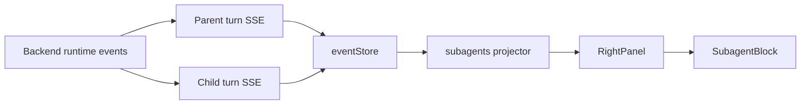

# Concurrent Subagent UI Design

## Context

The backend already emits delegation lifecycle runtime events:

- `delegation_started`
- `delegation_child_started`
- `delegation_finished`
- `delegation_failed`
- `delegation_cancelled`

The desktop client already stores runtime events by task and by turn in `eventStore`, subscribes to child-turn event streams through `useDelegationStreams`, and renders delegation lifecycle entries inside the parent turn timeline. The remaining gap is the right-panel `SubagentBlock`, which is still a placeholder and does not show concurrent child Agent execution under the current task.

## Goal

Add a first-class right-panel view for subagent execution under the current task. The view must show multiple delegated child Agents running concurrently, their lifecycle state, latest activity, child-turn linkage, and terminal summary or error.

This should reuse existing runtime event state as the source of truth. It must not introduce a parallel subagent state system unless a later performance or persistence need proves that necessary.

## Non-Goals

- Do not add a second backend API just to query subagent status.
- Do not duplicate SSE connection logic.
- Do not replace the existing parent timeline delegation rendering.
- Do not implement nested subagent visualization beyond preserving data shapes that can support it later.
- Do not add a new UI framework.

## Recommended Architecture

Use an event projection layer plus a pure right-panel rendering component.

1. Add a dedicated projection module, likely `apps/desktop/src/services/subagents/projector.ts`.
2. The projector consumes current task runtime events and `eventsByTurnId`.
3. It returns stable `SubagentRunViewModel[]` grouped by `delegation_id`.
4. `SubagentBlock` becomes a pure display component that receives projected items.
5. The right-panel container wires `eventStore` state into the projector.

This keeps responsibilities clear:

- `eventStore`: raw runtime event cache and turn shards.
- `useDelegationStreams`: child-turn SSE subscription orchestration.
- `services/subagents/projector.ts`: delegation and child-turn event projection.
- `SubagentBlock`: rendering only.
- `RightPanel`: composition and data passing.

## View Model

The projected item should include:

```ts
export interface SubagentRunViewModel {
  delegationId: string;
  parentTurnId: string;
  childTurnId?: string;
  childAgentId: string;
  delegationType: string;
  status: "pending" | "running" | "waiting_approval" | "completed" | "failed" | "cancelled";
  startedAt?: string;
  finishedAt?: string;
  latestActivityAt?: string;
  latestActivity?: string;
  summary?: string;
  error?: string;
  toolCounts: {
    running: number;
    completed: number;
    failed: number;
  };
  messagePreview?: string;
}
```

The exact fields can be narrowed during implementation if tests show a simpler shape is enough, but the projector should remain the boundary that hides raw event details from UI components.

## Data Flow



The parent task stream provides delegation lifecycle events. Child-turn streams provide model, tool, and terminal events for each child turn. The projector merges both sources by `delegation_id` and `child_turn_id`.

## UI Behavior

The right-panel `SubagentBlock` should show:

- Header with total count and running/completed/failed counts.
- Empty state when no delegation has occurred.
- One compact row per delegation.
- Status icon and badge.
- Child Agent id and delegation type.
- Latest activity preview.
- Tool count summary.
- Terminal summary or error when available.
- Optional expand/collapse for a child-turn activity preview.

The design should stay dense and operational, consistent with the existing desktop UI. It should not become a marketing-style card layout.

## Event Semantics

Lifecycle events are merged by `delegation_id`.

Terminal lifecycle events must not be downgraded by late nonterminal events. This matches the existing timeline projector behavior.

Child-turn activity is derived from `eventsByTurnId[childTurnId]`:

- `model_output_delta` and `final_response` can provide message preview.
- `tool_call_started`, `tool_output_delta`, and `tool_call_finished` can provide latest activity and tool counts.
- `run_finished`, `run_failed`, and `run_cancelled` can reinforce terminal display but should not override explicit delegation terminal events when those are present.

Malformed delegation events without `delegation_id` should be skipped and logged through the existing frontend logger.

## Testing

Add focused Vitest coverage for the projection layer:

- Multiple delegations from the same parent turn are projected independently.
- Concurrent running children remain visible at the same time.
- `delegation_child_started` fills `childTurnId` without duplicating the row.
- Terminal events update the existing row.
- Late nonterminal events do not downgrade terminal status.
- Child-turn tool events update tool counts and latest activity.
- Missing or malformed delegation ids are ignored.

Add component tests for `SubagentBlock`:

- Empty state.
- Running/completed/failed rows.
- Long ids and summaries do not overflow.
- Expand/collapse renders child activity preview when provided.

## Development Entry Plan

After this design is approved:

1. Invoke the `writing-plans` superpower.
2. Create an implementation plan with test-first steps.
3. Implement the projector and tests.
4. Replace the placeholder `SubagentBlock` with the pure display component.
5. Wire the right panel to projected state.
6. Run Vitest for affected frontend tests.
7. Run the required review and verification loop before claiming completion.
