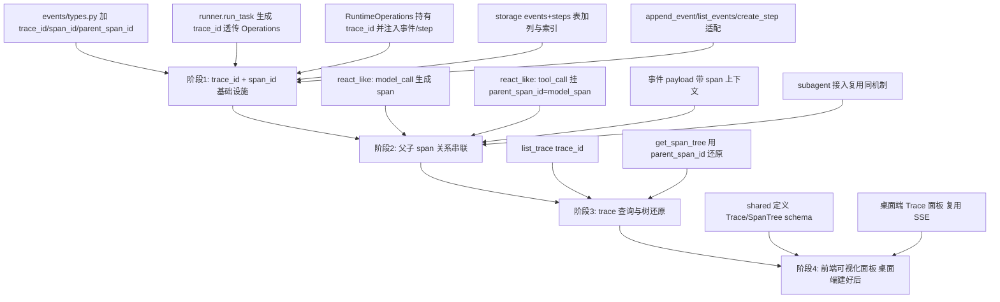

# 全链路 Trace 系统设计

本文记录 coding-agent 在**单次任务内**（`model → tool → subagent`）调用链路追踪（trace）的设计方案。该方案基于现有 `RuntimeEvent` + `task / turn / step / checkpoint` 体系做轻量扩展，不引入 OpenTelemetry 等重依赖，符合 AGENTS.md 中"不重复造轮子、改动最小化、本地桌面交付、模型无关"的原则。

## 背景与目标

当前后端已经具备结构化的运行时事件与层级状态模型，但还无法还原"一次任务内部模型调用、工具调用、子 Agent 调用之间的父子调用树"。本方案的目标是为单次任务建立可追踪、可还原、可审计的调用链路，支撑后续的调试、性能分析、失败定位与可视化。

目标边界（已与用户确认）：

- **范围**：单次任务内 `model → tool → subagent` 的调用链路。
- **不包含**：前端点击 → API 路由 → Runtime → 模型/工具的整条 HTTP/SSE 链路（类似传统 APM）。API/HTTP 层不在本方案内。

## 现状盘点

### 已有的好底子（可直接复用）

- `RuntimeEvent`（`apps/backend/app/events/types.py`）已是结构化事件，自带 `event_id`、`task_id`、`event_type`、`payload`、`created_at`。
- `runner.py` 的 `_record()` 已是统一的事件落库 + 日志入口，workflow 全程通过它产出事件。
- SQLite 已有 `events` 表，按 `task_id` 顺序存储；`steps` 表记录每个 step 的 `status` 与 `created_at / updated_at`。
- 已有 `session / task / turn / step / checkpoint` 层级模型，天然是 trace 的骨架。

### 当前缺口

1. **缺少贯穿标识**：`RuntimeEvent` 只有 `task_id`，没有 `trace_id`，一次任务内的事件无法被一个稳定 ID 贯穿聚合。
2. **缺少父子链路**：`model_call` 触发的 `tool_call`、以及 `tool_call` 派生的 `subagent` 调用之间没有父子关系字段，无法还原调用树。
3. **steps 表没有 trace 上下文**：`StepRecord` 与 `steps` 表没有 `trace_id` / 父 span 指针，无法直接从 step 维度还原树。
4. **没有独立 span 概念**：现有事件离散，缺少"一次 model_call / tool_call 从开始到结束"的 span 聚合能力（当前 step 的 `status` + 时间戳已能算出 duration，但缺少 span 级父子指针）。

### 现有真实结构（实施前）

`events` 表：

```text
event_id TEXT PRIMARY KEY
task_id TEXT NOT NULL
event_type TEXT NOT NULL
payload_json TEXT NOT NULL
created_at TEXT NOT NULL
```

`steps` 表：

```text
step_id TEXT PRIMARY KEY
turn_id TEXT NOT NULL
step_type TEXT NOT NULL
status TEXT NOT NULL
input_summary TEXT NOT NULL
output_summary TEXT NOT NULL
error TEXT
created_at TEXT NOT NULL
updated_at TEXT NOT NULL
```

`RuntimeEvent` 字段：`event_type, task_id, payload, event_id, created_at`。

`StepRecord` 字段：`step_id, turn_id, step_type, status, input_summary, output_summary, error, created_at, updated_at`。

## 设计原则

- **复用优先**：基于现有 `RuntimeEvent` 与 step 体系扩展，不另起炉灶。
- **改动最小**：新增字段默认生成，向后兼容既有事件与查询。
- **模型无关**：trace 上下文不依赖任何具体模型或协议。
- **本地优先**：trace 数据落在本地 SQLite，不引入外部 trace 后端。
- **span 与业务实体解耦**（见方案选型）：为未来 subagent / checkpoint / context compaction / 流式 delta 独立打 span 预留空间。

## 方案选型

关于 `span_id` 的取法，讨论过两种：

| 维度 | 方案 X（step_id 即 span_id） | 方案 Y（span 独立生成，已选） |
| --- | --- | --- |
| span 与 step 关系 | 合一 | 解耦，独立 ID 空间 |
| 父子指针 | `parent_step_id` | `parent_span_id`（指向 span，非 step） |
| subagent / checkpoint 打 span | 受限（必须建 step） | 自由（任何阶段可独立开 span） |
| 查询树依据 | step_id 树 | span_id 树 |
| 复杂度 | 极低 | 略高（多一层生成/映射） |

**决策：方案 Y**。理由：`span_id` 与 `step_id` 解耦后，未来像 `context_compaction`、`checkpoint`、流式 `model_output_delta` 这些不一定是 step 的阶段也能独立开 span 挂到链路里，全链路更完整，更贴合 AGENTS.md 要求的"生产级深度"。代价仅是多一层 `span_id` 生成与映射，属于可接受投入。

## 数据模型设计

### RuntimeEvent（events/types.py）

新增三个字段，默认生成，向后兼容：

```python
@dataclass(frozen=True)
class RuntimeEvent:
    event_type: str
    task_id: str
    payload: Dict[str, Any] = field(default_factory=dict)
    event_id: str = field(default_factory=lambda: str(uuid4()))
    created_at: datetime = field(default_factory=lambda: datetime.now(timezone.utc))
    # 新增 trace 上下文
    trace_id: str = field(default_factory=lambda: str(uuid4()))       # 一次 run_task 一个
    span_id: str = field(default_factory=lambda: str(uuid4()))        # 每次新建，独立于 step_id
    parent_span_id: Optional[str] = None                              # 指向父 span_id
```

`to_dict()` 同步输出 `trace_id / span_id / parent_span_id`，供 SSE 与 API 复用。

### StepRecord（storage/records.py）

新增三个字段，将 step 与其主 span 关联：

```python
@dataclass
class StepRecord:
    step_id: str
    turn_id: str
    step_type: str
    status: str
    input_summary: str
    output_summary: str
    error: Optional[str]
    created_at: datetime
    updated_at: datetime
    # 新增 trace 上下文
    trace_id: str                                                  # 所属 trace
    span_id: str                                                   # 本 step 的主 span（解耦于 step_id）
    parent_span_id: Optional[str] = None                           # 父 span（如 model_call 的 span）
```

### 存储表（storage/sqlite.py）

`events` 表新增三列 + 索引：

```sql
ALTER TABLE events ADD COLUMN trace_id TEXT;
ALTER TABLE events ADD COLUMN span_id TEXT;
ALTER TABLE events ADD COLUMN parent_span_id TEXT;
CREATE INDEX IF NOT EXISTS idx_events_trace ON events(trace_id);
```

`steps` 表新增三列：

```sql
ALTER TABLE steps ADD COLUMN trace_id TEXT;
ALTER TABLE steps ADD COLUMN span_id TEXT;
ALTER TABLE steps ADD COLUMN parent_span_id TEXT;
CREATE INDEX IF NOT EXISTS idx_steps_trace ON steps(trace_id);
```

> 说明：建表语句需同步更新 `CREATE TABLE` 部分（新增列带默认值或允许 NULL），保证全新安装与旧库迁移一致。`append_event` / `list_events` / `create_step` / `list_steps_for_task` 需适配新字段。

## 链路串联方式

以 `workflows/react_like.py` 的 ReAct-like 流程为例：

```python
# model_call step：作为本次 turn 的根 span
model_span = str(uuid4())
model_step = operations.create_step(
    turn_id=turn.turn_id, step_type="model_call", status="running",
    input_summary=..., trace_id=trace_id, span_id=model_span, parent_span_id=None,
)

# tool_call step：作为 model_call 的子 span
tool_span = str(uuid4())
tool_step = operations.create_step(
    turn_id=turn.turn_id, step_type="tool_call", status="running",
    input_summary=..., trace_id=trace_id, span_id=tool_span,
    parent_span_id=model_span,   # 解耦：指向 model 的 span_id，不是 step_id
)
```

事件 `payload` 中同时携带 `span_id` / `parent_span_id`，前端还原树时统一以 `span_id` 为准，不直接依赖 `step_id`。

`trace_id` 在 `runner.run_task` 开头生成一次，通过 `RuntimeOperations` 构造参数下发给 workflow，所有 `create_step` / `record_event` 自动带上，避免逐处透传。

subagent 接入时（未来复用 Runtime），其根 step 的 `parent_span_id` 指向派发它的 tool step 的 `span_id`，链路自然延伸，无需改动 trace 机制本身。

## 日志 Trace 与链路回放统一（阶段 1 子项）

链路回放（结构化事件）与日志排查（文本日志）是**同一件事的两个视角**，必须共用一套 ID 才能互相印证。

| 诉求 | 载体 | 用途 |
| --- | --- | --- |
| 回放 Agent 链路 | `events` / `steps` 表里的结构化数据 | 可视化调用树、按 `trace_id` 聚合、还原 `model → tool → subagent` |
| 排查问题时的日志 trace | `logs/` 里的文本日志 | `grep` 定位某次任务/某次调用的报错、看运行时异常栈 |

当前两者脱节：文本日志只有 `task_id`，没有 `trace_id` / `span_id`；结构化事件（本方案）有 `trace_id` / `span_id`，但日志打不出来。排查时拿着日志里的 `task_id` 去库里捞，还得自己筛，无法精确定位到"那一次 model_call 的子 tool_call"。

**统一方案**：让 `trace_id` / `span_id` 同时出现在「结构化事件」和「文本日志」里。日志里看到一条异常，直接拿它的 `trace_id` 去查询接口/前端回放整条链路；反过来，回放发现某个 span 失败，拿 `span_id` 去日志 `grep` 就能看到当时的完整堆栈。

### 选型：零依赖 `logging.LoggerAdapter` + `contextvars`

日志带 trace 上下文有两种路径，决策如下：

| 维度 | 方案 B1（零依赖，已选） | 方案 B2（轻量包 `structlog`） |
| --- | --- | --- |
| 新增依赖 | 0（标准库自带） | 1 包 |
| 与 `events/steps` 关系 | 共存，仅给日志加字段 | 共存，仅给日志加字段 |
| 改动范围 | `configuration.py` 加 Formatter + `LoggerAdapter`；`runner`/`operations` 用 `LoggerAdapter` 持有 trace | 替换 `configuration.py` 的 Formatter 为 structlog 管线 |
| 日志形态 | 文本（带 `[trace=xxx span=yyy]` 前缀） | 结构化 JSON |
| 未来切 JSON | 需改 Formatter | 天然支持 |

**决策：方案 B1**。理由：项目现状用标准库 `logging` + 文本 Formatter，B1 零依赖、改动局限在日志配置与少量调用点，完全满足"grep trace_id 反查"。若未来希望日志是机器可解析的 JSON（方便前端/脚本直接消费），再切 `structlog` 也不迟，改动同样局限在 `logging/configuration.py` 一处。OpenTelemetry 类重方案不在考虑范围（见「非目标与风险」）。

### 三个落点

1. **日志格式加 trace 上下文（最小改动）**：`configuration.py` 的 `Formatter` 当前为 `"%(asctime)s %(levelname)s %(name)s %(message)s"`，引入 `logging.LoggerAdapter`（标准库自带）把 `trace_id` / `span_id` 注入 `extra`，再在 Formatter 里格式化出来：

   ```python
   # 概念示意：用 LoggerAdapter 持有当前 trace 上下文
   logger = logging.LoggerAdapter(base_logger, {"trace_id": trace_id, "span_id": span_id})
   logger.info("tool_call_failed tool=%s", tool_name)
   # 输出: 2026-07-13 ... INFO coding_agent.backend [trace=xxx span=yyy] tool_call_failed tool=read_file
   ```

   `trace_id` 用 `contextvars` 存储当前值，`LoggerAdapter` 自动把它加进每条日志，避免逐处透传。

2. **`_record()` 成为唯一 trace 注入点（关键）**：`runner.py` 的 `_record()` 是"事件落库 + 打日志"的唯一入口。事件生成后，日志那行顺手带上 `event.trace_id` / `event.span_id`，则所有经过 `_record()` 的事件，日志与库里天然对齐，零额外成本。

3. **`RuntimeOperations` 持有 trace 上下文**：`operations.py` 已持有 `self._logger`，且本方案已让 `RuntimeOperations` 构造接收 `trace_id`。把它升级成 `LoggerAdapter`，则 `create_checkpoint`、`log_exception` 等内部日志自动带 `trace_id`，无需逐处改。

### 噪音控制约定

- `LoggerAdapter` 统一携带 `trace_id`（每次任务一条，稳定且低频）。
- `span_id` 仅在 `_record()` 这种"明确处于某个 span 内"的日志才打，避免无关日志噪音。
- 不处于任何 span 的启动/框架级日志只带 `trace_id` 或不带，保持文本日志可读。

## 分阶段实施计划



### 阶段 1（必须做，低成本）

- `events/types.py`：`RuntimeEvent` 增加 `trace_id / span_id / parent_span_id` 三字段（默认生成，向后兼容）；`to_dict()` 输出新字段。
- `runtime/runner.py`：`run_task` 开头生成 `trace_id`，传给 `RuntimeOperations`。
- `runtime/operations.py`：`RuntimeOperations` 构造接收 `trace_id`；`record_event` / `create_step` 自动注入 `trace_id` 与 `span_id`。
- `storage/sqlite.py`：`events` + `steps` 表加列 + 索引；`append_event` / `list_events` / `create_step` / `list_steps_for_task` 适配。

收益：立刻能按 `trace_id` 拉出单次任务完整事件流。

### 阶段 2（建议做，生产级深度）

- `workflows/react_like.py`：`model_call` 生成 `span_id`（root），`tool_call` 以 `model_span` 为 `parent_span_id`；事件 payload 带 span 上下文。
- 未来 subagent 复用同一 `RuntimeOperations.create_step`，天然接入链路。

收益：`model → tool` 调用树成立，subagent 未来直接复用。

### 阶段 3（查询支撑）

- `storage/sqlite.py`：新增 `list_trace(trace_id)`、`get_span_tree(task_id)`（按 `parent_span_id` 迭代还原树，不依赖 `step_id`）。
- `runtime/runner.py`：暴露上述方法。

收益：后端可独立返回全链路事件流与调用树，供 API / 前端消费。

### 阶段 4（以后做，依赖桌面端）

- `packages/shared`：定义 `Trace` / `SpanNode` 的 TS 类型。
- `apps/desktop`：Trace 调用树 / 甘特面板，复用现有 SSE 实时刷新。

## 验收标准

参考 `production-acceptance.md` 的生产级口径，trace 系统第一版需满足：

- **有贯穿标识**：一次 `run_task` 内的所有事件与 step 都带同一个 `trace_id`，可按 `trace_id` 完整聚合。
- **有父子链路**：`model_call → tool_call` 的 `parent_span_id` 正确指向父 span，能还原调用树。
- **有持久化**：`trace_id / span_id / parent_span_id` 落库，应用重启后可查询。
- **有查询能力**：`list_trace(trace_id)` 与 `get_span_tree(task_id)` 返回正确结果，覆盖正常路径与无子节点的边界情况。
- **有测试**：阶段 1-3 需有单元测试覆盖字段注入、建表迁移、父子关系、树还原。
- **向后兼容**：旧事件（无 trace 字段）在查询时不被破坏，新字段默认生成。
- **可扩展**：subagent / checkpoint / context compaction 未来可独立开 span 挂入链路，无需改 trace 机制。

## 非目标与风险

- **非目标**：不在本方案内做 HTTP/SSE 层 APM 级 trace；不引入 OpenTelemetry 或外部 trace 后端。

### 为什么不用 OpenTelemetry（选型依据留档）

OpenTelemetry 是分布式链路追踪的事实标准，但其设计假设与本项目形态错配，引入会制造额外负担。具体冲突：

1. **数据双轨**：OTel 自带 `trace_id / span_id / parent_span_id` 概念，与本方案 `RuntimeEvent` + `steps` 表高度重合。引入后要么双写（同一件事存两份 ID 体系），要么替换（但 `events` 表还承载 SSE 实时推送前端的职责，OTel span 不为实时 UI 设计，替换会牵动 `sse.py` / `api` 整条链路）。
2. **形态错配**：OTel 假设分布式服务、跨进程、跨网络，trace 汇聚到 collector（Jaeger / Tempo / 云端）。本项目是单进程（Tauri 本地进程跑 FastAPI）、单任务内 `model → tool → subagent`、数据落本地 SQLite、不联网。其 exporter / processor / 异步批量上报机制在本地单进程里绝大部分用不上，却要承担初始化复杂度与后台线程开销。
3. **跨进程接入繁琐**：OTel 的惯用法是 `start_as_current_span` + `contextvars` 自动传播。但 `tools/execution.py` 用 `multiprocessing.spawn` 跑子进程，OTel context **不会自动跨进程传播**，需手动序列化 `trace_id/span_id` 传进子进程再重建 context——恰好是 OTel 最繁琐的部分，而本方案已明确"第一阶段子进程不产事件、结果回主进程记 span"绕开了。
4. **依赖与维护负担**：OTel 通常引入 6-10 个互相版本耦合的包，违背 AGENTS.md"不引入超出需求的依赖、长期稳定"原则；多一份依赖即多一份版本锁、安全审计面与升级风险。
5. **排查自身难度**：OTel 的 contextvars 传播、span 生命周期、exporter 配置出问题（span 未关、context 泄漏）时，排查 OTel 自身比排查本方案 4 行的 `_record()` 难得多。

结论：链路回放自研（复用 `RuntimeEvent` + `steps`，零依赖足够），日志 trace 用零依赖 `LoggerAdapter + contextvars`。OTel 留待"真要做跨进程 / 上 LangGraph 深度集成 / 多端汇聚"的未来阶段再评估。
- **跨进程透传**：`tools/execution.py` 当前用 `multiprocessing.spawn` 跑工具，子进程不产事件，第一阶段不需要处理 trace 透传——tool 执行结果通过 `ToolObservation` 回到主进程，由主进程以 `tool_step` 的子 span 记录即可。仅当未来 subagent 在子进程独立产事件时，才需在 `execute_tool_handler` 参数里加 `trace_id / span_id` 透传，届时扩展成本低。
- **迁移风险**：`events` / `steps` 表为既有表，新增列需兼顾全新安装与旧库 `ALTER TABLE` 迁移，避免破坏已有数据。
- **ID 空间**：`span_id` 与 `step_id` 解耦后，需在事件与 step 中同时维护二者映射，查询与展示统一以 `span_id` 为树依据，避免混淆。
