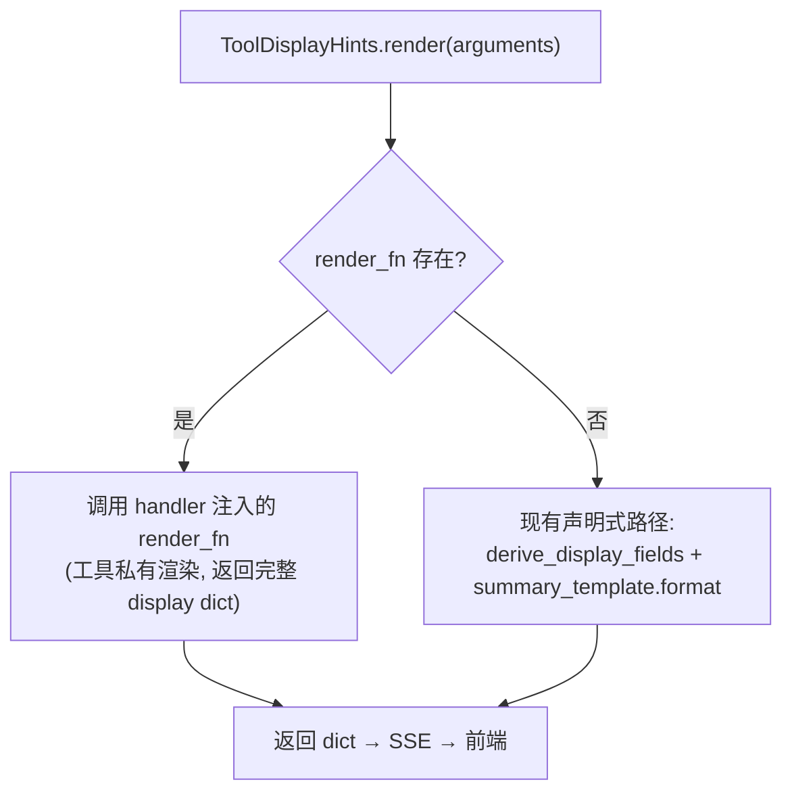

# 工具调用结果透传与前端渲染技术方案

> 把当前 `tool_call_finished` 事件从「仅 `status`」扩展为携带成功结果摘要/正文、失败原因/错误/可重试标记的完整载体；同时给 `ToolDisplayHints` 新增 `result_summary_template` + 可选 `render_fn` 逃生舱，使其能声明式渲染结果摘要；前端 `ToolCallCard` 基于新字段做折叠行/展开区分渲染（成功默认折叠、失败红色高亮）。
>
> 依赖策略（已与用户确认）：**扩展 `tool_call_finished` 事件** + **`ToolDisplayHints.result_summary_template` 声明式渲染**（可选 `render_fn` 逃生舱） + **失败以 `error` 为主因、`reason` 为辅**。
> 改动规模：中/大（后端 4 文件 + 前端 3 文件 + 7 个 handler 补 `data` 字段 + 新增测试），按 `AGENTS.md` 第八节须走**独立审查 Agent + 独立测试 Agent** 闭环。

---

## 一、背景与目标

项目已有完整的工具调用链路：`nodes.py` emit `TOOL_CALL_REQUESTED`（携带 `display` 投影）→ `tool_execution_service.py` 执行 → emit `TOOL_CALL_FINISHED`。前端 `ToolCallCard` 基于 `display` 已能做到「执行前渲染」（verb + 参数摘要、可折叠）。

但**执行后渲染**是空的：`tool_call_finished` 只携带 `step_id / tool_name / status / tool_call_id` 四个字段，既无成功结果摘要/正文，也无失败原因/错误/可重试标记。前端没有数据可渲染展开区。

目标：
1. **执行后信息补全**：`tool_call_finished` 携带成功摘要、成功正文、失败主因、失败辅因、可重试标记、结构化 `data`。
2. **声明式结果摘要**：成功后的"已读取 120 行"类摘要，由 `ToolDisplayHints.result_summary_template` 基于 `observation.data` 渲染（后端单一来源、前端零分支）。
3. **逃生舱机制**：当 `str.format` 模板表达不了条件式摘要时，handler 可注入自定义 `render_fn` 覆盖默认渲染路径。
4. **前端区分渲染**：折叠行以 `error` 为主因（红色高亮）、展开区成功/失败不同内容，保持当前可折叠交互不变。
5. **零前端工具特化分支**：所有展示差异收敛在后端 `ToolDisplayHints`，前端只消费通用结构。

设计取舍（已与用户确认）：
- **扩展 `tool_call_finished` 事件**（而非复用 `observation_added`）：按 `call_id` 一次合并，不新增事件类型，投影器改动最小。
- **`ToolDisplayHints.result_summary_template` 声明式渲染**（而非在 handler 构造 `ToolObservation` 时加 summary 字段）：沿用现有 `summary_template` 声明式思路，后端单一事实来源，前端零分支。当声明式真不够时通过可选 `render_fn` 逃生舱覆盖。
- **失败以 `error` 为主因、`reason` 为辅**：`error` 作为折叠行与展开区主因，`reason` 作为展开补充说明。

---

## 二、现状与缺口

### 2.1 现状（事件链路）

| 环节 | 位置 | 当前字段 |
|---|---|---|
| 模型发出工具调用 | `nodes.py` → emit `TOOL_CALL_REQUESTED` | `model_calls / display / tool_call_id / tool_name / arguments / llm_call_id / step_id` |
| 执行 | `tool_execution_service.py` `run_calls_with_events` | 串行 `scheduler.execute(call)` 产出 `ToolObservation` |
| 执行后事件 | `tool_execution_service.py` → emit `TOOL_CALL_FINISHED` | **仅** `step_id / tool_name / status / tool_call_id` |
| 结果载体 | `ToolObservation`（`tools/schemas/tool_observation.py`） | `content / error / reason / retryable / data / ...` 全部齐备 |
| 前端渲染 | `ToolCallCard` | 基于 `display` 渲染折叠行，展开区目前空 |

### 2.2 缺口

1. `tool_call_finished` 不携带 `content`（模型所见完整结果）、`error`（失败主因）、`reason`（失败辅因）、`retryable`、`data`（结构化载荷）。
2. **无结果摘要**：`ToolDisplayHints` 当前无 `result_summary_template`，无机制从 `observation.data` 渲染结果摘要（如 `已读取 120 行`）。
3. `ToolExecutionService` 构造函数不持有 `ToolDefinition` 列表，拿不到对应工具的 `ToolDisplayHints`，无法在当前点调用 `render_result`。
4. 前端 `projector.ts` 的 `TimelineToolItem` 无结果字段；`ToolCallCard` 无成功/失败分区渲染。

---

## 三、方案概述（高层次）

```mermaid
flowchart LR
    A["handler 执行 -> ToolObservation<br/>(content/error/reason/retryable/data)"] --> B["tool_execution_service<br/>写 TOOL_CALL_FINISHED"]
    D["ToolDisplayHints<br/>result_summary_template + render_fn"] -->|render_result(data)| B
    B -->|新增字段| C["summary / content / error /<br/>reason / retryable / data"]
    C -.SSE.-> E["eventStore 接收"]
    E --> F["projector 按 call_id 合并<br/>-> TimelineToolItem"]
    F --> G["ToolCallCard 折叠/展开渲染"]
    G --> H["折叠: verb + (resultSummary ?? display.summary)<br/>展开: 成功=模型结果 / 失败=error+reason"]
```

### 3.1 后端核心改动

**A. `ToolCallFinishedPayload` 扩展**：新增 `summary`（结果摘要）、`content`（模型所见完整正文）、`error`（失败主因）、`reason`（失败辅因）、`retryable`（可重试标记）、`data`（结构化载荷）。

**B. `ToolDisplayHints` 扩展**：新增字段 `result_summary_template: str | None` + 可选字段 `render_fn: Callable | None` + 方法 `render_result(data) -> str | None`，沿用现有 `render` 的声明式模板思路。`render` 新增对 `render_fn` 的委托分支（render_fn 存在时走 handler 自定义渲染、否则走声明式模板）。

**C. `render` 重构**：将现有内联的通用派生逻辑（分页 start/end、path_basename 推导）外提为模块级 `derive_display_fields(arguments)` 共享函数，使默认路径与 handler 的 `render_fn` 都能复用。

**D. `ToolExecutionService` 注入**：构造函数新增 `tool_definitions` 参数，接受 `list[ToolDefinition]`，构建 `name -> ToolDisplayHints` 映射；在 `run_calls_with_events` 的 finished 事件构造点调用 `display.render_result(observation.data)` 并填入 payload。

**E. 接线**：`RuntimeOperations` 将已有的 `self.model_tools` 传给 `ToolExecutionService`。

### 3.2 前端核心改动

**F. `projector.ts`**：`TimelineToolItem` 新增 `resultSummary / result / error / reason / retryable / resultData` 可选字段；`projectTool` 在 `tool_call_finished` 分支映射新字段。

**G. `ToolCallCard.tsx`**：折叠行逻辑更新（完成态优先显示 `resultSummary`，失败红色高亮 `error`）；展开区按成功/失败分区渲染。

**H. `ChatPanel.tsx`**：透传新 props。

### 3.3 handler 改动（7 个文件）

各工具 handler 的 `ToolDisplayHints(...)` 补 `result_summary_template`，并在 `data` 缺键时补齐：

| 工具 | result_summary_template | data 需补键 |
|---|---|---|
| read_file | `已读取 {path_basename} · {line_count} 行` | `line_count` |
| write_file | `已写入 {path_basename} · {byte_count} 字节` | `byte_count` |
| patch_tool | `已修改 {diff_stats[total_files]} 个文件 · +{diff_stats[total_insertions]} -{diff_stats[total_deletions]}` | 复用已有 `diff_stats`（嵌套键取值），无需补键 |
| search_files | `共 {match_count} 条结果` | `match_count`（来自搜索引擎返回的分页前结果总数） |
| list_directory | `{total} 个条目` | 复用已有 `total`，无需补键 |
| delete | `已删除 {path_basename}` | `path_basename`（delete 为单目标删除，无 count） |
| execute_terminal | `退出码 {exit_code} · {line_count} 行输出` | `exit_code`, `line_count` |

> 说明（与初版设想的偏差，已与实现对齐）：
> - **patch_tool** 直接复用已有 `data["diff_stats"]`（`str.format` 的 `{key[subkey]}` 语法支持 dict 下标取值），比新增扁平 `file_count`/`change_count` 更符合「不重复造轮子」，故不再补扁平键。
> - **search_files** 的 `match_count` 由搜索引擎函数返回：`search_content` / `search_filenames` 返回值由 `str` 改为 `tuple[str, int]`，第二项为**分页前的结果总数**（content 模式为命中相关行总数，含上下文）。因非「本页命中处数」，文案改为中性的「共 N 条结果」以免分页场景歧义。故本改动还涉及 `search/content_search.py`、`search/filename_search.py` 两个引擎文件（见 §5.3）。
> - **list_directory** 复用已有 `data["total"]`（无需新增 `total_count`）。
> - **delete** 实际为单目标删除（条目数恒为 1），模板简化为 `已删除 {path_basename}`，不引入 `count` 键。

---

## 四、render_fn 逃生舱设计

### 4.1 背景

当前 `ToolDisplayHints.render` 完全不依赖 handler 逻辑——它只从 `arguments` 做**通用派生**（分页 start/end、路径 basename），再由 `summary_template.format(**derived)` 渲染，新增工具无需改 `render`。

纯 `str.format` 对"条件式摘要"（如"成功且命中 0 处" vs "命中 N 处"要不同文案）表达力不足。若不加逃生舱，条件逻辑会以 `if tool == "xxx"` 形式渗进共享 `render`，违背单一职责。

### 4.2 设计



要点：
- **默认仍是 `summary_template`**：7 个现有工具一行不改，延续"前端零分支"约定。
- **`render_fn` 是可选覆盖**：仅当模板真表达不了条件式摘要时才在 handler 里提供。
- **`render_result` 暂不设对应逃生舱**：结果摘要都是简单数据投影（`已读取 {line_count} 行`），先走声明式 `result_summary_template`；真遇到条件式结果摘要时再对称加 `render_result_fn`（YAGNI）。
- **契约约束**：`render_fn` 必须返回与现有 `render` **同形状的 dict**（`verb`/`icon`/`summary`/`detail_keys`/`click_action`），前端 `toolDisplayFromPayload` 完全不用动。

### 4.3 共享派生助手

```python
# tool_display.py 模块级 helper，默认路径与 handler 的 render_fn 都能复用
def derive_display_fields(arguments: dict[str, Any]) -> dict[str, Any]:
    """分页 start/end + path_basename 的通用派生（原 render 内联逻辑外提）。"""
    ...
```

---

## 五、代码落点（精确落点）

### 5.1 后端

#### A. `models/payload/tool_call_finished_payload.py` — 扩字段

保留现有 4 字段，新增 6 可选字段：

| 字段 | 类型 | 默认值 | 说明 |
|---|---|---|---|
| `summary` | `str \| None` | `None` | 成功结果一行摘要（来自 `display.render_result`） |
| `content` | `str \| None` | `None` | 模型所见完整结果（展开用） |
| `error` | `str` | `""` | 失败主因：发生了什么（错误描述，非堆栈） |
| `reason` | `str` | `""` | 失败辅因：为什么失败 + 如何修正 |
| `retryable` | `bool` | `False` | 程序化布尔信号（可重试瞬态 / 需先修正） |
| `data` | `dict[str, Any]` | `{}` | 结构化载荷 |

#### B. `tools/schemas/tool_display.py` — 新增 `result_summary_template` + `render_fn` + `render_result`，重构 `render`

`ToolDisplayHints` 新增：
```python
result_summary_template: str | None = None
render_fn: Callable[[dict[str, Any]], dict[str, Any]] | None = None
```

新增 `render_result(self, data: dict[str, Any]) -> str | None`：
- 若 `self.result_summary_template` 为 None → 返回 `None`（前端降级）
- `try: self.result_summary_template.format(**data) except (KeyError, IndexError, TypeError, ValueError): None`（与 `_render_summary` 同款容错；比初版多捕 `IndexError`/`TypeError` 以覆盖嵌套键下标取值失败）

`render` 新增委托分支：
```python
def render(self, arguments: dict[str, Any]) -> dict[str, Any]:
    if self.render_fn is not None:
        return self.render_fn(arguments)
    derived = derive_display_fields(arguments)
    return self._render_default(derived)
```

共享函数 `derive_display_fields`（从原 `render` 内联外提）：
- 分页类 path / path_start 推导 `start` / `end`
- path / path_start 推导 `path_basename`

#### C. `service/tool_execution/tool_execution_service.py` — 写事件处注入结果

构造函数新增：
```python
tool_definitions: list[ToolDefinition] | None = None
```
构造 `self._display_by_name = {d.name: d.display for d in tool_definitions or []}`。

`run_calls_with_events` 内 write_event 处（当前约第 104 行）改为：

```python
display = self._display_by_name.get(observation.tool_name)
result_summary = None
if display is not None and display.result_summary_template is not None:
  result_summary = display.render_result(observation.display_data)

write_event(
  EventType.TOOL_CALL_FINISHED,
  ToolCallFinishedPayload(
    step_id=step_id,
    tool_name=observation.tool_name,
    status=status,
    tool_call_id=observation.tool_call_id,
    summary=result_summary,
    content=redact_terminal_output(observation.content),
    error=observation.error,
    reason=observation.reason,
    retryable=observation.retryable,
    data=observation.display_data,
  ),
)
```

删除第 105 行当前 `TODO` 注释。

#### D. `core/runtime/runtime_operations.py` — 接线

`RuntimeOperations.__init__` 构造 `ToolExecutionService` 处补 `tool_definitions=self.model_tools`。

### 5.2 前端

#### E. `services/timeline/projector.ts`

`TimelineToolItem` 接口新增可选字段（与 `display` 同级，不属于 `display`）：
```typescript
export interface TimelineToolItem {
  /** 执行前渲染数据（不变） */
  display: ToolDisplayPayload;
  /** 执行前参数（不变） */
  args: Record<string, unknown>;
  /** 调用状态（扩展） */
  status: 'running' | 'completed' | 'error';
  // --- 新增字段 ---
  /** 执行后结果摘要（成功时） */
  resultSummary?: string;
  /** 执行后完整结果正文（成功时，展开用） */
  result?: string;
  /** 失败错误主因 */
  error?: string;
  /** 失败辅因 */
  reason?: string;
  /** 是否可重试 */
  retryable?: boolean;
  /** 结构化载荷（通用） */
  resultData?: Record<string, unknown>;
}
```

`projectTool` 函数的 `tool_call_finished` 分支映射：
```typescript
case 'tool_call_finished': {
  const finished = payload as ToolCallFinishedPayload;
  const entry = entries.find(e => e.type === 'tool' && e.callId === finished.tool_call_id);
  if (entry) {
    entry.status = finished.status === 'success' ? 'completed' : 'error';
    entry.resultSummary = finished.summary;
    entry.result = finished.content;
    entry.error = finished.error || undefined;
    entry.reason = finished.reason || undefined;
    entry.retryable = finished.retryable;
    entry.resultData = finished.data;
  }
  break;
}
```

同时更新 `tool_call_finished` 的 payload 类型断言以包含新字段（`summary` / `content` / `error` / `reason` / `retryable` / `data`）。

#### F. `components/chat/ToolCallCard.tsx`

扩展 `ToolCallCardProps`：
```typescript
interface ToolCallCardProps {
  toolName: string;
  display: ToolDisplayPayload;
  args: Record<string, unknown>;
  error?: string;
  // --- 新增 ---
  status?: 'running' | 'completed' | 'error';
  resultSummary?: string | null;
  result?: string | null;
  reason?: string | null;
  retryable?: boolean;
  resultData?: Record<string, unknown> | null;
}
```

**折叠行逻辑**（状态 + 摘要显示）：
- `running` → `verb + " " + display.summary`（不显示结果摘要，保留当前"调用中…"）
- `completed` → `verb + " " + (resultSummary ?? display.summary)`
- `error` → `verb + " " + (error || reason || "执行失败")`（红色高亮；`error` 空缺时降级为 `reason`，再兜底固定文案，保证失败态折叠行始终有主因）

**展开区**：
- 成功（`status === 'completed'`）→ 「模型结果」段渲染 `result`（`<pre>` 等宽可滚动、`max-h` 限制、复制按钮）
- 失败（`status === 'error'`）→ 「失败原因」段 = `error`（主因）+ `reason`（辅因补充）+ `retryable` 徽标（`可重试` / `需先修正参数`）
- 保留原有的参数 + 打开文件动作按钮
- 失败卡片默认展开（因 `error` 已在折叠行可见，可保持折叠状态，等实际渲染时决定）

#### G. `components/layout/ChatPanel.tsx`

两处 `ToolCallCard` 调用补传 `status` / `resultSummary` / `result` / `error` / `reason` / `retryable` / `resultData`（从 `TimelineToolItem` 取出对应字段）。

### 5.3 handler 逐个补 data 键（7 个文件）

**`write_file.py`**（`tool_success` 构造点）：
- `data` 已有 `path`，补 `"byte_count": len(content.encode("utf-8"))`、`"path_basename": os.path.basename(path)`

**`search_files.py`**（`tool_success` 构造点）：
- `data` 补 `"match_count": match_count`；`match_count` 来自搜索引擎返回值。
- **连带改动**：`search/content_search.py` 的 `search_content` 与 `search/filename_search.py`
  的 `search_filenames` 返回值由 `str` 改为 `tuple[str, int]`（`(output, total)`，
  `total` 为分页前结果总数，错误时为 0），docstring 同步更新。

**`list_directory.py`**（success 观察构造点）：
- `data` 已有 `total`（分页前条目总数）→ 无需补键，模板直接引用 `{total}`

**`delete.py`**（success 观察构造点）：
- 三个成功分支（link / dir / file）的 `data` 均补 `"path_basename"`；已有 `type`。
  单目标删除不引入 `count` 键。

**`read_file.py`**（`tool_success` 构造点）：
- `data` 补 `"line_count"`（本页实际返回行数：分页截断时为 `[offset, next_offset)`，
  读到末尾时为 `[offset, total_lines]`）与 `"path_basename"`

**`patch_tool.py`**（`tool_success` 构造点）：
- `data` 已有 `diff_stats`（含 `total_files` / `total_insertions` / `total_deletions`）
  → 无需补键，模板用 `{diff_stats[total_files]}` 嵌套键取值

**`execute_terminal.py`**（`tool_success` 构造点）：
- `data` 已有 `exit_code`，补 `"line_count": len(output.splitlines())`

每个 handler 的 `display` 补 `result_summary_template`（见 §3.3 表格）。

### 5.4 改动最小化核对

- 不新增事件类型，只扩充 `tool_call_finished` 的 payload 字段（非破坏性，前端按需取）。
- `ToolDisplayHints` 的 `result_summary_template` 和 `render_fn` 均为 `None` 默认值 → 已有构建点零改动，触发修改的仅 7 个 handler 需手动补值。
- `render` 现有声明式路径完全保留，`render_fn` 仅为可选委托，不影响既有行为。
- `ToolObservation` 契约零改动；其字段通过 `render_result` / `render_fn` 投影进 payload。
- `tool_success.py` / `tool_error.py` 零改动。

---

## 六、测试计划（独立测试 Agent 执行）

### 6.1 后端测试

**新增 `tests/test_tool_call_finished_payload.py`**：
- 字段校验：`ToolCallFinishedPayload` 带所有新字段构造 → 值正确，类型正确
- 兼容性：旧式 payload（仅 4 字段）→ 新字段取默认值

**新增/扩展 `tests/test_tool_execution_service.py`**：
- `TOOL_CALL_FINISHED` 事件含 `content` / `error` / `reason` / `retryable` / `data` / `summary`
- `render_result` 正常渲染（`result_summary_template` 正确 / `data` 缺键容错返回 None）
- `render` 委托 `render_fn` 路径：callback 被调用且返回值被使用
- **`ToolExecutionService` 无 `tool_definitions` 时**（旧调用者空构造）→ `_display_by_name` 为空、`TOOL_CALL_FINISHED` 的 `summary` 为 None（向后兼容）

**`tests/test_tool_display.py`**：
- `derive_display_fields` 正确推导分页 start/end / path_basename
- `render` 默认路径不变
- `render_result` 正常渲染、缺键容错返回 None

### 6.2 前端测试

- `projector.test.ts`：`tool_call_finished` 合并断言新字段被正确合并
- `ToolCard` 增加成功/失败渲染断言（或快照）

### 6.3 闭环

- `uv run ruff check` 零新增告警
- `uv run mypy` 零新增类型错误
- 覆盖率 >80%（后端新增模块）
- 独立审查 Agent + 独立测试 Agent 闭环至全通过

---

## 七、已知限制与风险

1. **`result_summary_template` 纯 `str.format` 限制**：仅支持简单变量替换，不支持条件/循环。条件式摘要见 §4（`render_fn` 逃生舱）。
2. **`render_fn` 的可测试性依赖 handler**：渲染逻辑跟着工具落在 handler 自己的单测里，不比集中式差但需注意 handler 侧测试是否已覆盖 summary 展示。
3. **前端兼容性**：旧 SSE 消息不携带新字段 → `TimelineToolItem` 的可选字段设计保证投影器与卡片正常工作，不崩不报错，只是展开区空。与旧记录的兼容由投影器 `??` 运算符自然兜底。

---

## 八、实施分期

| 阶段 | 内容 | 涉及文件 |
|---|---|---|
| P0 | `ToolCallFinishedPayload` 扩字段 + `ToolDisplayHints` 扩字段（result_summary_template + render_fn + render_result） + `derive_display_fields` 外提 + `render` 委托 | `tool_call_finished_payload.py`、`tool_display.py` |
| P1 | `ToolExecutionService` 注入 + `RuntimeOperations` 接线 + 删除 TODO | `tool_execution_service.py`、`runtime_operations.py` |
| P2 | 7 个 handler 补 `data` 缺键 + `result_summary_template` | 7 个 handler 文件 |
| P3 | 前端 projector + ToolCallCard + ChatPanel | `projector.ts`、`ToolCallCard.tsx`、`ChatPanel.tsx` |
| P4 | 测试 + `ruff check` / `mypy` 清零 | `tests/` |
| P5 | 独立审查 Agent + 独立测试 Agent 闭环 | — |

---

## 九、闭环与验收

1. 本技术方案经**独立审查 Agent** 审核（对照 `rules/Agent代码开发规范.md`：单一职责、改动最小化、不重复造轮子、依赖锁版本、分层、无跨层、docstring 同步），输出 符合/不符合 + 问题清单。
2. 按审查意见修订后落地代码（P0–P4 逐阶段）。
3. 走**独立测试 Agent** 补测试，覆盖率 >80%，`pytest` 全绿。
4. 交付前 `uv run ruff check` + `uv run mypy` 零新增告警；开发 Agent 不自判完成。

---

## 十、风险与回滚

- `ToolCallFinishedPayload` 新字段为可选（`None`/`""`/`False` 默认值），新后端兼容旧前端（旧前端忽略未知字段）；回滚 payload 后字段仅删声明，下游投影器自然降级为缺失值。
- `ToolDisplayHints` 的 `result_summary_template` 与 `render_fn` 默认 None → 不传时不触发任何行为改变；回滚仅删字段声明，构造点自动用旧 args。
- `ToolExecutionService` 的 `tool_definitions` 为可选构造参数，旧调用者不传入则 `_display_by_name` 为空字典、`summary` 始终 None，行为与改造前完全一致。
- handler `data` 缺键只影响本工具 `render_result` 返回 None（`str.format` 抛 `KeyError` 被 `try/except` 容错）→ 不影响执行和回传模型的 `ToolObservation`。

---

## 十一、未来扩展（非本期）

### 11.1 `render_result_fn` 逃生舱

当 `result_summary_template` 表达不了条件式结果摘要（如"成功且命中 0 处" vs "命中 N 处"需不同文案）时，对称加 `render_result_fn: Callable[[dict[str, Any]], str | None] | None`。本期默认不预铺（YAGNI），等真实需求触发。

### 11.2 `ToolCallCard` 交互增强

- `running` 态折叠行加「调用中…」动画。
- 失败卡片默认展开（因 `error` 已在折叠行可见，等价于保持折叠）。
- 结果正文的代码片段语法高亮（`shiki` / `prism`）。
- 结果长度超过阈值时自动折叠并显示「显示完整输出」按钮。

### 11.3 `data` 在 `ToolMessage` 之外的展示

当前 `data` 不单独落库或进 `ToolMessage` 之外通道。若后续需在前端展示结构化 data 表格/树状视图，可复用 `ToolDisplayHints` 的 `detail_keys` 范式定义 data 中哪些字段进展示摘要。
